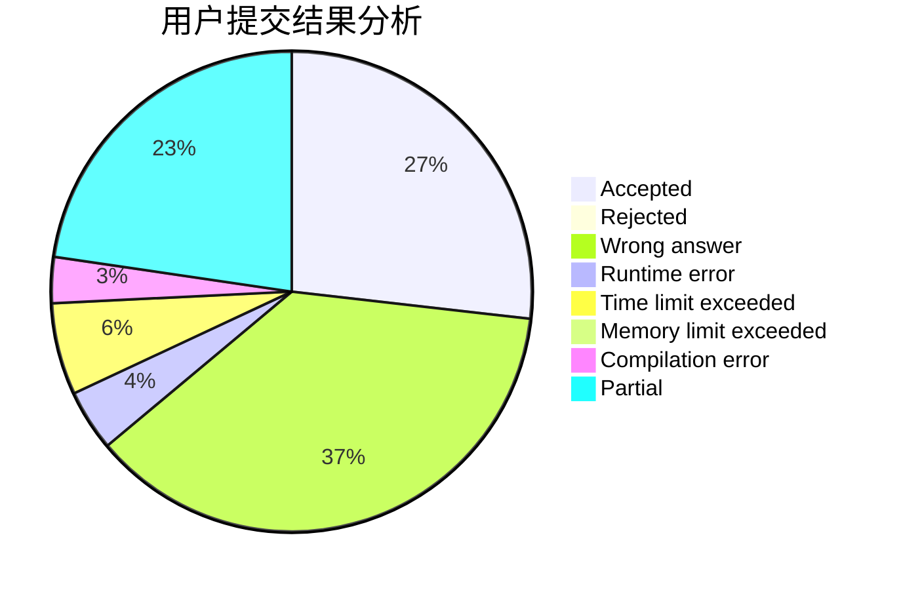
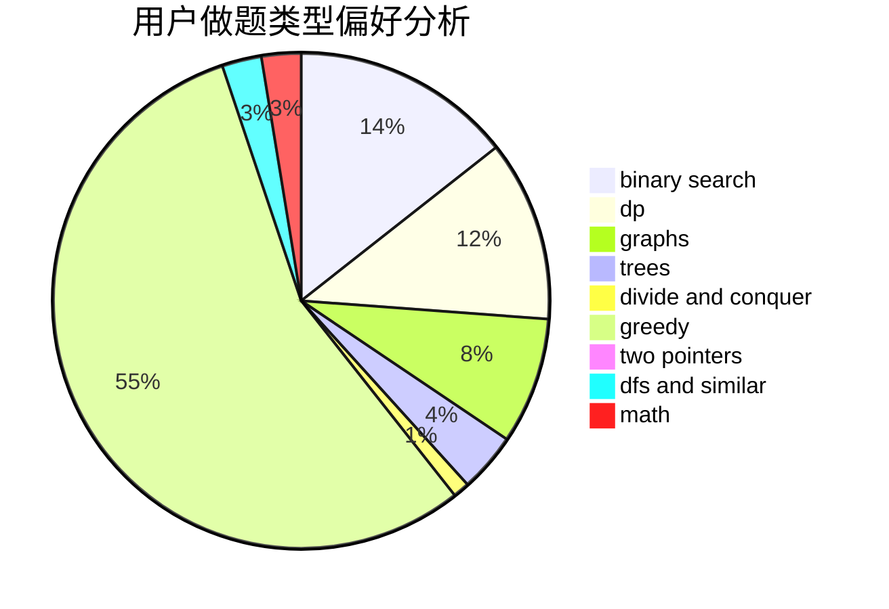

# Lagoon_

<!-- tabs:start -->

#### **用户提交结果分析**

#### **用户做题类型偏好分析**

<!-- tabs:end -->
# 推荐题目
[793F](https://codeforces.com/contest/793/problem/F)
[1347C](https://codeforces.com/contest/1347/problem/C)
[11292](https://codeforces.com/contest/1129/problem/2)
[507D](https://codeforces.com/contest/507/problem/D)
[300C](https://codeforces.com/contest/300/problem/C)
[1408E](https://codeforces.com/contest/1408/problem/E)
[499C](https://codeforces.com/contest/499/problem/C)
[358D](https://codeforces.com/contest/358/problem/D)
[1238B](https://codeforces.com/contest/1238/problem/B)
[498B](https://codeforces.com/contest/498/problem/B)
