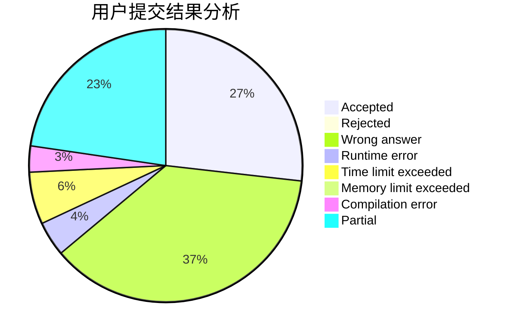
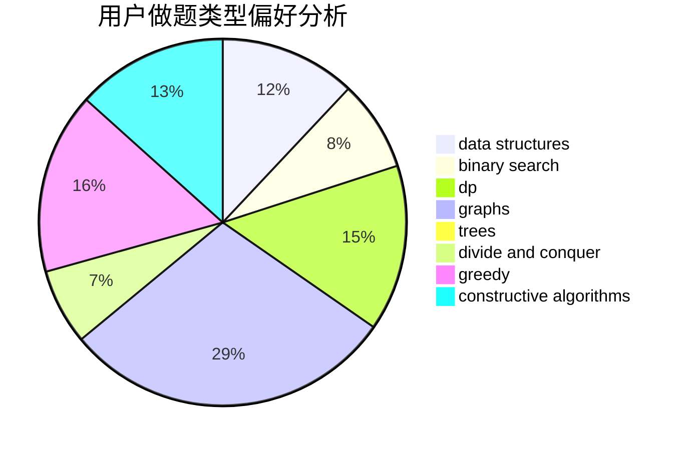
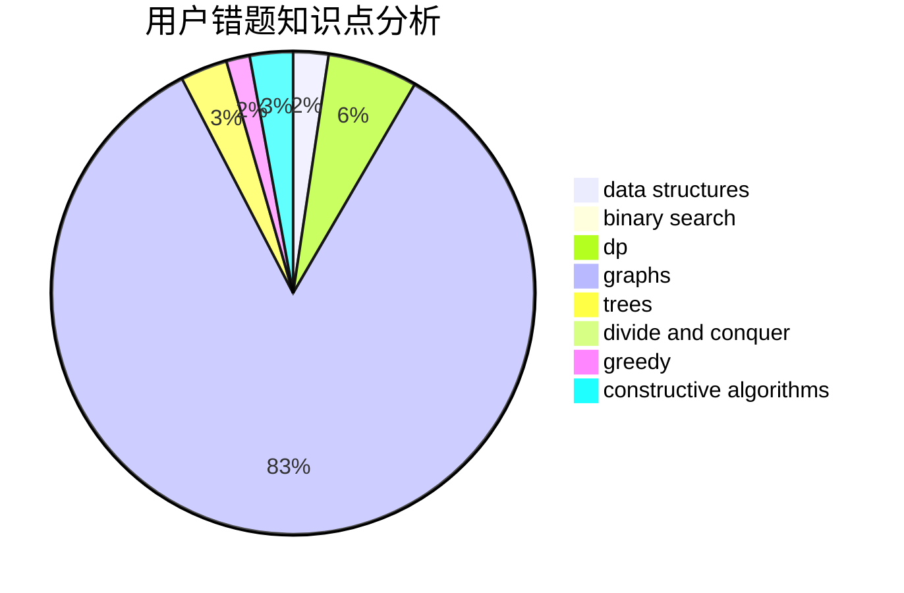

# Lagoon_

<!-- tabs:start -->

#### **用户提交结果分析**

#### **用户做题类型偏好分析**

#### **用户错题知识点分析**

<!-- tabs:end -->
# 推荐题目
[793F](https://codeforces.com/contest/793/problem/F)		data structures,
                        divide and conquer,
                        dp		  
[1347C](https://codeforces.com/contest/1347/problem/C)		dsu,graphs,sortings,trees		  
[11292](https://codeforces.com/contest/1129/problem/2)		dsu,graphs,sortings,trees		  
[507D](https://codeforces.com/contest/507/problem/D)		dp,
                        implementation		  
[300C](https://codeforces.com/contest/300/problem/C)		brute force,
                        combinatorics		  
[1408E](https://codeforces.com/contest/1408/problem/E)		data structures,
                        dsu,
                        graphs,
                        greedy,
                        sortings,
                        trees		  
[499C](https://codeforces.com/contest/499/problem/C)		dsu,graphs,sortings,trees		  
[358D](https://codeforces.com/contest/358/problem/D)		dp,
                        greedy		  
[1238B](https://codeforces.com/contest/1238/problem/B)		greedy,
                        sortings		  
[498B](https://codeforces.com/contest/498/problem/B)		dp,
                        probabilities,
                        two pointers		  
