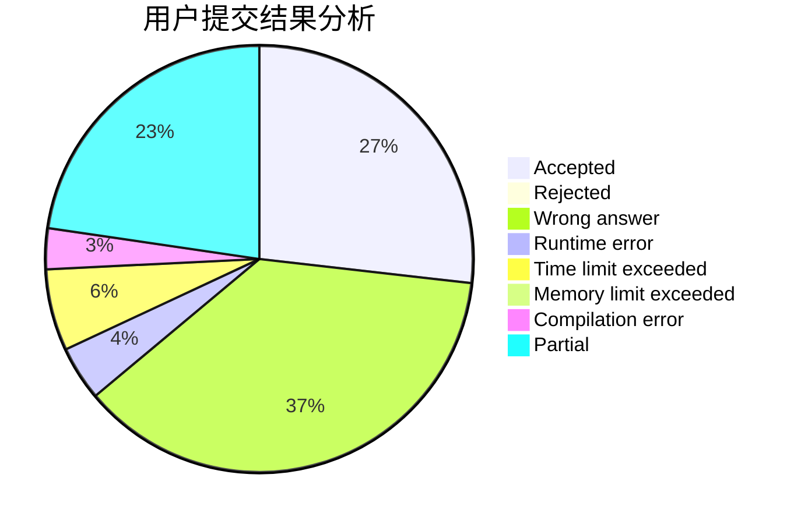
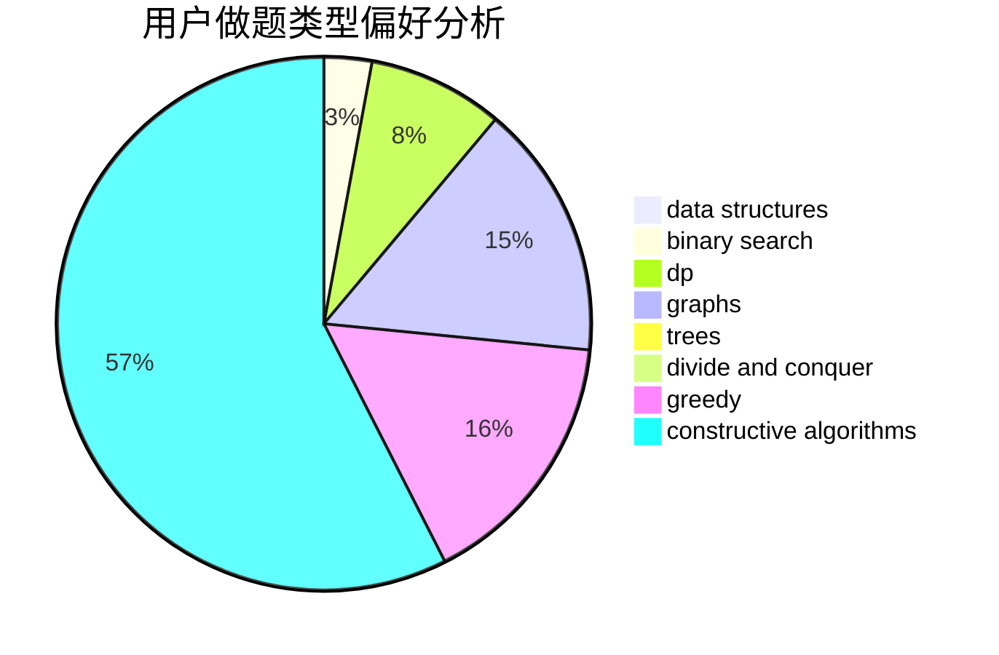
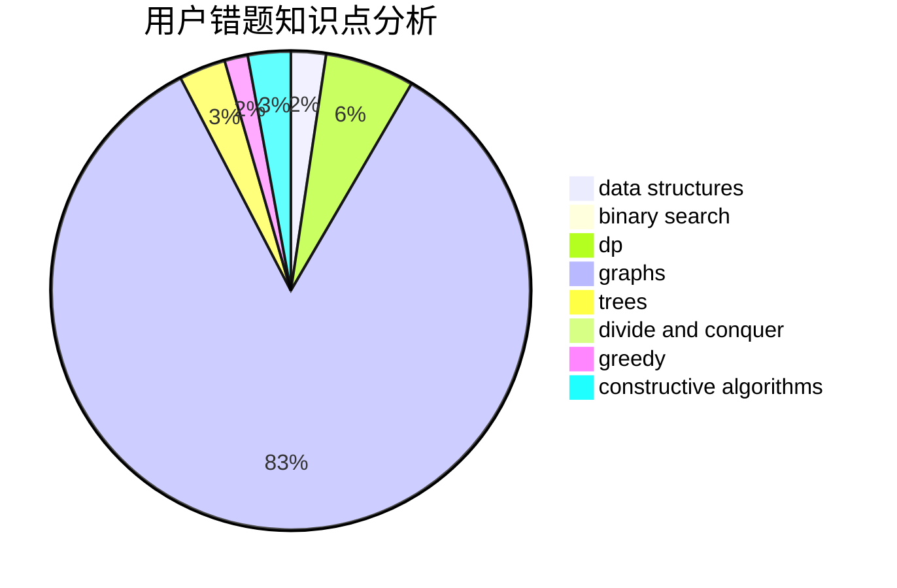

# Lagoon_

<!-- tabs:start -->

#### **用户提交结果分析**

#### **用户做题类型偏好分析**

#### **用户错题知识点分析**

<!-- tabs:end -->
# 推荐题目
[774G](https://codeforces.com/contest/774/problem/G)		*special problem,
                        number theory		  
[1340D](https://codeforces.com/contest/1340/problem/D)		constructive algorithms,
                        dfs and similar,
                        graphs,
                        trees		  
[1119E](https://codeforces.com/contest/1119/problem/E)		brute force,
                        dp,
                        fft,
                        greedy,
                        ternary search		  
[486D](https://codeforces.com/contest/486/problem/D)		dfs and similar,
                        dp,
                        math,
                        trees		  
[286B](https://codeforces.com/contest/286/problem/B)		implementation		  
[1399D](https://codeforces.com/contest/1399/problem/D)		constructive algorithms,
                        data structures,
                        greedy,
                        implementation		  
[479A](https://codeforces.com/contest/479/problem/A)		brute force,
                        math		  
[32B](https://codeforces.com/contest/32/problem/B)		expression parsing,
                        implementation		  
[122A](https://codeforces.com/contest/122/problem/A)		brute force,
                        number theory		  
[478B](https://codeforces.com/contest/478/problem/B)		combinatorics,
                        constructive algorithms,
                        greedy,
                        math		  
