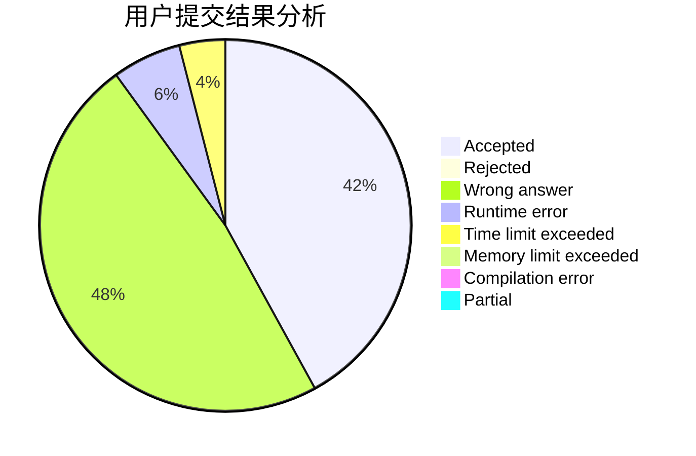
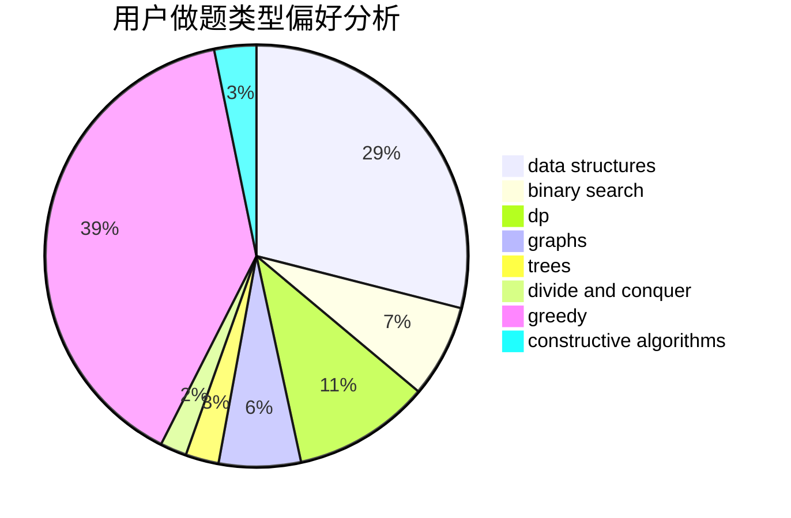
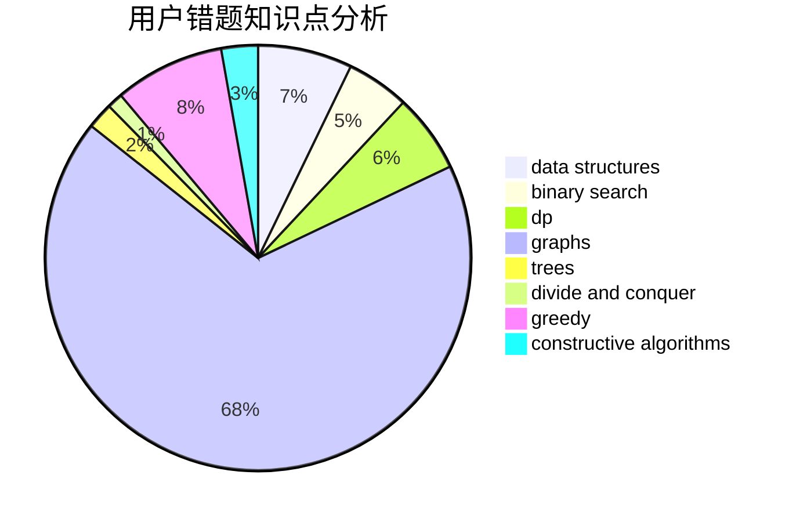

# LaiAng8086
<!-- tabs:start -->
#### **用户提交结果分析**

#### **用户做题类型偏好分析**

#### **用户错题知识点分析**

<!-- tabs:end -->
# 推荐题目
[Eels](http://codeforces.com/problemset/problem/1098/D)		data structures		  
[Permutation](http://codeforces.com/problemset/problem/359/B)		constructive algorithms,
                        dp,
                        math		  
[Quirky Quantifiers](http://codeforces.com/problemset/problem/952/A)		math		  
[Beautiful Matrix](http://codeforces.com/problemset/problem/1085/G)		combinatorics,
                        data structures,
                        dp		  
[Prefix Enlightenment](https://codeforces.com/contest/1291/problem/E)		dfs and similar,
                        dsu,
                        graphs		  
[Fibonacci-ish](http://codeforces.com/problemset/problem/633/D)		brute force,
                        dp,
                        hashing,
                        implementation,
                        math		  
[Keyboard Layouts](http://codeforces.com/problemset/problem/831/B)		implementation,
                        strings		  
[AI robots](http://codeforces.com/problemset/problem/1045/G)		data structures		  
[Long Colorful Strip](http://codeforces.com/problemset/problem/1178/F2)		dp		  
[Running in Pairs](http://codeforces.com/problemset/problem/1244/G)		constructive algorithms,
                        greedy,
                        math		  
<!-- tabs:start -->
#### **data structures**
[Eels](http://codeforces.com/problemset/problem/1098/D)		data structures		  
[Permutation](http://codeforces.com/problemset/problem/1085/G)		combinatorics,
                        data structures,
                        dp		  
[Quirky Quantifiers](http://codeforces.com/problemset/problem/1045/G)		data structures		  
[Beautiful Matrix](https://codeforces.com/contest/705/problem/C)		brute force,
                        data structures,
                        implementation		  
[Prefix Enlightenment](http://codeforces.com/problemset/problem/1266/E)		data structures,
                        greedy,
                        implementation		  
[Fibonacci-ish](http://codeforces.com/problemset/problem/633/G)		bitmasks,
                        data structures,
                        dfs and similar,
                        math,
                        number theory		  
[Keyboard Layouts](http://codeforces.com/problemset/problem/1195/F)		data structures,
                        geometry,
                        math,
                        sortings		  
[AI robots](http://codeforces.com/problemset/problem/1366/G)		data structures,
                        dp,
                        strings		  
[Long Colorful Strip](http://codeforces.com/problemset/problem/1379/F2)		data structures,
                        divide and conquer		  
[Running in Pairs](http://codeforces.com/problemset/problem/1089/K)		data structures		  
#### **binary search**
[Eels](https://codeforces.com/contest/800/problem/A)		binary search,
                        math		  
[Permutation](http://codeforces.com/problemset/problem/1344/D)		binary search,
                        greedy,
                        math		  
[Quirky Quantifiers](http://codeforces.com/problemset/problem/1492/C)		binary search,
                        data structures,
                        dp,
                        greedy,
                        two pointers		  
[Beautiful Matrix](http://codeforces.com/problemset/problem/1463/D)		binary search,
                        constructive algorithms,
                        greedy,
                        two pointers		  
[Prefix Enlightenment](http://codeforces.com/problemset/problem/1490/G)		binary search,
                        data structures,
                        math		  
[Fibonacci-ish](http://codeforces.com/problemset/problem/1479/D)		binary search,
                        bitmasks,
                        brute force,
                        data structures,
                        probabilities,
                        trees		  
[Keyboard Layouts](http://codeforces.com/problemset/problem/1436/E)		binary search,
                        data structures,
                        two pointers		  
[AI robots](http://codeforces.com/problemset/problem/1461/D)		binary search,
                        brute force,
                        data structures,
                        divide and conquer,
                        implementation,
                        sortings		  
[Long Colorful Strip](http://codeforces.com/problemset/problem/1493/C)		binary search,
                        brute force,
                        constructive algorithms,
                        greedy,
                        strings		  
[Running in Pairs](http://codeforces.com/problemset/problem/1487/D)		binary search,
                        brute force,
                        math,
                        number theory		  
#### **dp**
[Eels](http://codeforces.com/problemset/problem/359/B)		constructive algorithms,
                        dp,
                        math		  
[Permutation](http://codeforces.com/problemset/problem/1085/G)		combinatorics,
                        data structures,
                        dp		  
[Quirky Quantifiers](http://codeforces.com/problemset/problem/633/D)		brute force,
                        dp,
                        hashing,
                        implementation,
                        math		  
[Beautiful Matrix](http://codeforces.com/problemset/problem/1178/F2)		dp		  
[Prefix Enlightenment](https://codeforces.com/contest/861/problem/C)		dp,
                        greedy,
                        implementation		  
[Fibonacci-ish](http://codeforces.com/problemset/problem/706/C)		dp,
                        strings		  
[Keyboard Layouts](http://codeforces.com/problemset/problem/1209/E1)		bitmasks,
                        brute force,
                        dp,
                        greedy,
                        sortings		  
[AI robots](http://codeforces.com/problemset/problem/1366/G)		data structures,
                        dp,
                        strings		  
[Long Colorful Strip](https://codeforces.com/contest/672/problem/C)		dp,
                        geometry,
                        greedy,
                        implementation		  
[Running in Pairs](http://codeforces.com/problemset/problem/261/C)		constructive algorithms,
                        dp,
                        math		  
#### **graph**
[Eels](https://codeforces.com/contest/1291/problem/E)		dfs and similar,
                        dsu,
                        graphs		  
[Permutation](http://codeforces.com/problemset/problem/1334/E)		combinatorics,
                        graphs,
                        greedy,
                        math,
                        number theory		  
[Quirky Quantifiers](http://codeforces.com/problemset/problem/1498/E)		brute force,
                        graphs,
                        greedy,
                        interactive,
                        sortings		  
[Beautiful Matrix](http://codeforces.com/problemset/problem/888/F)		dp,
                        graphs		  
[Prefix Enlightenment](http://codeforces.com/problemset/problem/1487/C)		brute force,
                        constructive algorithms,
                        dfs and similar,
                        graphs,
                        greedy,
                        implementation,
                        math		  
[Fibonacci-ish](http://codeforces.com/problemset/problem/1437/C)		dp,
                        flows,
                        graph matchings,
                        greedy,
                        math,
                        sortings		  
[Keyboard Layouts](http://codeforces.com/problemset/problem/1470/D)		constructive algorithms,
                        dfs and similar,
                        graph matchings,
                        graphs,
                        greedy		  
[AI robots](http://codeforces.com/problemset/problem/1476/C)		dp,
                        graphs,
                        greedy		  
[Long Colorful Strip](http://codeforces.com/problemset/problem/1304/D)		constructive algorithms,
                        graphs,
                        greedy,
                        two pointers		  
[Running in Pairs](http://codeforces.com/problemset/problem/1475/C)		combinatorics,
                        graphs,
                        math		  
#### **trees**
[Eels](http://codeforces.com/problemset/problem/1479/D)		binary search,
                        bitmasks,
                        brute force,
                        data structures,
                        probabilities,
                        trees		  
[Permutation](http://codeforces.com/problemset/problem/1511/C)		brute force,
                        data structures,
                        implementation,
                        trees		  
[Quirky Quantifiers](http://codeforces.com/problemset/problem/1499/F)		combinatorics,
                        dfs and similar,
                        dp,
                        trees		  
[Beautiful Matrix](http://codeforces.com/problemset/problem/1491/E)		brute force,
                        dfs and similar,
                        divide and conquer,
                        number theory,
                        trees		  
[Prefix Enlightenment](http://codeforces.com/problemset/problem/1466/D)		data structures,
                        greedy,
                        sortings,
                        trees		  
[Fibonacci-ish](http://codeforces.com/problemset/problem/1495/D)		combinatorics,
                        dfs and similar,
                        graphs,
                        math,
                        shortest paths,
                        trees		  
[Keyboard Layouts](http://codeforces.com/problemset/problem/1303/G)		data structures,
                        divide and conquer,
                        geometry,
                        trees		  
[AI robots](http://codeforces.com/problemset/problem/1454/E)		combinatorics,
                        dfs and similar,
                        graphs,
                        trees		  
[Long Colorful Strip](http://codeforces.com/problemset/problem/1494/D)		constructive algorithms,
                        data structures,
                        dfs and similar,
                        divide and conquer,
                        dsu,
                        greedy,
                        sortings,
                        trees		  
[Running in Pairs](http://codeforces.com/problemset/problem/1292/C)		combinatorics,
                        dfs and similar,
                        dp,
                        greedy,
                        trees		  
#### **divide and conquer**
[Eels](http://codeforces.com/problemset/problem/1379/F2)		data structures,
                        divide and conquer		  
[Permutation](http://codeforces.com/problemset/problem/1461/D)		binary search,
                        brute force,
                        data structures,
                        divide and conquer,
                        implementation,
                        sortings		  
[Quirky Quantifiers](http://codeforces.com/problemset/problem/1466/G)		combinatorics,
                        divide and conquer,
                        hashing,
                        math,
                        string suffix structures,
                        strings		  
[Beautiful Matrix](http://codeforces.com/problemset/problem/1490/D)		dfs and similar,
                        divide and conquer,
                        implementation		  
[Prefix Enlightenment](https://codeforces.com/contest/1483/problem/C)		data structures,
                        divide and conquer,
                        dp		  
[Fibonacci-ish](http://codeforces.com/problemset/problem/1491/E)		brute force,
                        dfs and similar,
                        divide and conquer,
                        number theory,
                        trees		  
[Keyboard Layouts](http://codeforces.com/problemset/problem/1303/G)		data structures,
                        divide and conquer,
                        geometry,
                        trees		  
[AI robots](http://codeforces.com/problemset/problem/1494/D)		constructive algorithms,
                        data structures,
                        dfs and similar,
                        divide and conquer,
                        dsu,
                        greedy,
                        sortings,
                        trees		  
[Long Colorful Strip](http://codeforces.com/problemset/problem/1482/E)		data structures,
                        divide and conquer,
                        dp		  
[Running in Pairs](http://codeforces.com/problemset/problem/566/C)		dfs and similar,
                        divide and conquer,
                        trees		  
#### **greedy**
[Eels](http://codeforces.com/problemset/problem/1244/G)		constructive algorithms,
                        greedy,
                        math		  
[Permutation](http://codeforces.com/problemset/problem/660/A)		greedy,
                        implementation,
                        math,
                        number theory		  
[Quirky Quantifiers](https://codeforces.com/contest/861/problem/C)		dp,
                        greedy,
                        implementation		  
[Beautiful Matrix](https://codeforces.com/contest/548/problem/C)		brute force,
                        greedy,
                        implementation,
                        math		  
[Prefix Enlightenment](https://codeforces.com/contest/736/problem/A)		combinatorics,
                        constructive algorithms,
                        greedy,
                        math		  
[Fibonacci-ish](http://codeforces.com/problemset/problem/1220/C)		games,
                        greedy,
                        strings		  
[Keyboard Layouts](http://codeforces.com/problemset/problem/1266/E)		data structures,
                        greedy,
                        implementation		  
[AI robots](https://codeforces.com/contest/443/problem/D)		greedy,
                        math,
                        probabilities		  
[Long Colorful Strip](http://codeforces.com/problemset/problem/1209/E1)		bitmasks,
                        brute force,
                        dp,
                        greedy,
                        sortings		  
[Running in Pairs](http://codeforces.com/problemset/problem/1334/E)		combinatorics,
                        graphs,
                        greedy,
                        math,
                        number theory		  
#### **constructive algorithms**
[Eels](http://codeforces.com/problemset/problem/359/B)		constructive algorithms,
                        dp,
                        math		  
[Permutation](http://codeforces.com/problemset/problem/1244/G)		constructive algorithms,
                        greedy,
                        math		  
[Quirky Quantifiers](https://codeforces.com/contest/736/problem/A)		combinatorics,
                        constructive algorithms,
                        greedy,
                        math		  
[Beautiful Matrix](http://codeforces.com/problemset/problem/737/F)		constructive algorithms,
                        math		  
[Prefix Enlightenment](http://codeforces.com/problemset/problem/261/C)		constructive algorithms,
                        dp,
                        math		  
[Fibonacci-ish](http://codeforces.com/problemset/problem/1400/C)		2-sat,
                        brute force,
                        constructive algorithms,
                        greedy		  
[Keyboard Layouts](http://codeforces.com/problemset/problem/1493/A)		constructive algorithms,
                        greedy		  
[AI robots](http://codeforces.com/problemset/problem/1463/D)		binary search,
                        constructive algorithms,
                        greedy,
                        two pointers		  
[Long Colorful Strip](https://codeforces.com/contest/1456/problem/B)		bitmasks,
                        brute force,
                        constructive algorithms		  
[Running in Pairs](http://codeforces.com/problemset/problem/1492/D)		bitmasks,
                        constructive algorithms,
                        greedy,
                        math		  
#### **sortings**
[Eels](http://codeforces.com/problemset/problem/1209/E1)		bitmasks,
                        brute force,
                        dp,
                        greedy,
                        sortings		  
[Permutation](http://codeforces.com/problemset/problem/1195/F)		data structures,
                        geometry,
                        math,
                        sortings		  
[Quirky Quantifiers](http://codeforces.com/problemset/problem/1498/E)		brute force,
                        graphs,
                        greedy,
                        interactive,
                        sortings		  
[Beautiful Matrix](http://codeforces.com/problemset/problem/1310/A)		data structures,
                        greedy,
                        sortings		  
[Prefix Enlightenment](https://codeforces.com/contest/1496/problem/C)		geometry,
                        greedy,
                        math,
                        sortings		  
[Fibonacci-ish](http://codeforces.com/problemset/problem/1495/A)		geometry,
                        greedy,
                        math,
                        sortings		  
[Keyboard Layouts](http://codeforces.com/problemset/problem/1497/A)		brute force,
                        data structures,
                        greedy,
                        sortings		  
[AI robots](http://codeforces.com/problemset/problem/1427/A)		math,
                        sortings		  
[Long Colorful Strip](http://codeforces.com/problemset/problem/1461/D)		binary search,
                        brute force,
                        data structures,
                        divide and conquer,
                        implementation,
                        sortings		  
[Running in Pairs](http://codeforces.com/problemset/problem/1437/C)		dp,
                        flows,
                        graph matchings,
                        greedy,
                        math,
                        sortings		  
<!-- tabs:end -->
