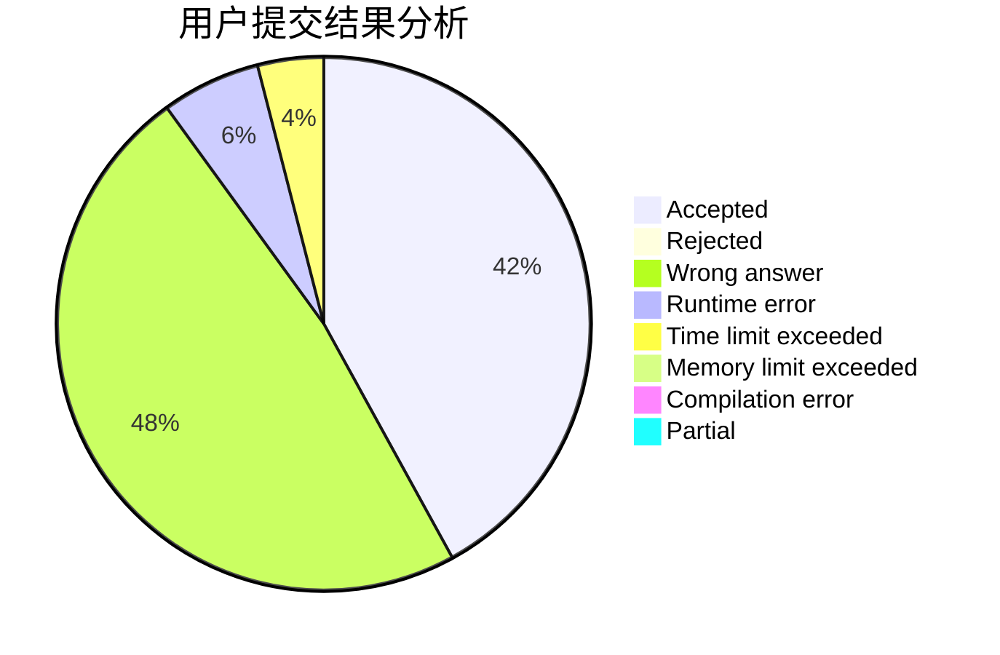
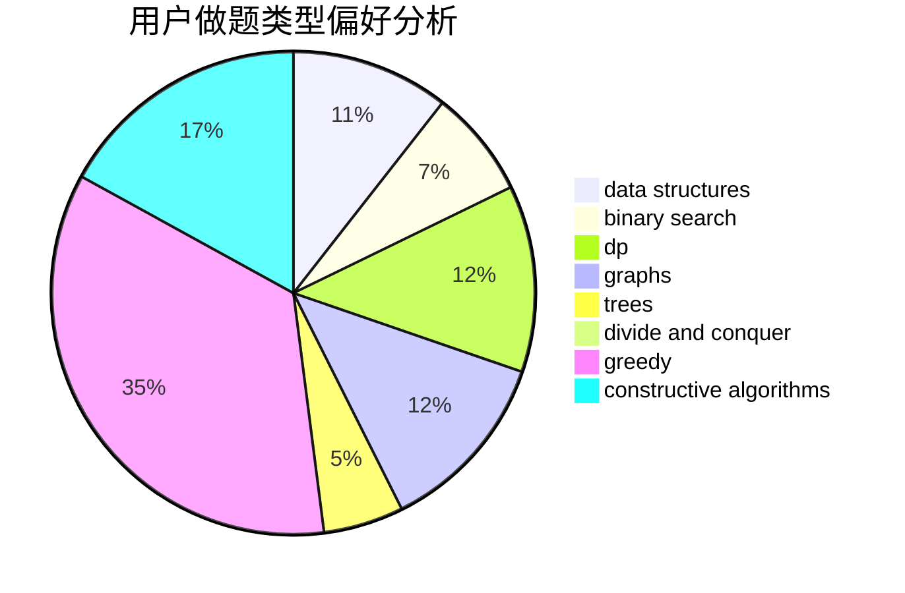
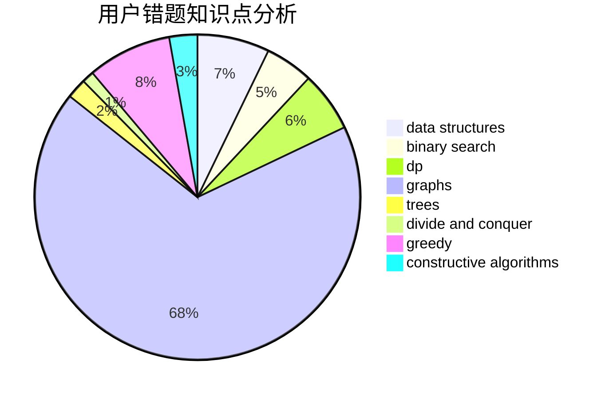

# LaiAng8086

<!-- tabs:start -->

#### **用户提交结果分析**

#### **用户做题类型偏好分析**

#### **用户错题知识点分析**

<!-- tabs:end -->
# 推荐题目
[724E](https://codeforces.com/contest/724/problem/E)		dp,
                        flows,
                        greedy		  
[1086C](https://codeforces.com/contest/1086/problem/C)		dsu,graphs,sortings,trees		  
[849B](https://codeforces.com/contest/849/problem/B)		brute force,
                        geometry		  
[665F](https://codeforces.com/contest/665/problem/F)		data structures,
                        dp,
                        math,
                        number theory,
                        sortings,
                        two pointers		  
[1181B](https://codeforces.com/contest/1181/problem/B)		greedy,
                        implementation,
                        strings		  
[96B](https://codeforces.com/contest/96/problem/B)		binary search,
                        bitmasks,
                        brute force		  
[385E](https://codeforces.com/contest/385/problem/E)		math,
                        matrices		  
[1250B](https://codeforces.com/contest/1250/problem/B)		brute force,
                        constructive algorithms,
                        greedy,
                        math		  
[1298D](https://codeforces.com/contest/1298/problem/D)		dsu,graphs,sortings,trees		  
[815B](https://codeforces.com/contest/815/problem/B)		brute force,
                        combinatorics,
                        constructive algorithms,
                        math		  
