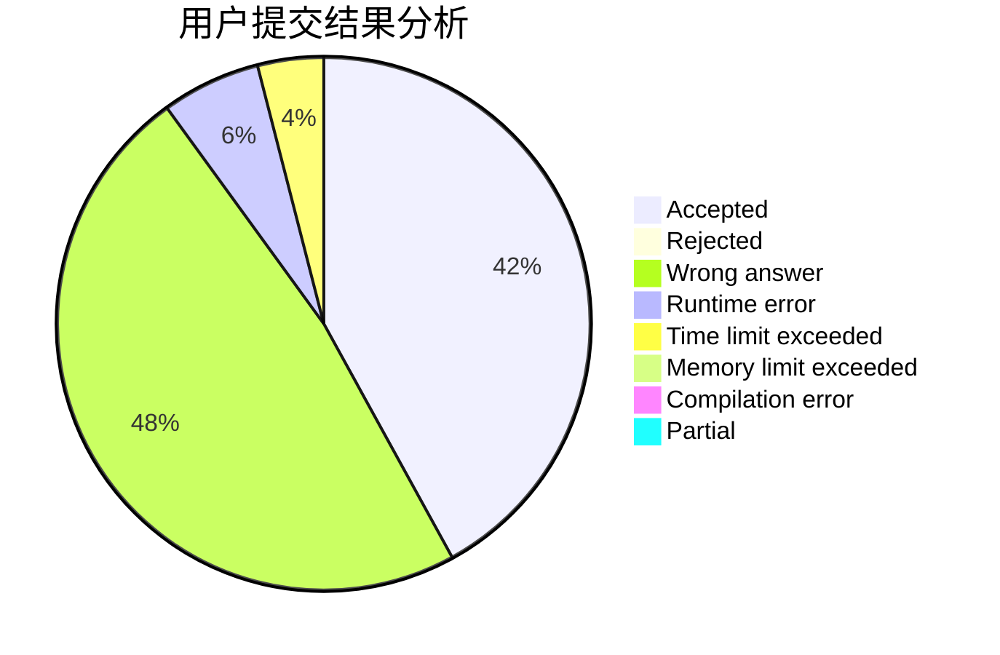
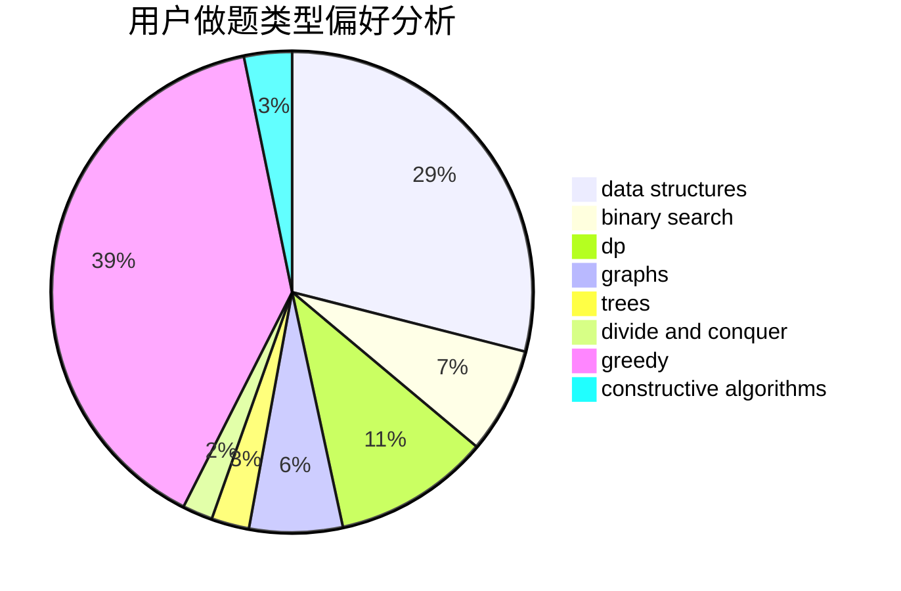
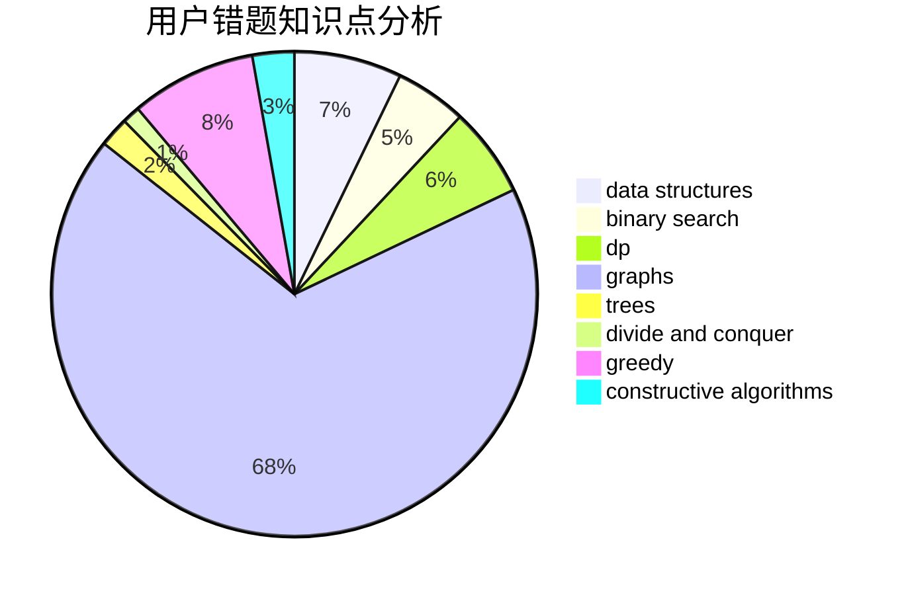

# LaiAng8086

<!-- tabs:start -->

#### **用户提交结果分析**

#### **用户做题类型偏好分析**

#### **用户错题知识点分析**

<!-- tabs:end -->
# 推荐题目
[705C](https://codeforces.com/contest/705/problem/C)		dsu,graphs,sortings,trees		  
[1085G](https://codeforces.com/contest/1085/problem/G)		combinatorics,
                        data structures,
                        dp		  
[831B](https://codeforces.com/contest/831/problem/B)		implementation,
                        strings		  
[633D](https://codeforces.com/contest/633/problem/D)		brute force,
                        dp,
                        hashing,
                        implementation,
                        math		  
[1178F2](https://codeforces.com/contest/1178F/problem/2)		dp		  
[952A](https://codeforces.com/contest/952/problem/A)		math		  
[359B](https://codeforces.com/contest/359/problem/B)		constructive algorithms,
                        dp,
                        math		  
[1244G](https://codeforces.com/contest/1244/problem/G)		constructive algorithms,
                        greedy,
                        math		  
[1291E](https://codeforces.com/contest/1291/problem/E)		dsu,graphs,sortings,trees		  
[800A](https://codeforces.com/contest/800/problem/A)		dsu,graphs,sortings,trees		  
