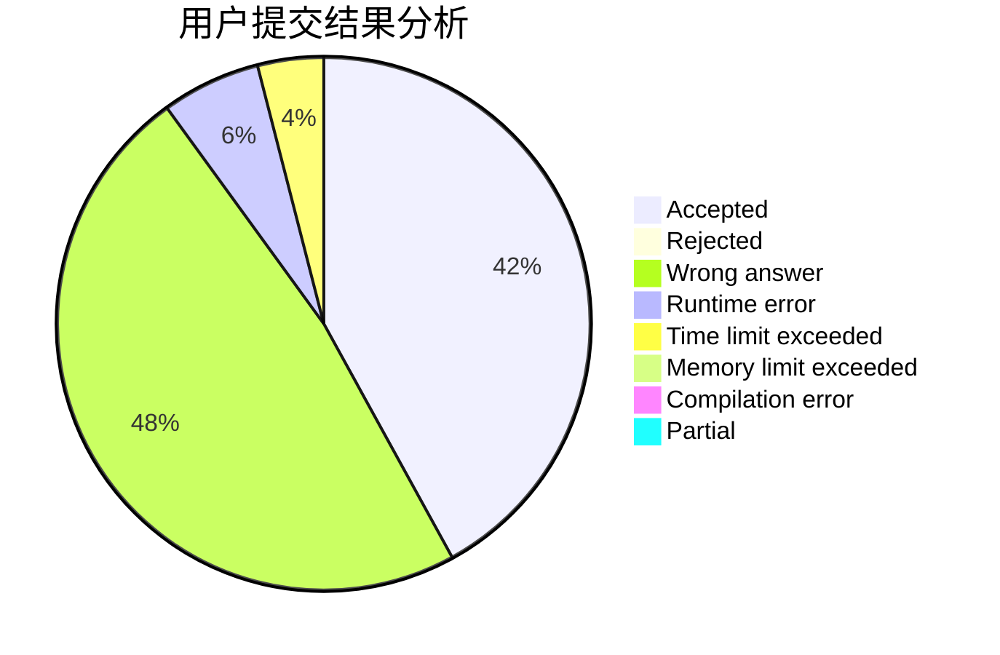
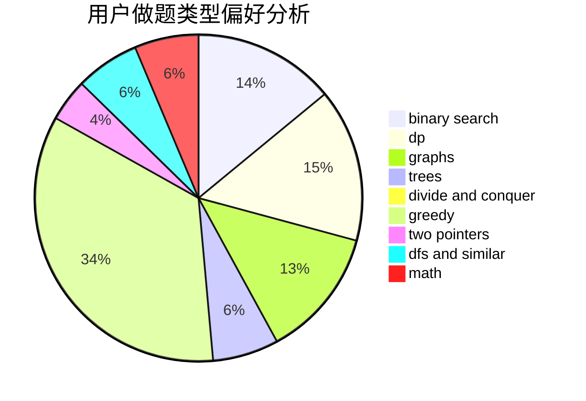

# LaiAng8086

<!-- tabs:start -->

#### **用户提交结果分析**

#### **用户做题类型偏好分析**

<!-- tabs:end -->
# 推荐题目
[724E](https://codeforces.com/contest/724/problem/E)
[1086C](https://codeforces.com/contest/1086/problem/C)
[849B](https://codeforces.com/contest/849/problem/B)
[665F](https://codeforces.com/contest/665/problem/F)
[1181B](https://codeforces.com/contest/1181/problem/B)
[96B](https://codeforces.com/contest/96/problem/B)
[385E](https://codeforces.com/contest/385/problem/E)
[1250B](https://codeforces.com/contest/1250/problem/B)
[1298D](https://codeforces.com/contest/1298/problem/D)
[815B](https://codeforces.com/contest/815/problem/B)
