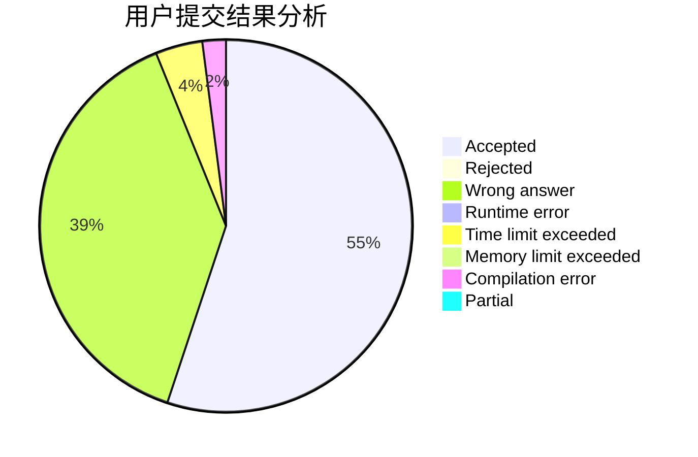
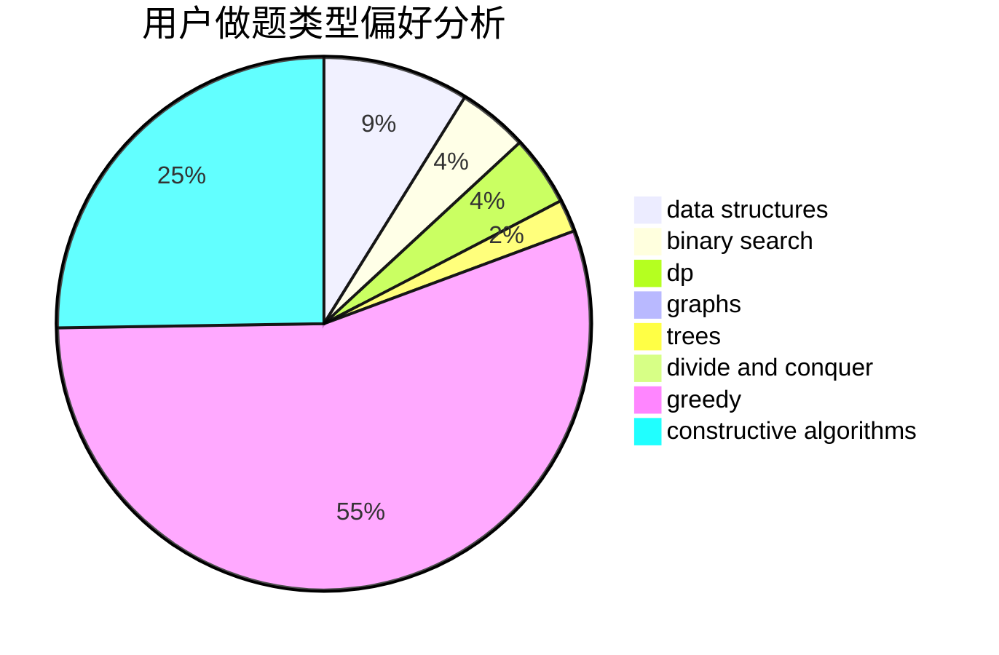
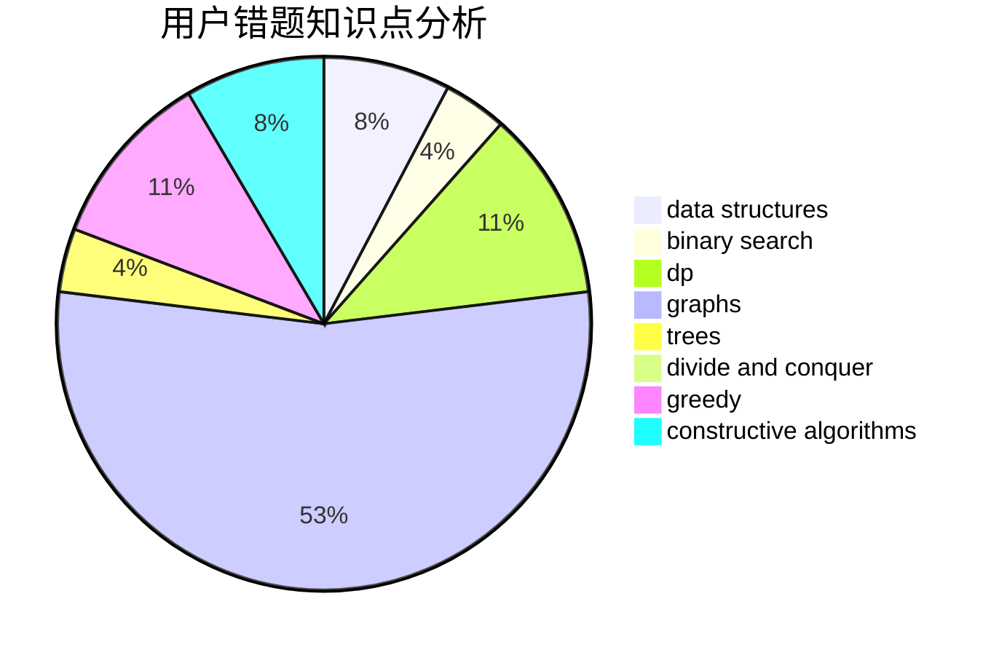

# Lakers_James

<!-- tabs:start -->

#### **用户提交结果分析**

#### **用户做题类型偏好分析**

#### **用户错题知识点分析**

<!-- tabs:end -->
# 推荐题目
[1301C](https://codeforces.com/contest/1301/problem/C)		binary search,
                        combinatorics,
                        greedy,
                        math,
                        strings		  
[1265C](https://codeforces.com/contest/1265/problem/C)		dsu,graphs,sortings,trees		  
[41E](https://codeforces.com/contest/41/problem/E)		constructive algorithms,
                        graphs,
                        greedy		  
[1137B](https://codeforces.com/contest/1137/problem/B)		greedy,
                        hashing,
                        strings		  
[818E](https://codeforces.com/contest/818/problem/E)		binary search,
                        data structures,
                        number theory,
                        two pointers		  
[199E](https://codeforces.com/contest/199/problem/E)		dsu,graphs,sortings,trees		  
[850E](https://codeforces.com/contest/850/problem/E)		bitmasks,
                        brute force,
                        divide and conquer,
                        fft,
                        math		  
[1261F](https://codeforces.com/contest/1261/problem/F)		bitmasks,
                        divide and conquer,
                        math		  
[1380C](https://codeforces.com/contest/1380/problem/C)		brute force,
                        dp,
                        greedy,
                        implementation,
                        sortings		  
[1036E](https://codeforces.com/contest/1036/problem/E)		fft,
                        geometry,
                        number theory		  
