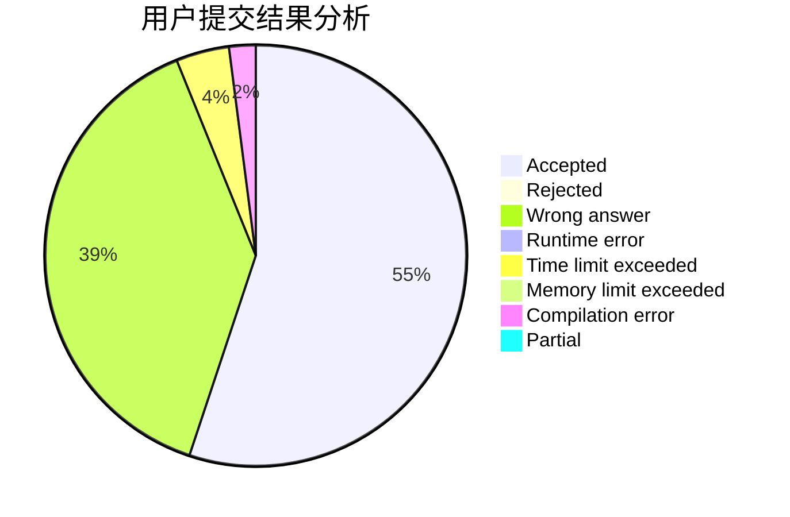
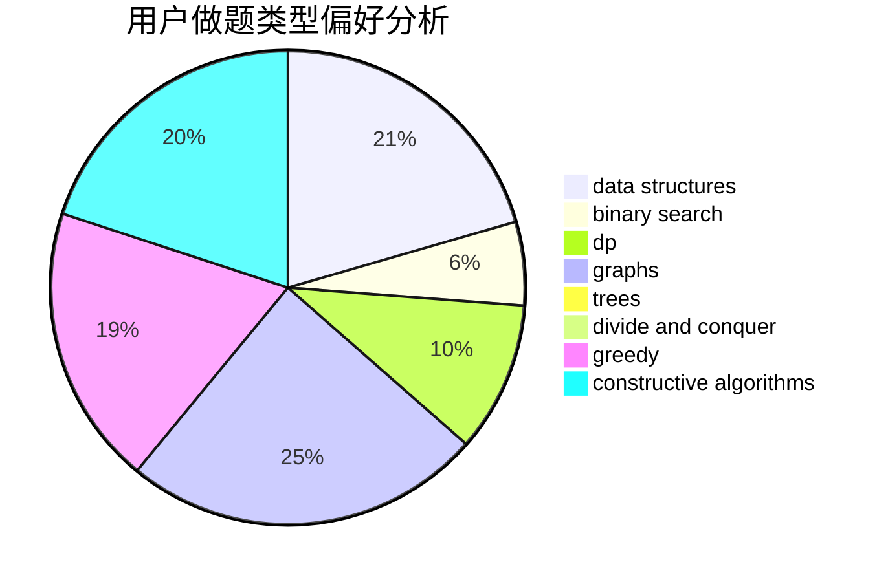
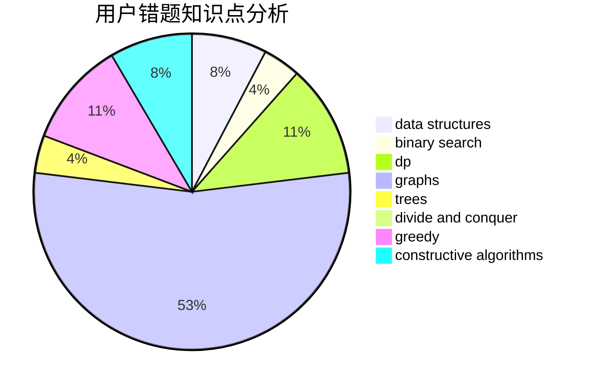

# Lakers_James

<!-- tabs:start -->

#### **用户提交结果分析**

#### **用户做题类型偏好分析**

#### **用户错题知识点分析**

<!-- tabs:end -->
# 推荐题目
[1294F](https://codeforces.com/contest/1294/problem/F)		dfs and similar,
                        dp,
                        greedy,
                        trees		  
[125A](https://codeforces.com/contest/125/problem/A)		math		  
[38G](https://codeforces.com/contest/38/problem/G)		data structures		  
[1133A](https://codeforces.com/contest/1133/problem/A)		implementation		  
[802O](https://codeforces.com/contest/802/problem/O)		binary search,
                        data structures,
                        flows		  
[171G](https://codeforces.com/contest/171/problem/G)		*special problem		  
[832C](https://codeforces.com/contest/832/problem/C)		binary search,
                        implementation,
                        math		  
[1254C](https://codeforces.com/contest/1254/problem/C)		constructive algorithms,
                        geometry,
                        interactive,
                        math		  
[1371E1](https://codeforces.com/contest/1371E/problem/1)		binary search,
                        brute force,
                        combinatorics,
                        math,
                        number theory,
                        sortings		  
[1036B](https://codeforces.com/contest/1036/problem/B)		math		  
