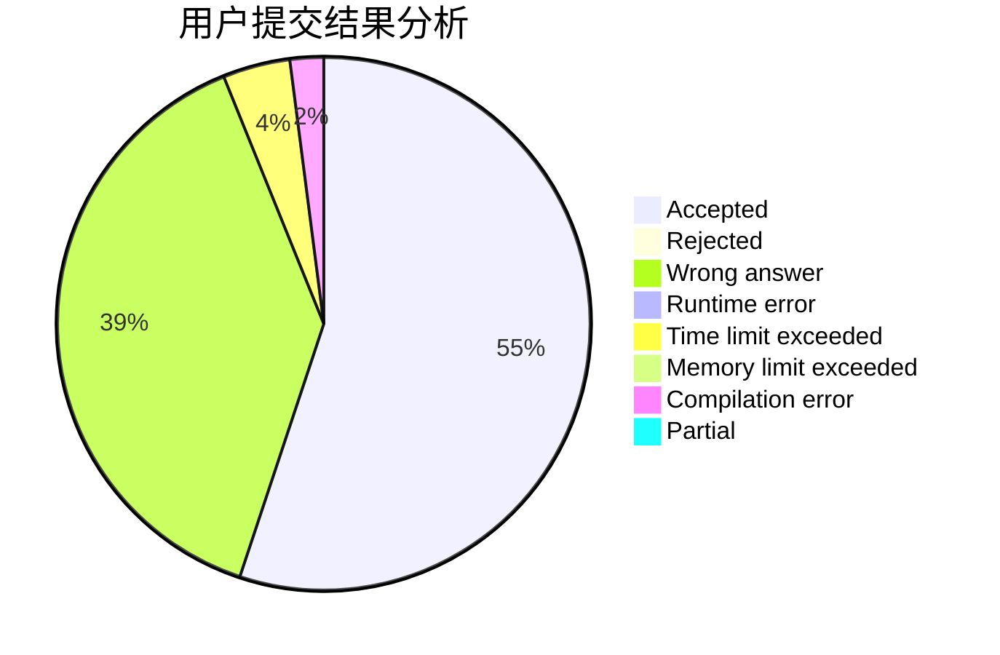
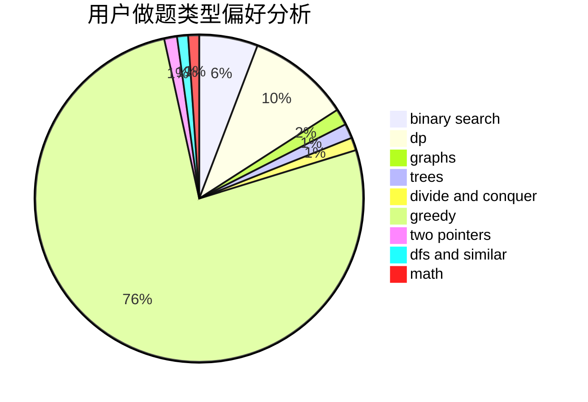

# Lakers_James

<!-- tabs:start -->

#### **用户提交结果分析**

#### **用户做题类型偏好分析**

<!-- tabs:end -->
# 推荐题目
[1301C](https://codeforces.com/contest/1301/problem/C)
[1265C](https://codeforces.com/contest/1265/problem/C)
[41E](https://codeforces.com/contest/41/problem/E)
[1137B](https://codeforces.com/contest/1137/problem/B)
[818E](https://codeforces.com/contest/818/problem/E)
[199E](https://codeforces.com/contest/199/problem/E)
[850E](https://codeforces.com/contest/850/problem/E)
[1261F](https://codeforces.com/contest/1261/problem/F)
[1380C](https://codeforces.com/contest/1380/problem/C)
[1036E](https://codeforces.com/contest/1036/problem/E)
