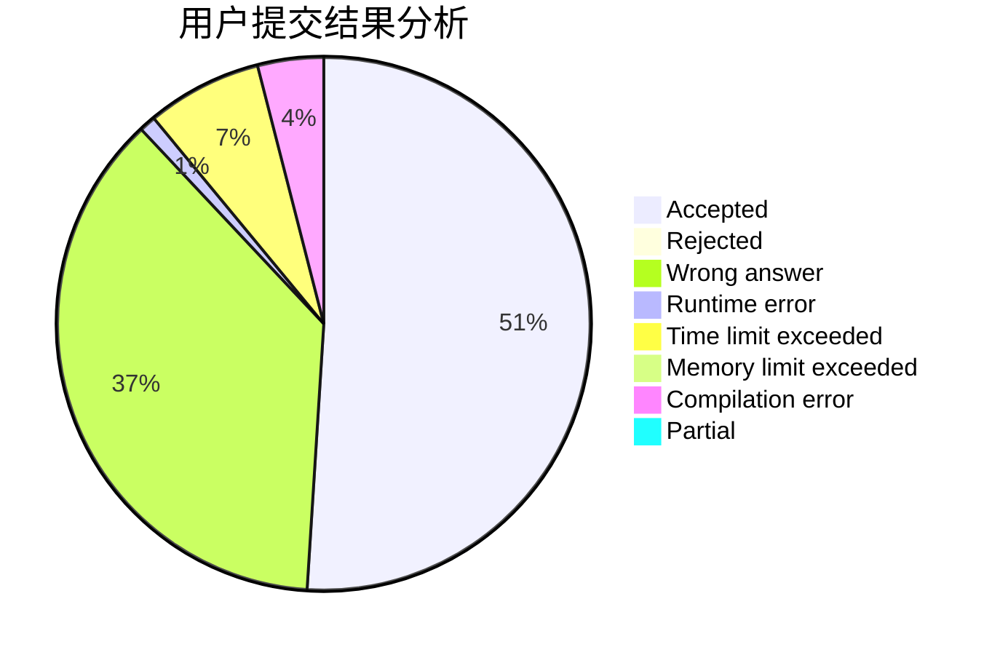
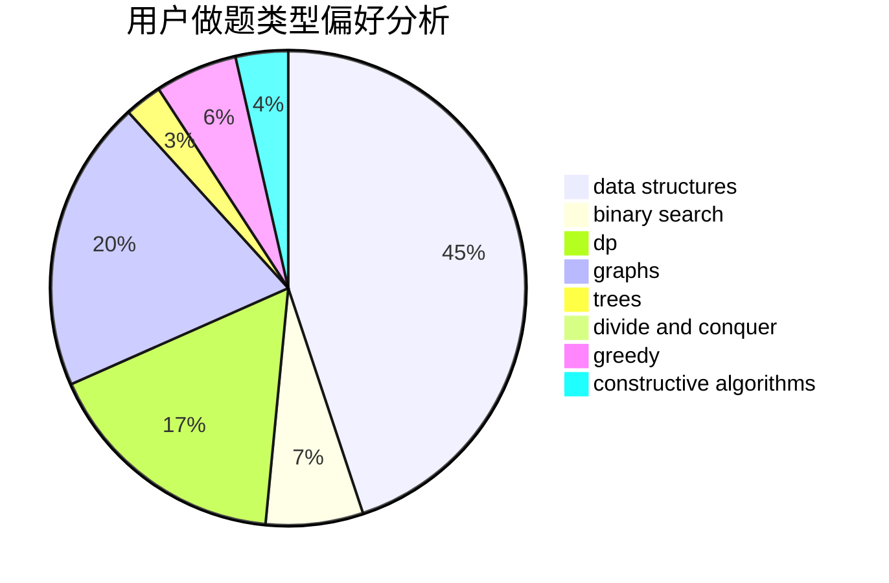
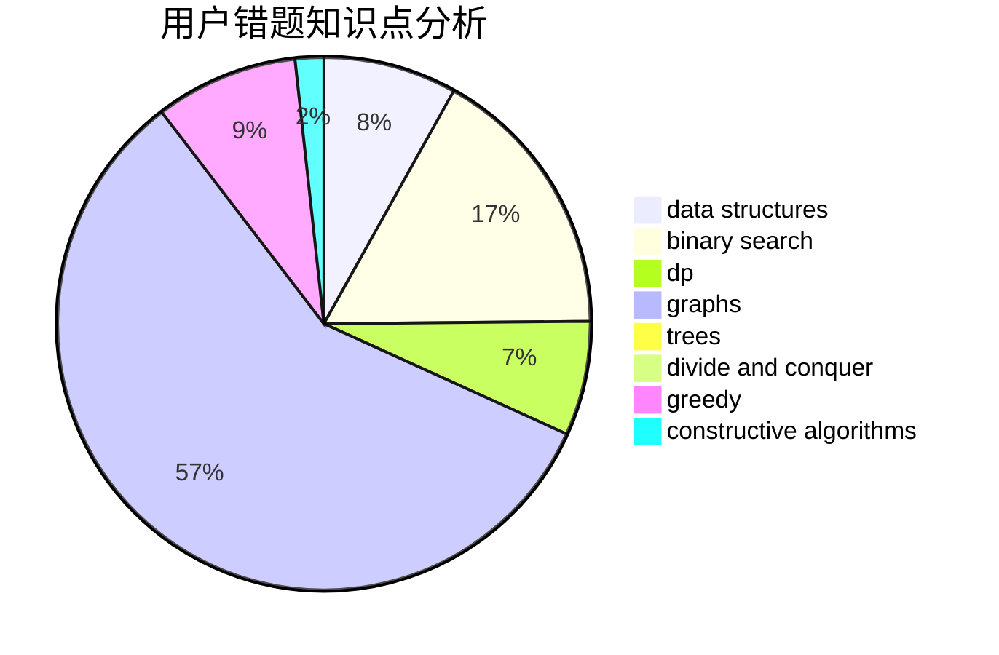

# Lanceloia

<!-- tabs:start -->

#### **用户提交结果分析**

#### **用户做题类型偏好分析**

#### **用户错题知识点分析**

<!-- tabs:end -->
# 推荐题目
[1277B](https://codeforces.com/contest/1277/problem/B)		greedy,
                        number theory		  
[1349E](https://codeforces.com/contest/1349/problem/E)		constructive algorithms,
                        dp,
                        greedy		  
[1399D](https://codeforces.com/contest/1399/problem/D)		constructive algorithms,
                        data structures,
                        greedy,
                        implementation		  
[301D](https://codeforces.com/contest/301/problem/D)		data structures		  
[1015C](https://codeforces.com/contest/1015/problem/C)		sortings		  
[25D](https://codeforces.com/contest/25/problem/D)		dsu,
                        graphs,
                        trees		  
[833D](https://codeforces.com/contest/833/problem/D)		data structures,
                        divide and conquer,
                        implementation,
                        trees		  
[1183F](https://codeforces.com/contest/1183/problem/F)		brute force,
                        math,
                        sortings		  
[817F](https://codeforces.com/contest/817/problem/F)		binary search,
                        data structures,
                        trees		  
[1231C](https://codeforces.com/contest/1231/problem/C)		greedy		  
