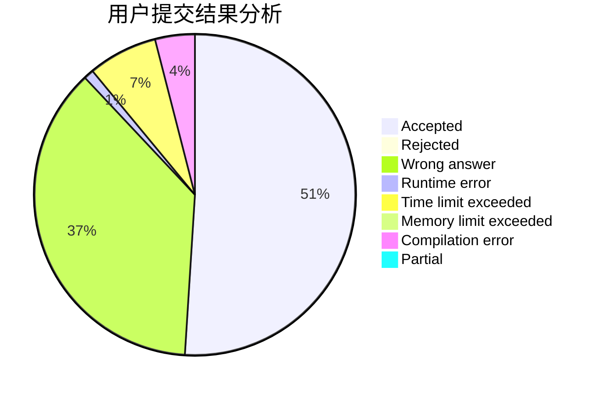
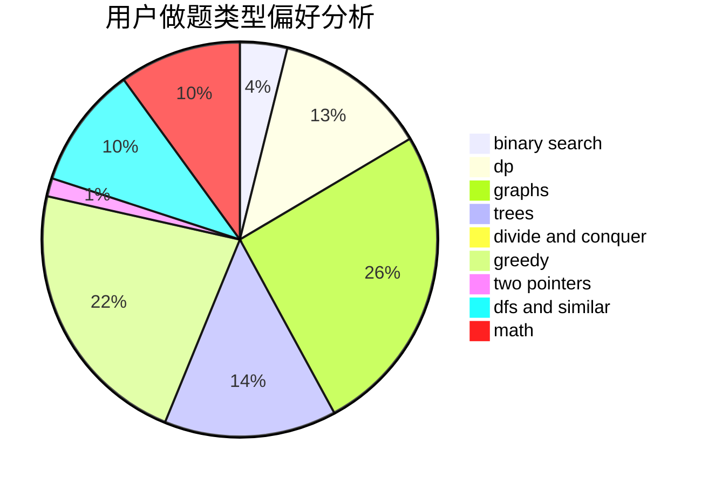

# Lanceloia

<!-- tabs:start -->

#### **用户提交结果分析**

#### **用户做题类型偏好分析**

<!-- tabs:end -->
# 推荐题目
[1283D](https://codeforces.com/contest/1283/problem/D)
[13563](https://codeforces.com/contest/1356/problem/3)
[1408E](https://codeforces.com/contest/1408/problem/E)
[320B](https://codeforces.com/contest/320/problem/B)
[1015D](https://codeforces.com/contest/1015/problem/D)
[277D](https://codeforces.com/contest/277/problem/D)
[851D](https://codeforces.com/contest/851/problem/D)
[1186D](https://codeforces.com/contest/1186/problem/D)
[837F](https://codeforces.com/contest/837/problem/F)
[1239D](https://codeforces.com/contest/1239/problem/D)
