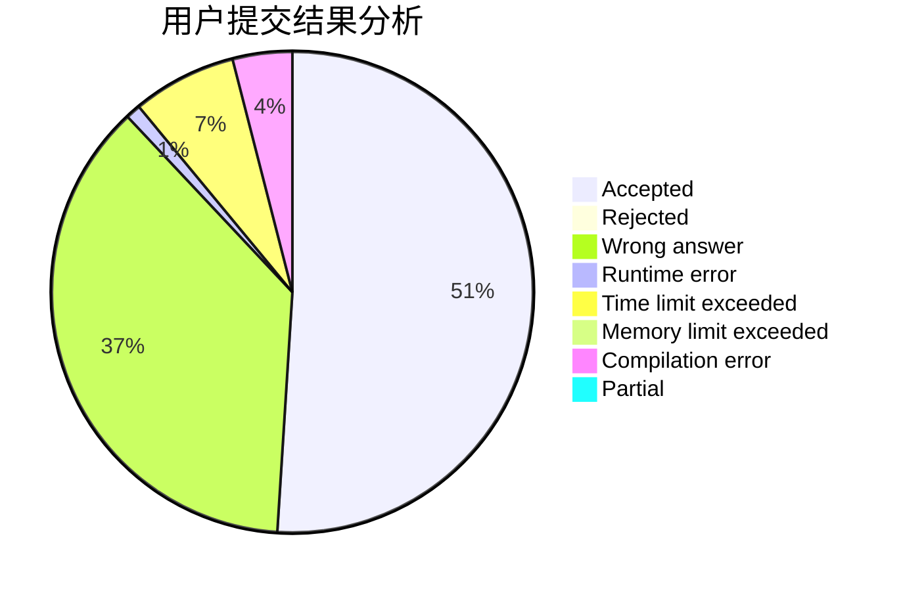
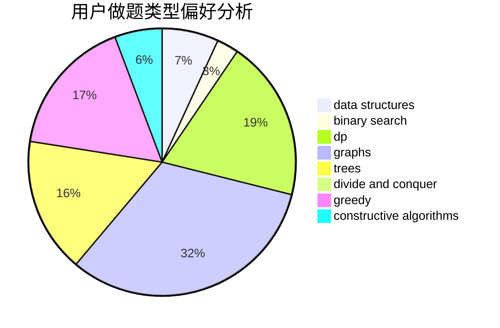
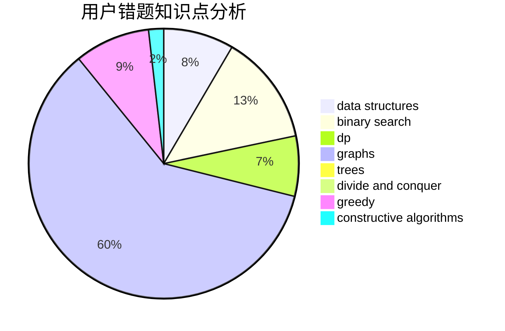

# Lanceloia

<!-- tabs:start -->

#### **用户提交结果分析**

#### **用户做题类型偏好分析**

#### **用户错题知识点分析**

<!-- tabs:end -->
# 推荐题目
[1283D](https://codeforces.com/contest/1283/problem/D)		graphs,
                        greedy,
                        shortest paths		  
[13563](https://codeforces.com/contest/1356/problem/3)		dsu,graphs,sortings,trees		  
[1408E](https://codeforces.com/contest/1408/problem/E)		data structures,
                        dsu,
                        graphs,
                        greedy,
                        sortings,
                        trees		  
[320B](https://codeforces.com/contest/320/problem/B)		dfs and similar,
                        graphs		  
[1015D](https://codeforces.com/contest/1015/problem/D)		constructive algorithms,
                        greedy		  
[277D](https://codeforces.com/contest/277/problem/D)		dp,
                        probabilities		  
[851D](https://codeforces.com/contest/851/problem/D)		dsu,graphs,sortings,trees		  
[1186D](https://codeforces.com/contest/1186/problem/D)		constructive algorithms,
                        greedy,
                        math		  
[837F](https://codeforces.com/contest/837/problem/F)		binary search,
                        brute force,
                        combinatorics,
                        math,
                        matrices		  
[1239D](https://codeforces.com/contest/1239/problem/D)		2-sat,
                        dfs and similar,
                        graph matchings,
                        graphs		  
