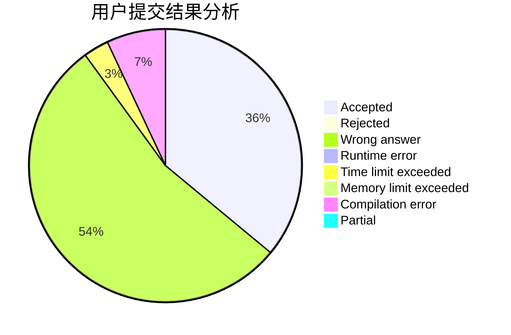
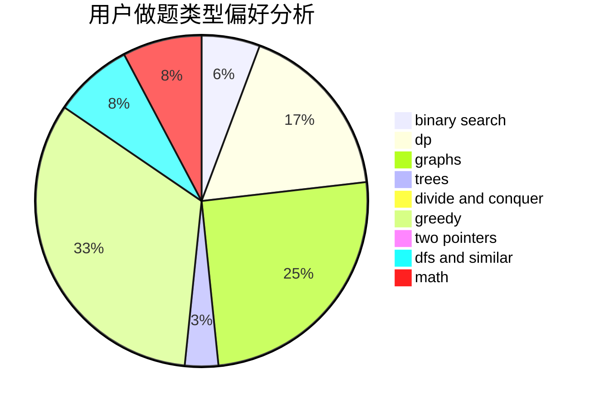

# Larry0101

<!-- tabs:start -->

#### **用户提交结果分析**

#### **用户做题类型偏好分析**

<!-- tabs:end -->
# 推荐题目
[732B](https://codeforces.com/contest/732/problem/B)
[723D](https://codeforces.com/contest/723/problem/D)
[792E](https://codeforces.com/contest/792/problem/E)
[576C](https://codeforces.com/contest/576/problem/C)
[975A](https://codeforces.com/contest/975/problem/A)
[852G](https://codeforces.com/contest/852/problem/G)
[620D](https://codeforces.com/contest/620/problem/D)
[830D](https://codeforces.com/contest/830/problem/D)
[293C](https://codeforces.com/contest/293/problem/C)
[1036B](https://codeforces.com/contest/1036/problem/B)
