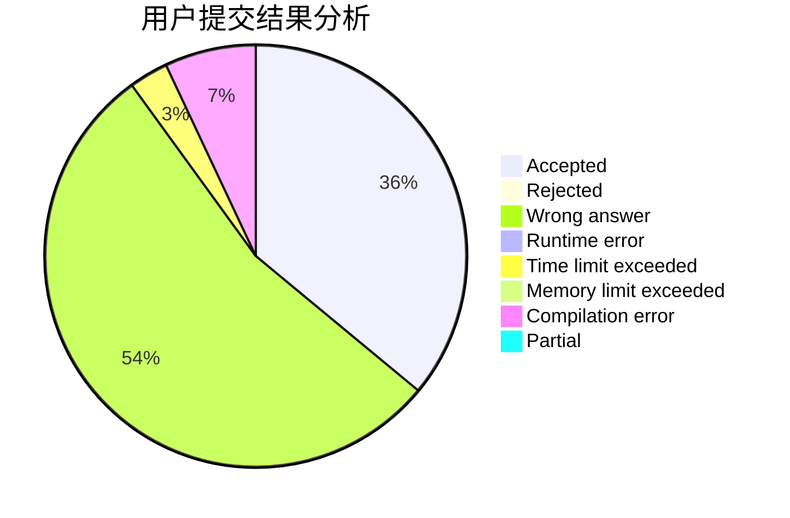
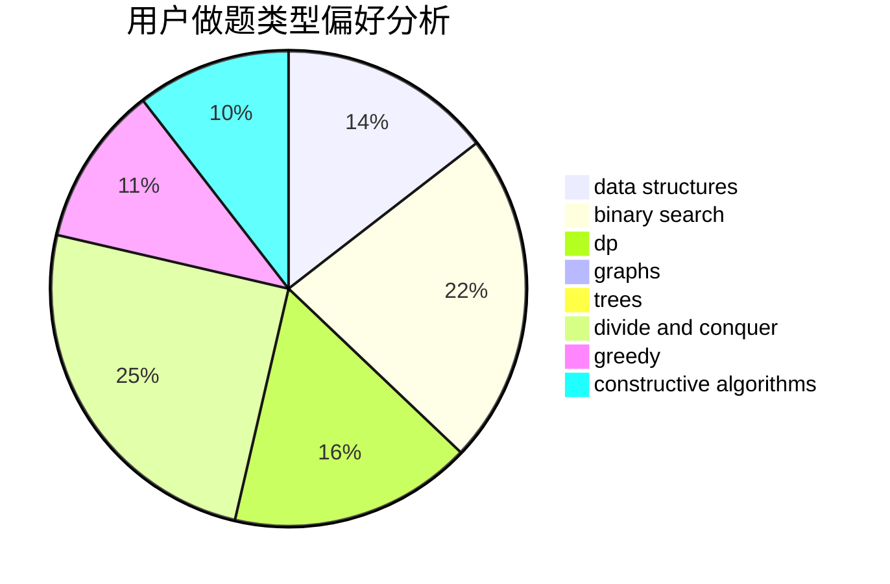
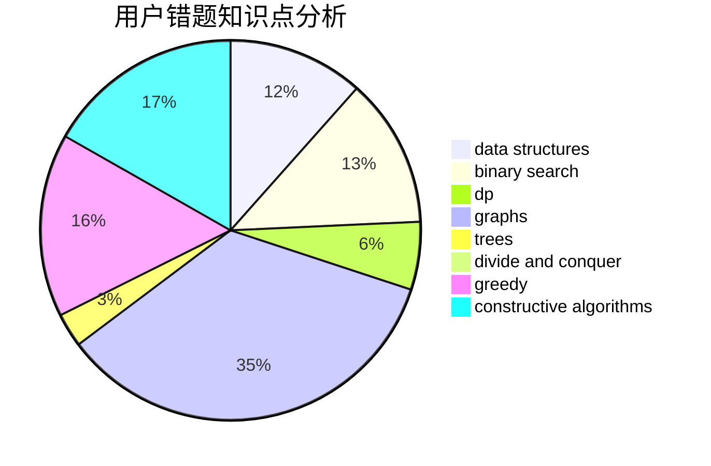

# Larry0101

<!-- tabs:start -->

#### **用户提交结果分析**

#### **用户做题类型偏好分析**

#### **用户错题知识点分析**

<!-- tabs:end -->
# 推荐题目
[713A](https://codeforces.com/contest/713/problem/A)		data structures,
                        implementation		  
[704D](https://codeforces.com/contest/704/problem/D)		flows,
                        greedy		  
[773E](https://codeforces.com/contest/773/problem/E)		data structures,
                        sortings		  
[551B](https://codeforces.com/contest/551/problem/B)		brute force,
                        constructive algorithms,
                        implementation,
                        strings		  
[952B](https://codeforces.com/contest/952/problem/B)		brute force,
                        interactive		  
[835A](https://codeforces.com/contest/835/problem/A)		math		  
[601B](https://codeforces.com/contest/601/problem/B)		data structures,
                        math		  
[812A](https://codeforces.com/contest/812/problem/A)		implementation		  
[278C](https://codeforces.com/contest/278/problem/C)		dsu,graphs,sortings,trees		  
[1034D](https://codeforces.com/contest/1034/problem/D)		binary search,
                        data structures,
                        two pointers		  
