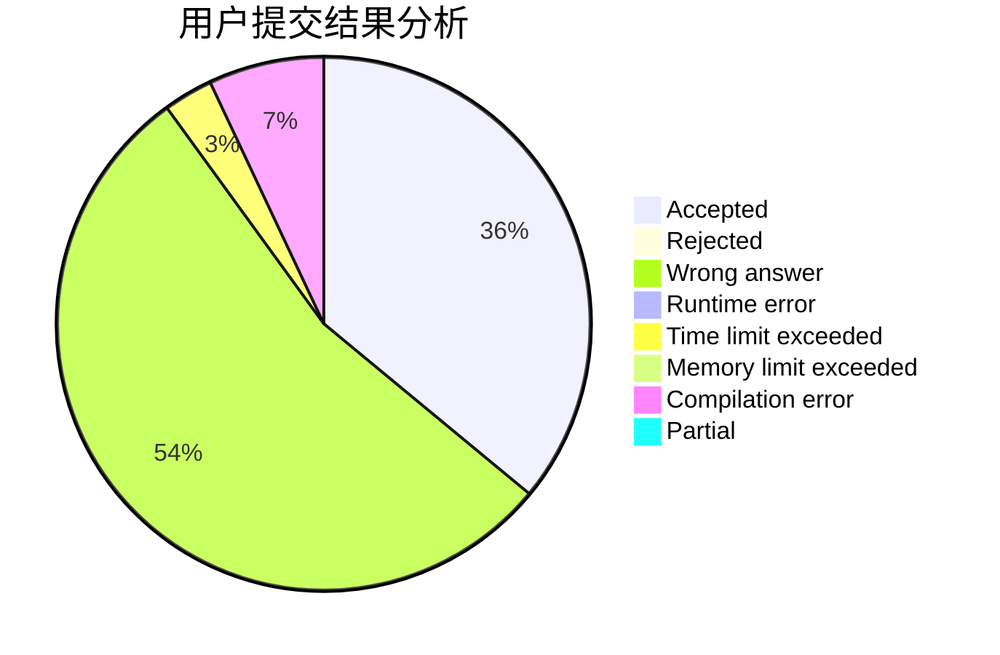
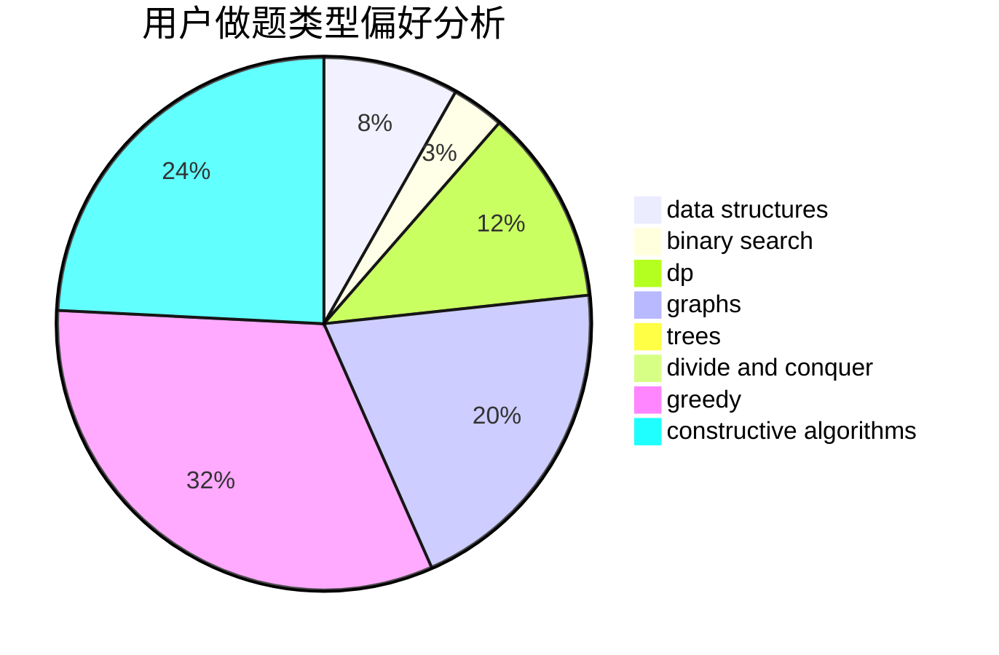
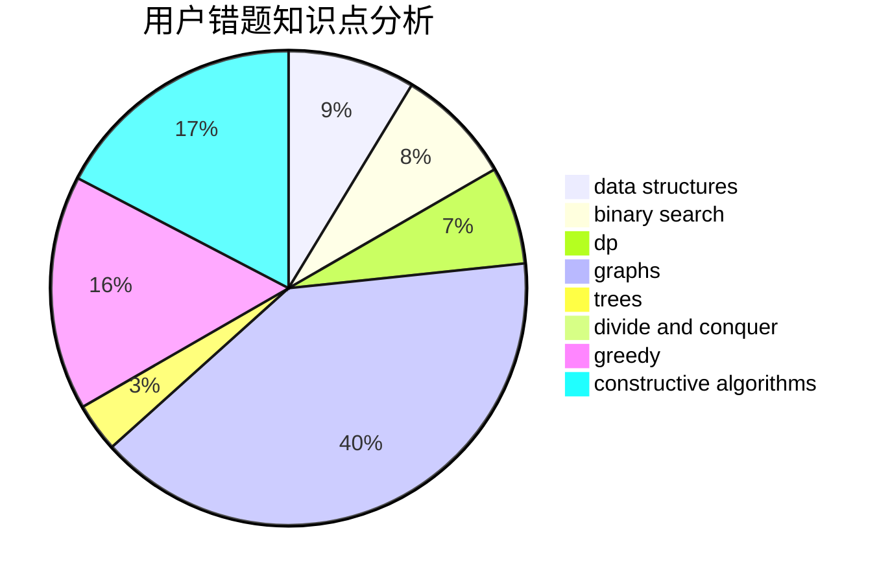

# Larry0101

<!-- tabs:start -->

#### **用户提交结果分析**

#### **用户做题类型偏好分析**

#### **用户错题知识点分析**

<!-- tabs:end -->
# 推荐题目
[732B](https://codeforces.com/contest/732/problem/B)		dp,
                        greedy		  
[723D](https://codeforces.com/contest/723/problem/D)		dfs and similar,
                        dsu,
                        graphs,
                        greedy,
                        implementation		  
[792E](https://codeforces.com/contest/792/problem/E)		greedy,
                        math,
                        number theory		  
[576C](https://codeforces.com/contest/576/problem/C)		constructive algorithms,
                        divide and conquer,
                        geometry,
                        greedy,
                        sortings		  
[975A](https://codeforces.com/contest/975/problem/A)		implementation,
                        strings		  
[852G](https://codeforces.com/contest/852/problem/G)		implementation		  
[620D](https://codeforces.com/contest/620/problem/D)		binary search,
                        two pointers		  
[830D](https://codeforces.com/contest/830/problem/D)		combinatorics,
                        dp,
                        graphs,
                        trees		  
[293C](https://codeforces.com/contest/293/problem/C)		brute force,
                        math,
                        number theory		  
[1036B](https://codeforces.com/contest/1036/problem/B)		math		  
