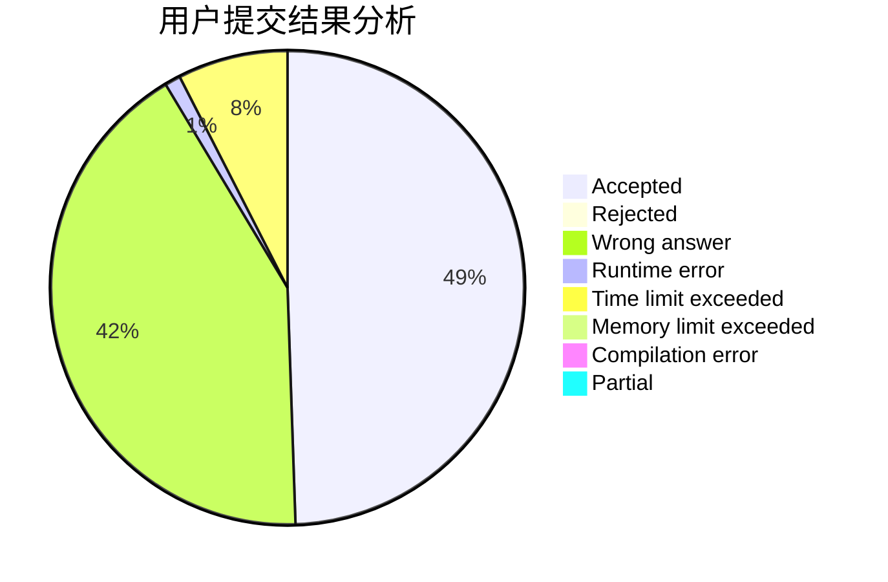
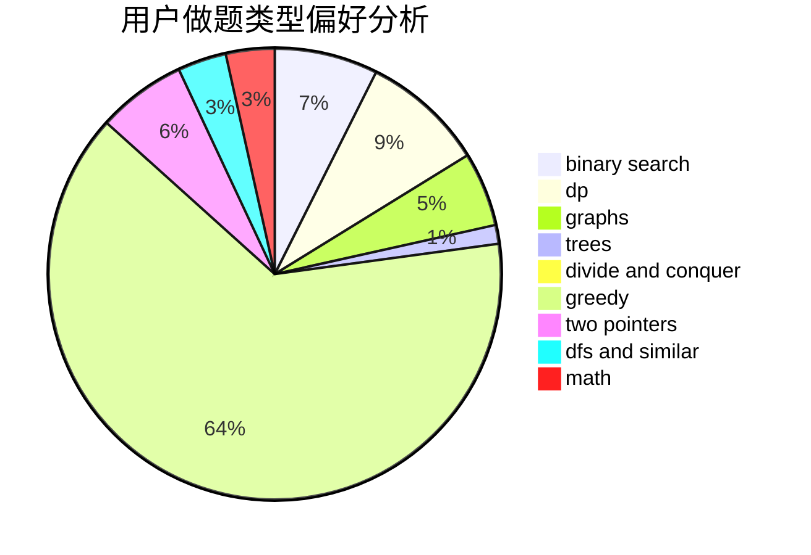

# LastDawn

<!-- tabs:start -->

#### **用户提交结果分析**

#### **用户做题类型偏好分析**

<!-- tabs:end -->
# 推荐题目
[843A](https://codeforces.com/contest/843/problem/A)
[61E](https://codeforces.com/contest/61/problem/E)
[494B](https://codeforces.com/contest/494/problem/B)
[743E](https://codeforces.com/contest/743/problem/E)
[954I](https://codeforces.com/contest/954/problem/I)
[784C](https://codeforces.com/contest/784/problem/C)
[426B](https://codeforces.com/contest/426/problem/B)
[584E](https://codeforces.com/contest/584/problem/E)
[424D](https://codeforces.com/contest/424/problem/D)
[446D](https://codeforces.com/contest/446/problem/D)
