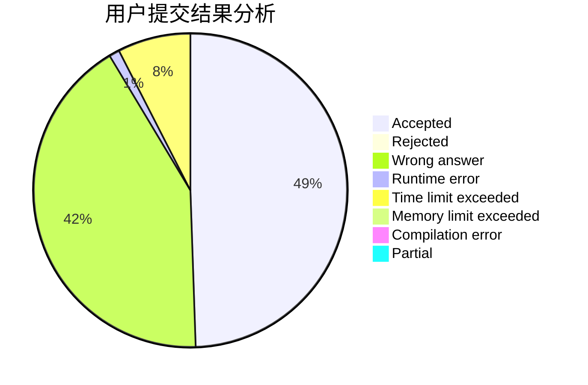
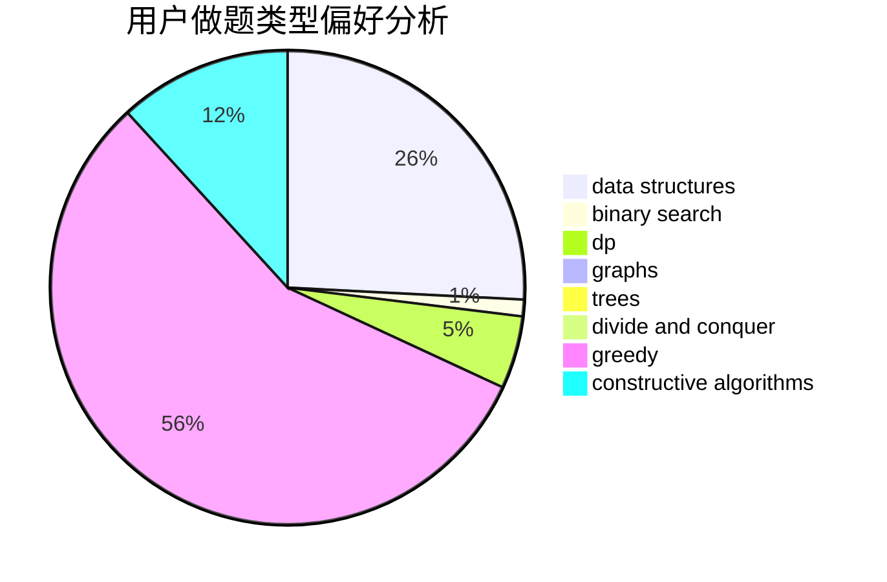
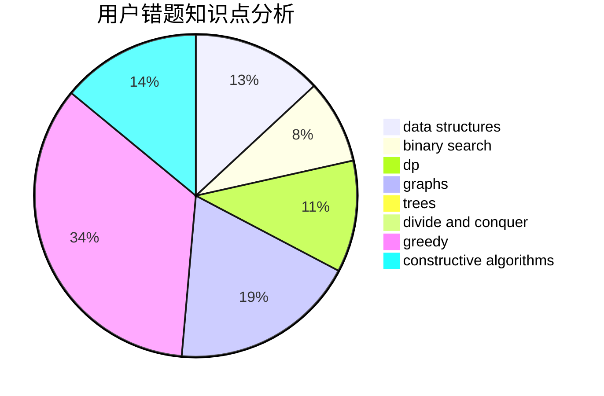

# LastDawn

<!-- tabs:start -->

#### **用户提交结果分析**

#### **用户做题类型偏好分析**

#### **用户错题知识点分析**

<!-- tabs:end -->
# 推荐题目
[843A](https://codeforces.com/contest/843/problem/A)		dfs and similar,
                        dsu,
                        implementation,
                        math,
                        sortings		  
[61E](https://codeforces.com/contest/61/problem/E)		data structures,
                        trees		  
[494B](https://codeforces.com/contest/494/problem/B)		dp,
                        strings		  
[743E](https://codeforces.com/contest/743/problem/E)		binary search,
                        bitmasks,
                        brute force,
                        dp		  
[954I](https://codeforces.com/contest/954/problem/I)		fft,
                        math		  
[784C](https://codeforces.com/contest/784/problem/C)		*special problem,
                        implementation		  
[426B](https://codeforces.com/contest/426/problem/B)		implementation		  
[584E](https://codeforces.com/contest/584/problem/E)		constructive algorithms,
                        greedy,
                        math		  
[424D](https://codeforces.com/contest/424/problem/D)		binary search,
                        brute force,
                        constructive algorithms,
                        data structures,
                        dp		  
[446D](https://codeforces.com/contest/446/problem/D)		math,
                        matrices,
                        probabilities		  
