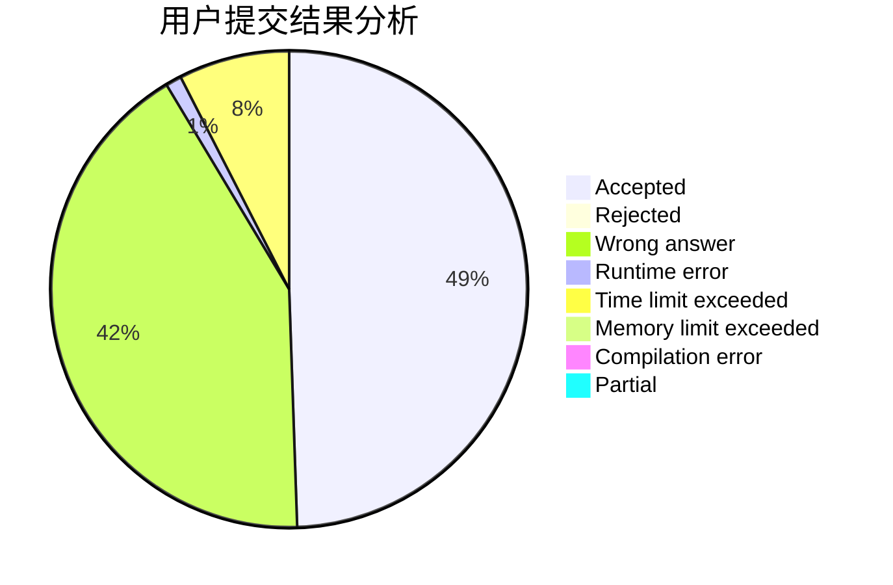
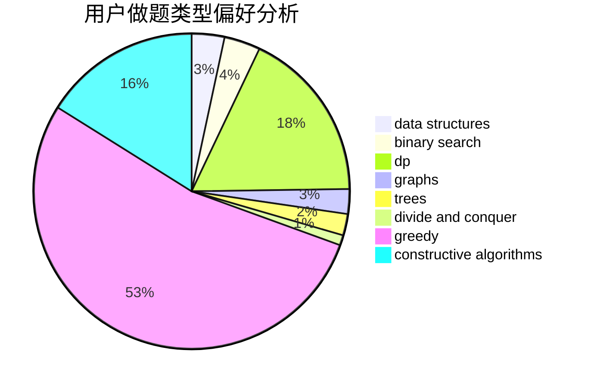
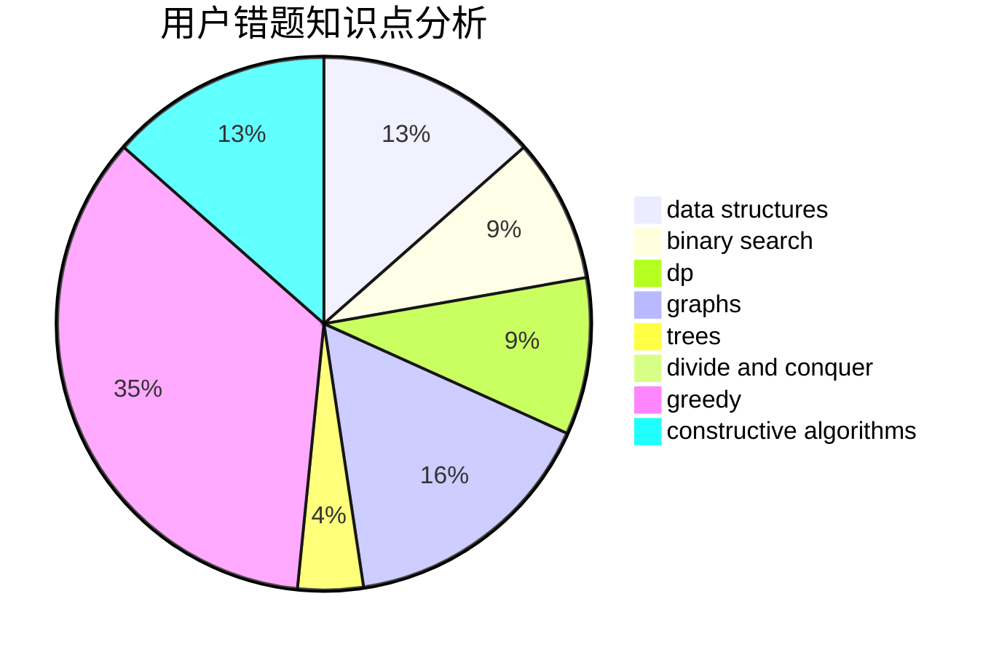

# LastDawn

<!-- tabs:start -->

#### **用户提交结果分析**

#### **用户做题类型偏好分析**

#### **用户错题知识点分析**

<!-- tabs:end -->
# 推荐题目
[825A](https://codeforces.com/contest/825/problem/A)		implementation		  
[600D](https://codeforces.com/contest/600/problem/D)		geometry		  
[475B](https://codeforces.com/contest/475/problem/B)		brute force,
                        dfs and similar,
                        graphs,
                        implementation		  
[725E](https://codeforces.com/contest/725/problem/E)		brute force,
                        greedy		  
[932G](https://codeforces.com/contest/932/problem/G)		dp,
                        string suffix structures,
                        strings		  
[764E](https://codeforces.com/contest/764/problem/E)		dsu,graphs,sortings,trees		  
[39D](https://codeforces.com/contest/39/problem/D)		math		  
[566A](https://codeforces.com/contest/566/problem/A)		dfs and similar,
                        strings,
                        trees		  
[398A](https://codeforces.com/contest/398/problem/A)		constructive algorithms,
                        implementation		  
[421B](https://codeforces.com/contest/421/problem/B)		dsu,graphs,sortings,trees		  
