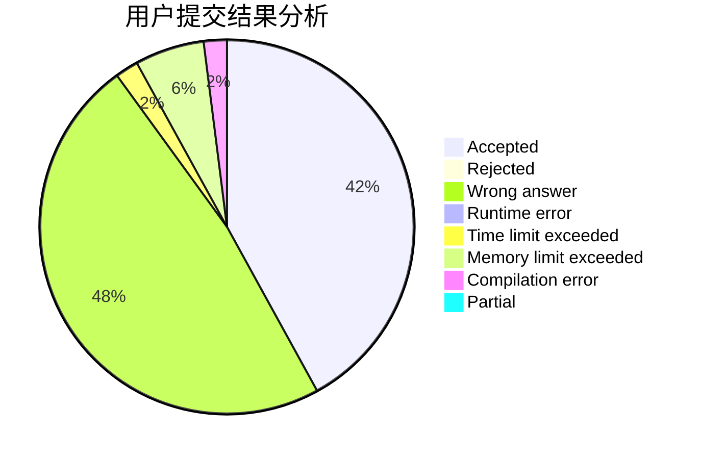
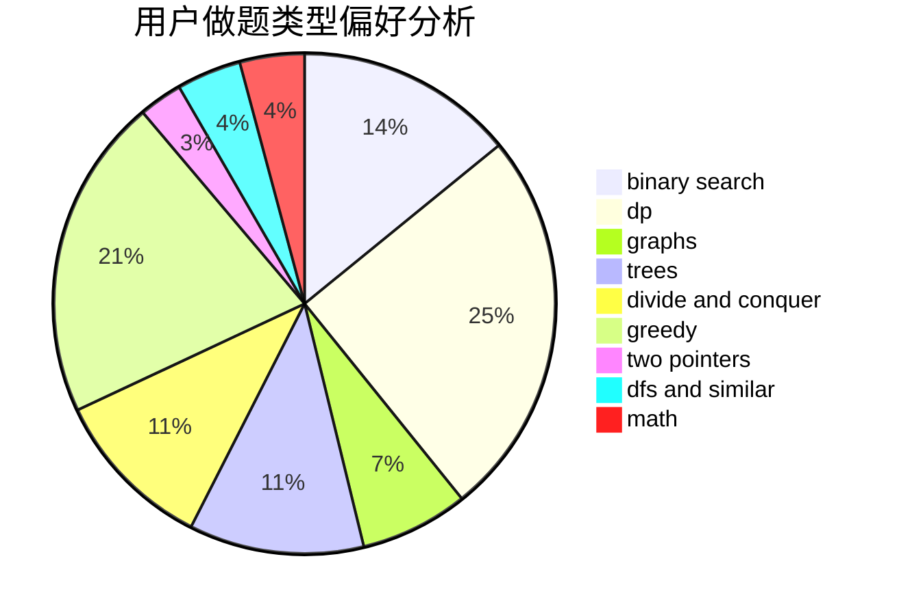

# Last_Beloved

<!-- tabs:start -->

#### **用户提交结果分析**

#### **用户做题类型偏好分析**

<!-- tabs:end -->
# 推荐题目
[1005D](https://codeforces.com/contest/1005/problem/D)
[25D](https://codeforces.com/contest/25/problem/D)
[1372F](https://codeforces.com/contest/1372/problem/F)
[812A](https://codeforces.com/contest/812/problem/A)
[477D](https://codeforces.com/contest/477/problem/D)
[600B](https://codeforces.com/contest/600/problem/B)
[895D](https://codeforces.com/contest/895/problem/D)
[457E](https://codeforces.com/contest/457/problem/E)
[445A](https://codeforces.com/contest/445/problem/A)
[1113F](https://codeforces.com/contest/1113/problem/F)
