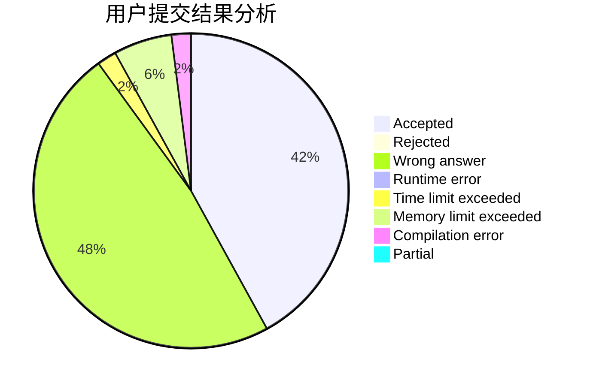
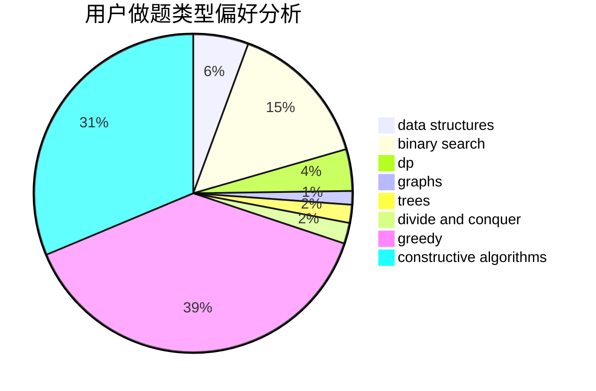

# Last_Beloved

<!-- tabs:start -->

#### **用户提交结果分析**

#### **用户做题类型偏好分析**

#### **用户错题知识点分析**

<!-- tabs:end -->
# 推荐题目
[1005C](https://codeforces.com/contest/1005/problem/C)		brute force,
                        greedy,
                        implementation		  
[238A](https://codeforces.com/contest/238/problem/A)		constructive algorithms,
                        math		  
[1366A](https://codeforces.com/contest/1366/problem/A)		binary search,
                        greedy,
                        math		  
[798A](https://codeforces.com/contest/798/problem/A)		brute force,
                        constructive algorithms,
                        strings		  
[457D](https://codeforces.com/contest/457/problem/D)		combinatorics,
                        math,
                        probabilities		  
[57D](https://codeforces.com/contest/57/problem/D)		dp,
                        math		  
[875D](https://codeforces.com/contest/875/problem/D)		binary search,
                        bitmasks,
                        combinatorics,
                        data structures,
                        divide and conquer		  
[436E](https://codeforces.com/contest/436/problem/E)		data structures,
                        greedy		  
[41B](https://codeforces.com/contest/41/problem/B)		brute force		  
[1113B](https://codeforces.com/contest/1113/problem/B)		greedy,
                        number theory		  
