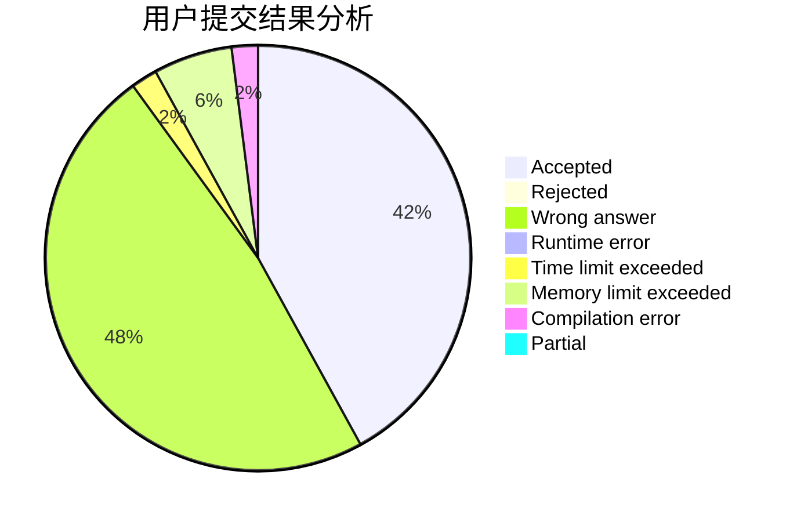
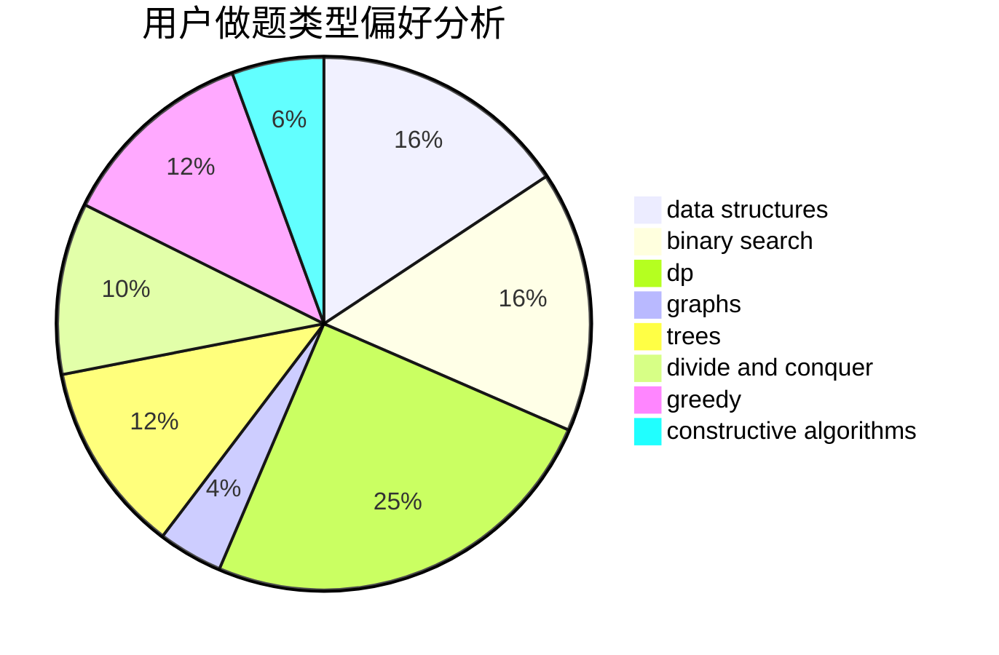

# Last_Beloved

<!-- tabs:start -->

#### **用户提交结果分析**

#### **用户做题类型偏好分析**

#### **用户错题知识点分析**

<!-- tabs:end -->
# 推荐题目
[1005D](https://codeforces.com/contest/1005/problem/D)		dp,
                        greedy,
                        number theory		  
[25D](https://codeforces.com/contest/25/problem/D)		dsu,
                        graphs,
                        trees		  
[1372F](https://codeforces.com/contest/1372/problem/F)		binary search,
                        divide and conquer,
                        interactive		  
[812A](https://codeforces.com/contest/812/problem/A)		implementation		  
[477D](https://codeforces.com/contest/477/problem/D)		dp,
                        strings		  
[600B](https://codeforces.com/contest/600/problem/B)		binary search,
                        data structures,
                        sortings,
                        two pointers		  
[895D](https://codeforces.com/contest/895/problem/D)		combinatorics,
                        math,
                        strings		  
[457E](https://codeforces.com/contest/457/problem/E)		constructive algorithms,
                        flows,
                        math		  
[445A](https://codeforces.com/contest/445/problem/A)		dfs and similar,
                        implementation		  
[1113F](https://codeforces.com/contest/1113/problem/F)		dsu,graphs,sortings,trees		  
