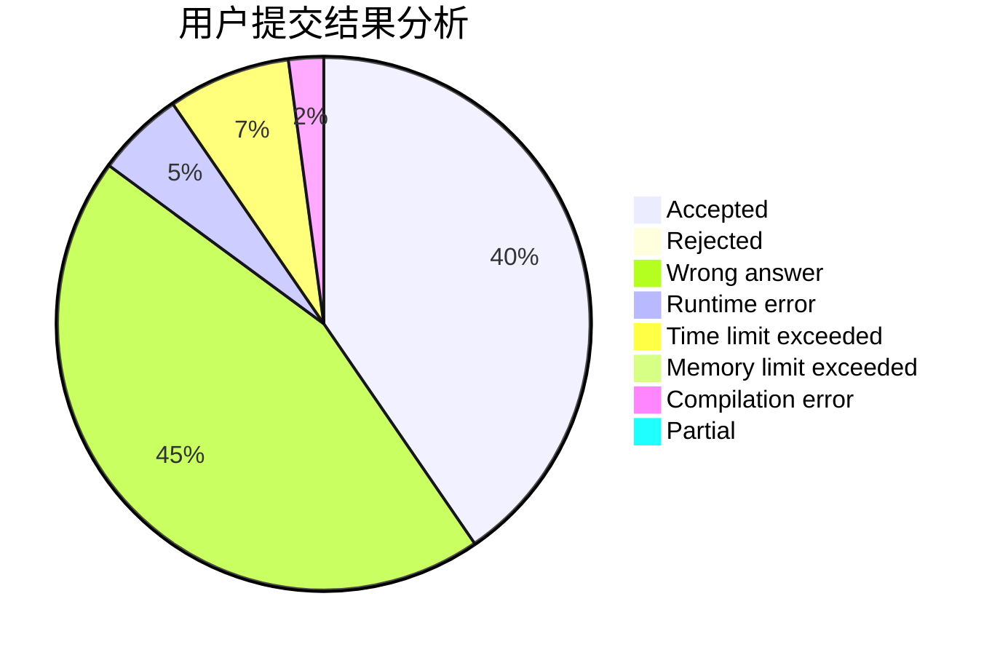
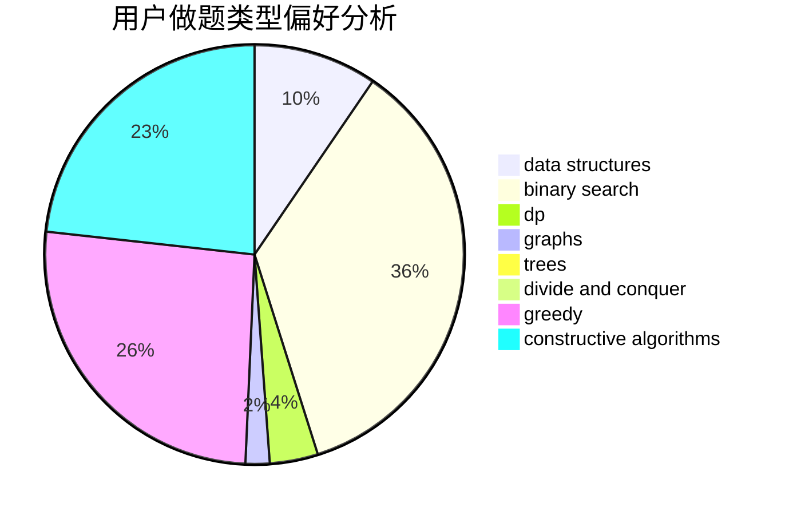
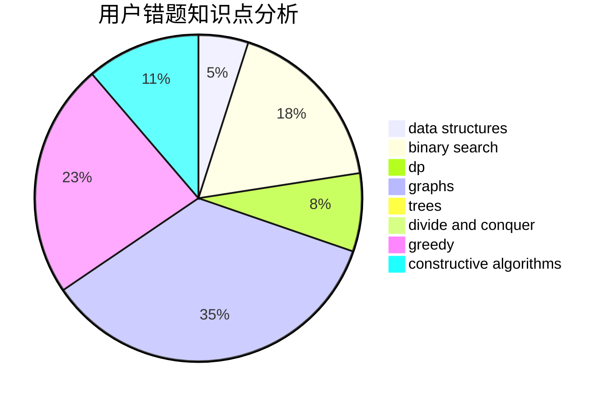

# Last_whisper

<!-- tabs:start -->

#### **用户提交结果分析**

#### **用户做题类型偏好分析**

#### **用户错题知识点分析**

<!-- tabs:end -->
# 推荐题目
[838A](https://codeforces.com/contest/838/problem/A)		brute force		  
[1505C](https://codeforces.com/contest/1505/problem/C)		implementation		  
[1292F](https://codeforces.com/contest/1292/problem/F)		bitmasks,
                        combinatorics,
                        dp		  
[574A](https://codeforces.com/contest/574/problem/A)		greedy,
                        implementation		  
[1354E](https://codeforces.com/contest/1354/problem/E)		dfs and similar,
                        dp,
                        graphs		  
[809C](https://codeforces.com/contest/809/problem/C)		combinatorics,
                        divide and conquer,
                        dp		  
[1172E](https://codeforces.com/contest/1172/problem/E)		data structures		  
[513E2](https://codeforces.com/contest/513E/problem/2)		dp		  
[1239D](https://codeforces.com/contest/1239/problem/D)		2-sat,
                        dfs and similar,
                        graph matchings,
                        graphs		  
[1482E](https://codeforces.com/contest/1482/problem/E)		data structures,
                        divide and conquer,
                        dp		  
