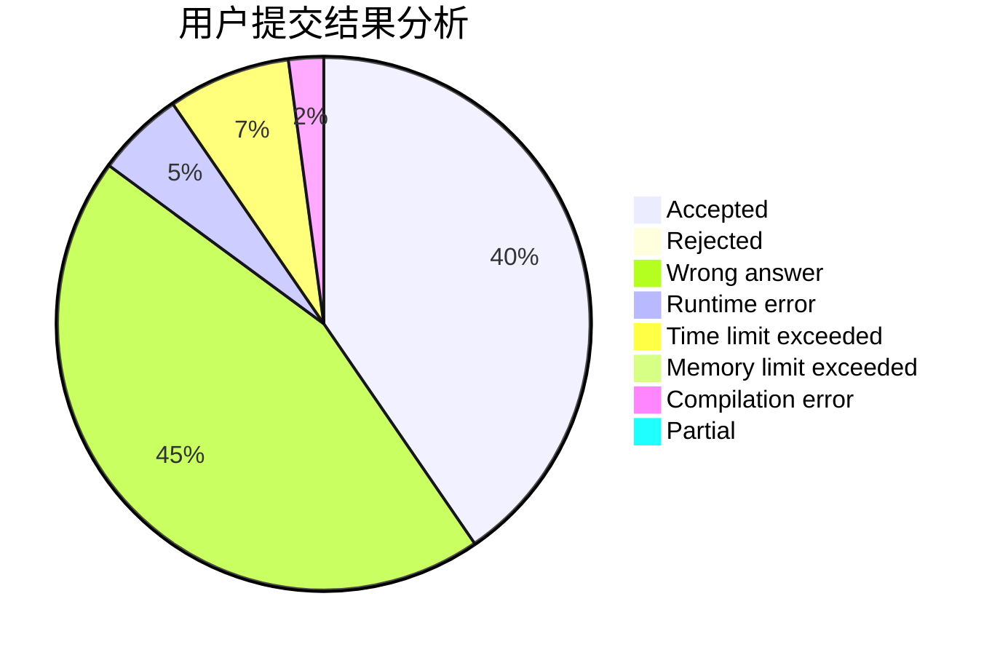
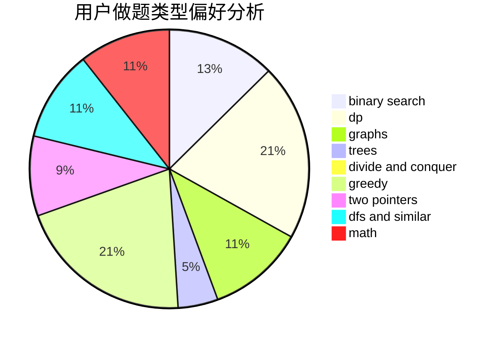

# Last_whisper

<!-- tabs:start -->

#### **用户提交结果分析**

#### **用户做题类型偏好分析**

<!-- tabs:end -->
# 推荐题目
[855F](https://codeforces.com/contest/855/problem/F)
[152D](https://codeforces.com/contest/152/problem/D)
[12A](https://codeforces.com/contest/12/problem/A)
[593E](https://codeforces.com/contest/593/problem/E)
[1361B](https://codeforces.com/contest/1361/problem/B)
[827B](https://codeforces.com/contest/827/problem/B)
[1175B](https://codeforces.com/contest/1175/problem/B)
[538H](https://codeforces.com/contest/538/problem/H)
[1244F](https://codeforces.com/contest/1244/problem/F)
[1490C](https://codeforces.com/contest/1490/problem/C)
