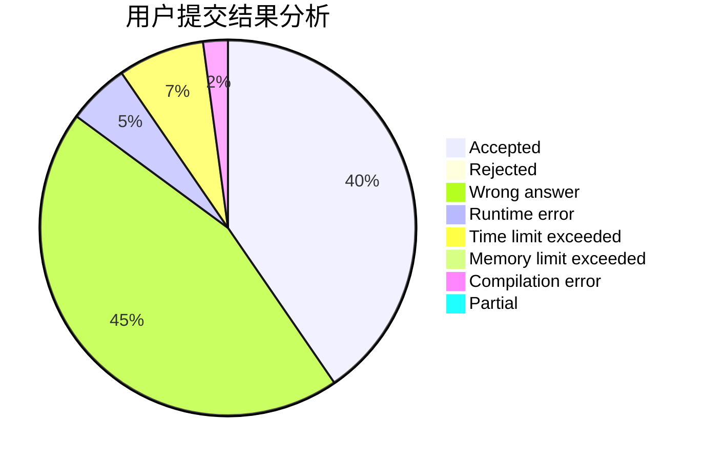
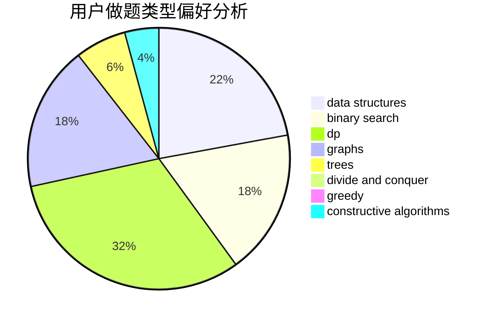
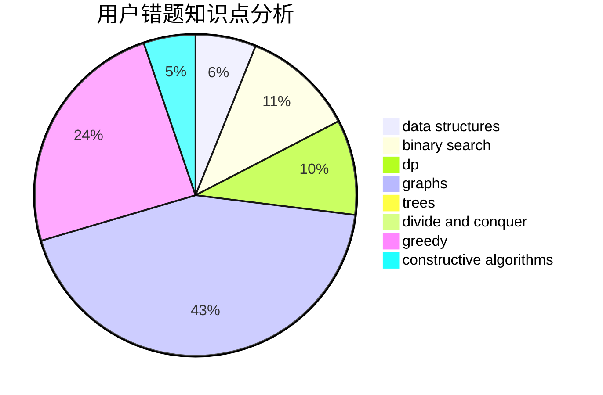

# Last_whisper

<!-- tabs:start -->

#### **用户提交结果分析**

#### **用户做题类型偏好分析**

#### **用户错题知识点分析**

<!-- tabs:end -->
# 推荐题目
[855F](https://codeforces.com/contest/855/problem/F)		binary search,
                        data structures		  
[152D](https://codeforces.com/contest/152/problem/D)		brute force		  
[12A](https://codeforces.com/contest/12/problem/A)		implementation		  
[593E](https://codeforces.com/contest/593/problem/E)		dp,
                        matrices		  
[1361B](https://codeforces.com/contest/1361/problem/B)		greedy,
                        implementation,
                        math,
                        sortings		  
[827B](https://codeforces.com/contest/827/problem/B)		constructive algorithms,
                        greedy,
                        implementation,
                        trees		  
[1175B](https://codeforces.com/contest/1175/problem/B)		data structures,
                        expression parsing,
                        implementation		  
[538H](https://codeforces.com/contest/538/problem/H)		2-sat,
                        data structures,
                        dfs and similar,
                        greedy		  
[1244F](https://codeforces.com/contest/1244/problem/F)		constructive algorithms,
                        implementation		  
[1490C](https://codeforces.com/contest/1490/problem/C)		binary search,
                        brute force,
                        brute force,
                        math		  
