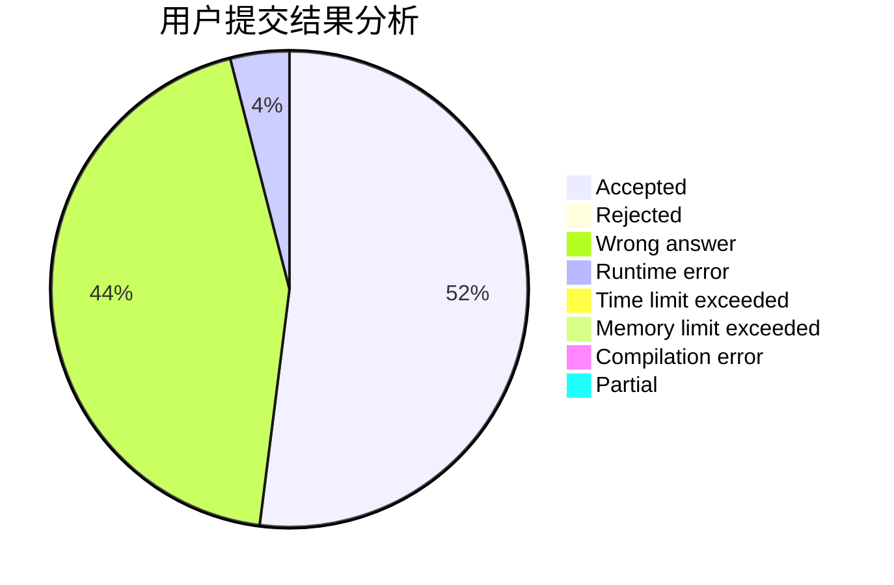
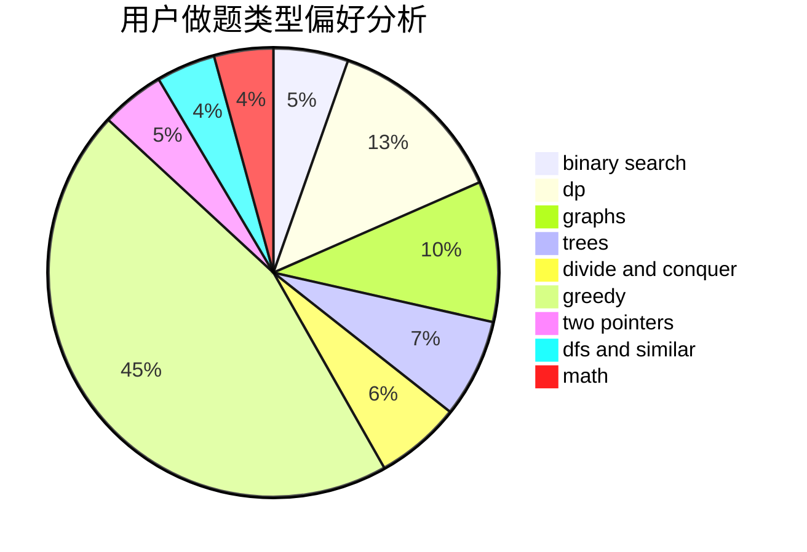

# 5times187

<!-- tabs:start -->

#### **用户提交结果分析**

#### **用户做题类型偏好分析**

<!-- tabs:end -->
# 推荐题目
[1065B](https://codeforces.com/contest/1065/problem/B)
[11962](https://codeforces.com/contest/1196/problem/2)
[1401C](https://codeforces.com/contest/1401/problem/C)
[1401E](https://codeforces.com/contest/1401/problem/E)
[1278B](https://codeforces.com/contest/1278/problem/B)
[1145F](https://codeforces.com/contest/1145/problem/F)
[1138F](https://codeforces.com/contest/1138/problem/F)
[13B](https://codeforces.com/contest/13/problem/B)
[137D](https://codeforces.com/contest/137/problem/D)
[1402A](https://codeforces.com/contest/1402/problem/A)
