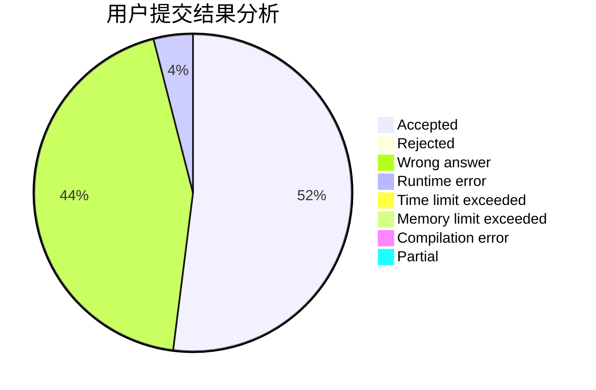
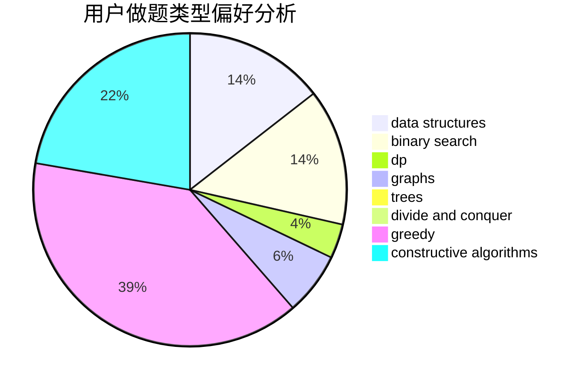
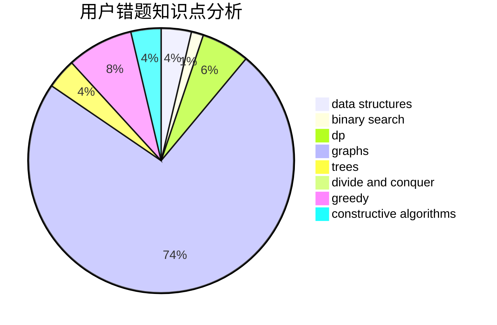

# 5times187

<!-- tabs:start -->

#### **用户提交结果分析**

#### **用户做题类型偏好分析**

#### **用户错题知识点分析**

<!-- tabs:end -->
# 推荐题目
[1064E](https://codeforces.com/contest/1064/problem/E)		dsu,graphs,sortings,trees		  
[1190B](https://codeforces.com/contest/1190/problem/B)		games		  
[1393D](https://codeforces.com/contest/1393/problem/D)		dfs and similar,
                        dp,
                        implementation,
                        shortest paths		  
[1393E2](https://codeforces.com/contest/1393E/problem/2)		dp,
                        hashing,
                        implementation,
                        string suffix structures,
                        strings,
                        two pointers		  
[1269B](https://codeforces.com/contest/1269/problem/B)		brute force,
                        sortings		  
[1143E](https://codeforces.com/contest/1143/problem/E)		dsu,graphs,sortings,trees		  
[1136D](https://codeforces.com/contest/1136/problem/D)		greedy		  
[1391E](https://codeforces.com/contest/1391/problem/E)		constructive algorithms,
                        dfs and similar,
                        graphs,
                        greedy,
                        trees		  
[1371B](https://codeforces.com/contest/1371/problem/B)		math		  
[1394B](https://codeforces.com/contest/1394/problem/B)		brute force,
                        dfs and similar,
                        graphs,
                        hashing		  
