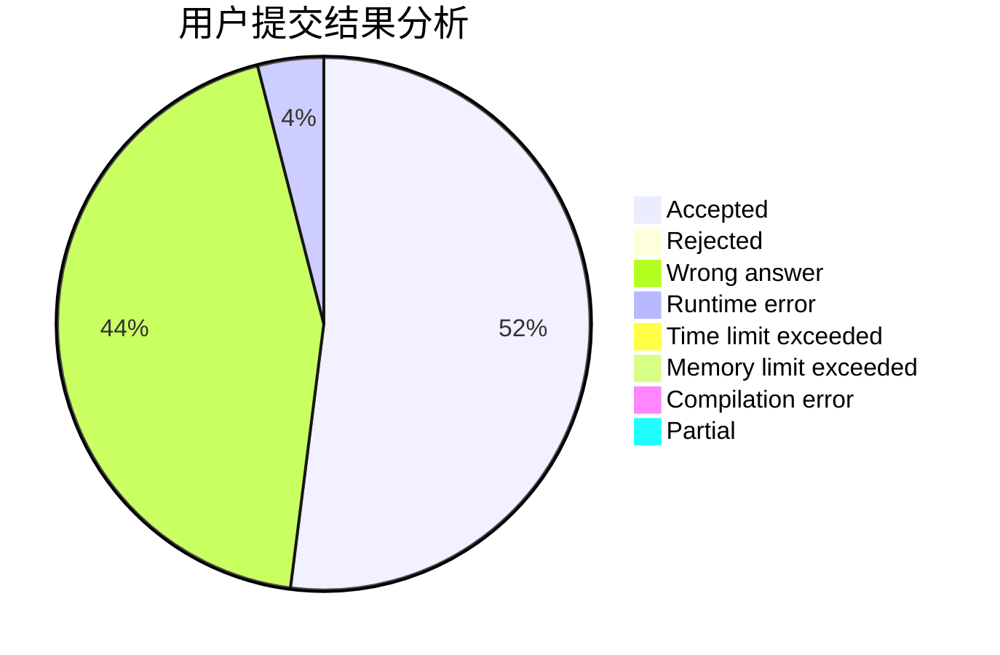
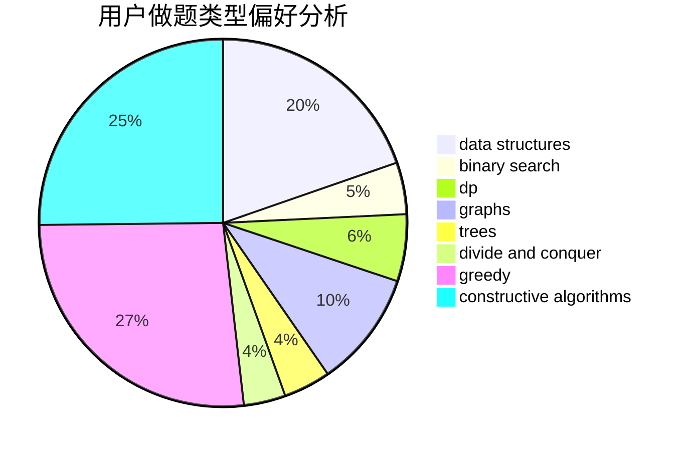
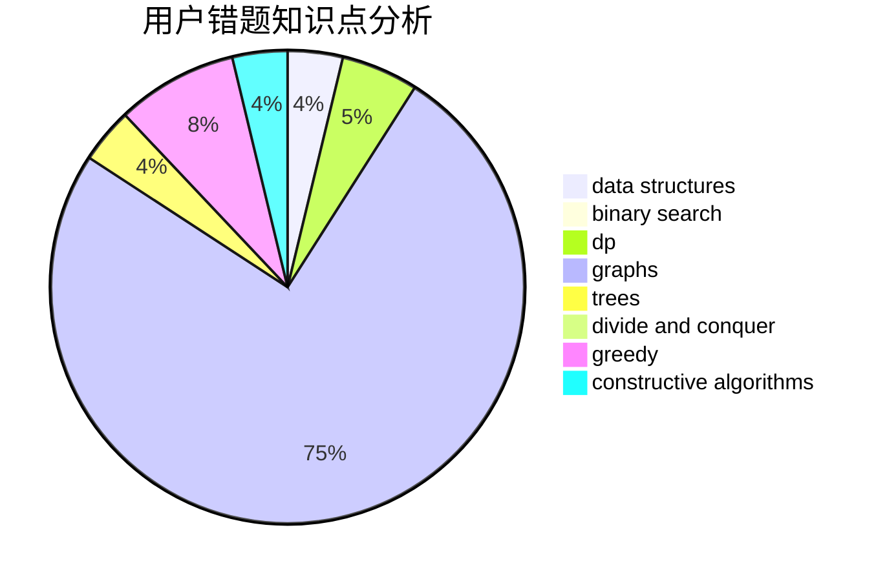

# 5times187

<!-- tabs:start -->

#### **用户提交结果分析**

#### **用户做题类型偏好分析**

#### **用户错题知识点分析**

<!-- tabs:end -->
# 推荐题目
[1065B](https://codeforces.com/contest/1065/problem/B)		constructive algorithms,
                        graphs		  
[11962](https://codeforces.com/contest/1196/problem/2)		dsu,graphs,sortings,trees		  
[1401C](https://codeforces.com/contest/1401/problem/C)		constructive algorithms,
                        math,
                        number theory,
                        sortings		  
[1401E](https://codeforces.com/contest/1401/problem/E)		data structures,
                        geometry,
                        implementation,
                        sortings		  
[1278B](https://codeforces.com/contest/1278/problem/B)		greedy,
                        math		  
[1145F](https://codeforces.com/contest/1145/problem/F)		nan		  
[1138F](https://codeforces.com/contest/1138/problem/F)		dsu,graphs,sortings,trees		  
[13B](https://codeforces.com/contest/13/problem/B)		geometry,
                        implementation		  
[137D](https://codeforces.com/contest/137/problem/D)		dp,
                        strings		  
[1402A](https://codeforces.com/contest/1402/problem/A)		*special problem,
                        data structures,
                        dsu,
                        implementation,
                        math,
                        sortings		  
