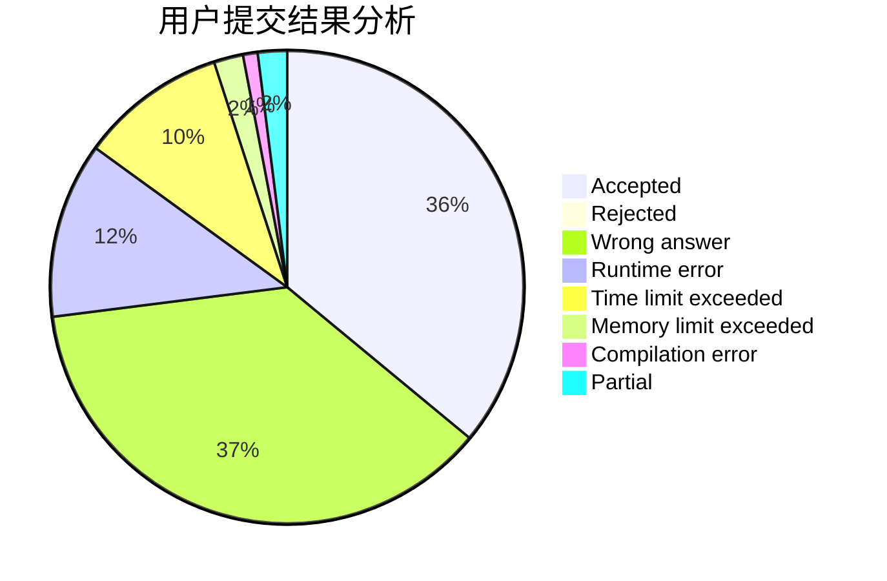
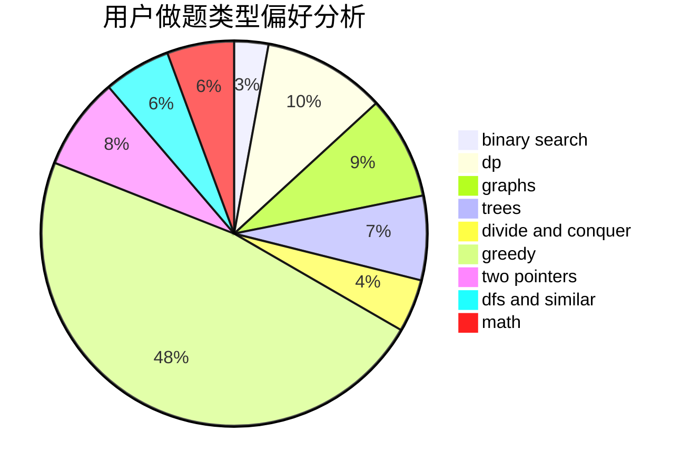

# Lavine

<!-- tabs:start -->

#### **用户提交结果分析**

#### **用户做题类型偏好分析**

<!-- tabs:end -->
# 推荐题目
[691C](https://codeforces.com/contest/691/problem/C)
[1237F](https://codeforces.com/contest/1237/problem/F)
[585B](https://codeforces.com/contest/585/problem/B)
[957E](https://codeforces.com/contest/957/problem/E)
[630J](https://codeforces.com/contest/630/problem/J)
[962A](https://codeforces.com/contest/962/problem/A)
[1131A](https://codeforces.com/contest/1131/problem/A)
[225E](https://codeforces.com/contest/225/problem/E)
[1150C](https://codeforces.com/contest/1150/problem/C)
[772C](https://codeforces.com/contest/772/problem/C)
