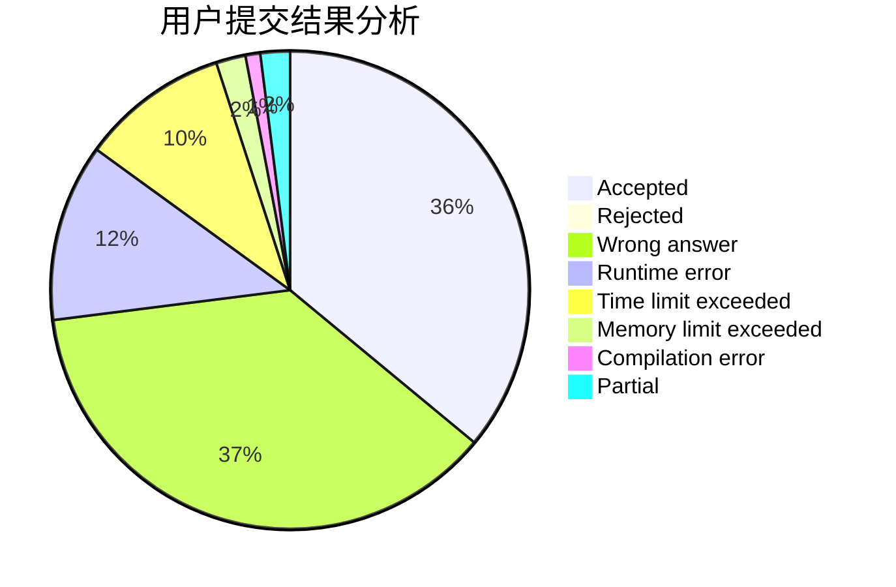
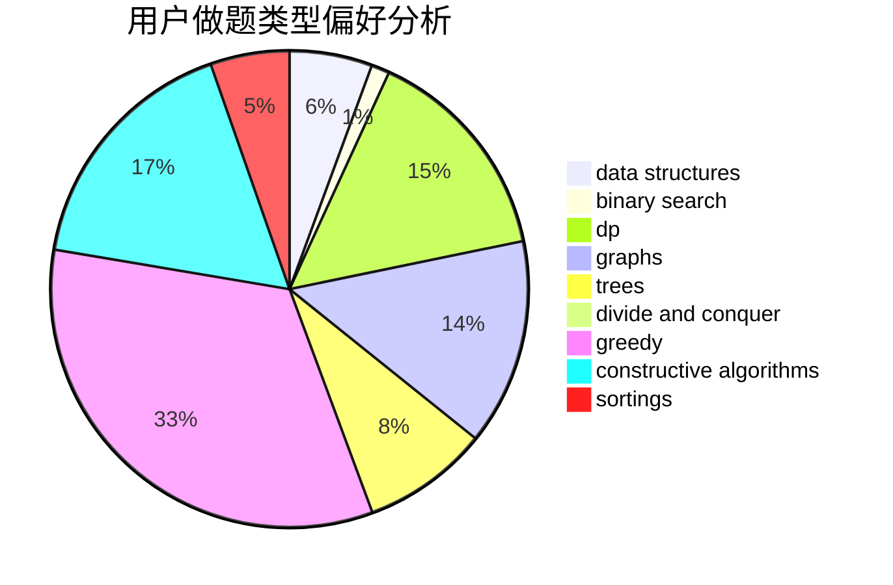
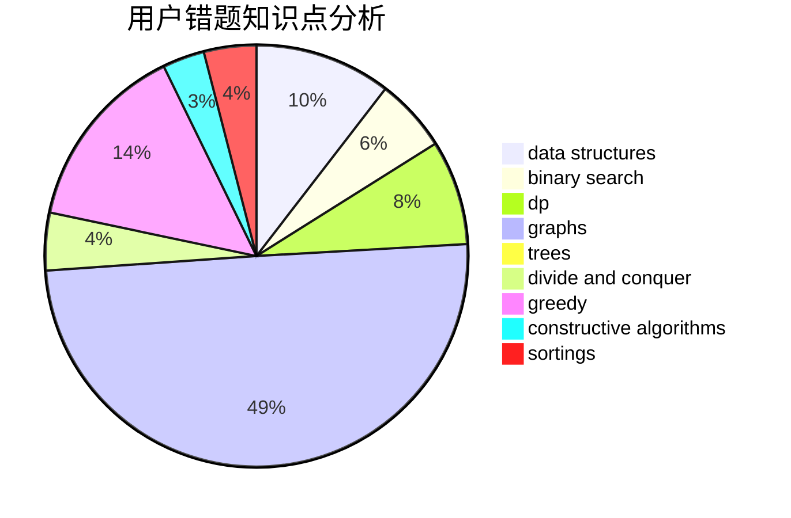

# Lavine
<!-- tabs:start -->
#### **用户提交结果分析**

#### **用户做题类型偏好分析**

#### **用户错题知识点分析**

<!-- tabs:end -->
# 推荐题目
[669C](https://codeforces.com/contest/669/problem/C)		implementation		  
[1129A2](http://codeforces.com/problemset/problem/1129/A2)		brute force,
                        greedy		  
[940D](http://codeforces.com/problemset/problem/940/D)		binary search,
                        implementation		  
[611F](http://codeforces.com/problemset/problem/611/F)		binary search,
                        implementation		  
[200C](http://codeforces.com/problemset/problem/200/C)		brute force,
                        implementation		  
[1398D](http://codeforces.com/problemset/problem/1398/D)		dp,
                        greedy,
                        sortings		  
[1229B](https://codeforces.com/contest/1229/problem/B)		math,
                        number theory,
                        trees		  
[935F](http://codeforces.com/problemset/problem/935/F)		data structures,
                        greedy		  
[566C](http://codeforces.com/problemset/problem/566/C)		dfs and similar,
                        divide and conquer,
                        trees		  
[952E](http://codeforces.com/problemset/problem/952/E)		nan		  
<!-- tabs:start -->
#### **data structures**
[935F](http://codeforces.com/problemset/problem/935/F)		data structures,
                        greedy		  
[1148H](http://codeforces.com/problemset/problem/1148/H)		data structures		  
[318D](https://codeforces.com/contest/318/problem/D)		2-sat,
                        data structures,
                        trees		  
[1179C](http://codeforces.com/problemset/problem/1179/C)		binary search,
                        data structures,
                        graph matchings,
                        greedy,
                        implementation,
                        math,
                        trees		  
[547E](http://codeforces.com/problemset/problem/547/E)		data structures,
                        string suffix structures,
                        strings,
                        trees		  
[1209F](http://codeforces.com/problemset/problem/1209/F)		data structures,
                        dfs and similar,
                        graphs,
                        shortest paths,
                        strings,
                        trees		  
[1051G](http://codeforces.com/problemset/problem/1051/G)		data structures,
                        dsu,
                        greedy		  
[316E1](http://codeforces.com/problemset/problem/316/E1)		brute force,
                        data structures		  
[1351C](http://codeforces.com/problemset/problem/1351/C)		data structures,
                        implementation		  
[242E](http://codeforces.com/problemset/problem/242/E)		bitmasks,
                        data structures		  
#### **binary search**
[940D](http://codeforces.com/problemset/problem/940/D)		binary search,
                        implementation		  
[611F](http://codeforces.com/problemset/problem/611/F)		binary search,
                        implementation		  
[1104D](https://codeforces.com/contest/1104/problem/D)		binary search,
                        constructive algorithms,
                        interactive		  
[1179C](http://codeforces.com/problemset/problem/1179/C)		binary search,
                        data structures,
                        graph matchings,
                        greedy,
                        implementation,
                        math,
                        trees		  
[1066D](http://codeforces.com/problemset/problem/1066/D)		binary search,
                        implementation		  
[1436C](http://codeforces.com/problemset/problem/1436/C)		binary search,
                        combinatorics		  
[1492C](http://codeforces.com/problemset/problem/1492/C)		binary search,
                        data structures,
                        dp,
                        greedy,
                        two pointers		  
[1463D](http://codeforces.com/problemset/problem/1463/D)		binary search,
                        constructive algorithms,
                        greedy,
                        two pointers		  
[1490G](http://codeforces.com/problemset/problem/1490/G)		binary search,
                        data structures,
                        math		  
[1479D](http://codeforces.com/problemset/problem/1479/D)		binary search,
                        bitmasks,
                        brute force,
                        data structures,
                        probabilities,
                        trees		  
#### **dp**
[1398D](http://codeforces.com/problemset/problem/1398/D)		dp,
                        greedy,
                        sortings		  
[1328D](http://codeforces.com/problemset/problem/1328/D)		constructive algorithms,
                        dp,
                        graphs,
                        greedy,
                        math		  
[838C](http://codeforces.com/problemset/problem/838/C)		dp,
                        games		  
[888F](http://codeforces.com/problemset/problem/888/F)		dp,
                        graphs		  
[1277C](https://codeforces.com/contest/1277/problem/C)		dp,
                        greedy		  
[1303E](http://codeforces.com/problemset/problem/1303/E)		dp,
                        strings		  
[1442D](http://codeforces.com/problemset/problem/1442/D)		data structures,
                        divide and conquer,
                        dp,
                        greedy		  
[1492C](http://codeforces.com/problemset/problem/1492/C)		binary search,
                        data structures,
                        dp,
                        greedy,
                        two pointers		  
[1457C](https://codeforces.com/contest/1457/problem/C)		brute force,
                        dp,
                        implementation		  
[1491C](http://codeforces.com/problemset/problem/1491/C)		brute force,
                        data structures,
                        dp,
                        greedy,
                        implementation		  
#### **graph**
[167E](http://codeforces.com/problemset/problem/167/E)		dfs and similar,
                        graphs,
                        math,
                        matrices		  
[131D](http://codeforces.com/problemset/problem/131/D)		dfs and similar,
                        graphs		  
[1009D](http://codeforces.com/problemset/problem/1009/D)		brute force,
                        constructive algorithms,
                        graphs,
                        greedy,
                        math		  
[1179C](http://codeforces.com/problemset/problem/1179/C)		binary search,
                        data structures,
                        graph matchings,
                        greedy,
                        implementation,
                        math,
                        trees		  
[1328D](http://codeforces.com/problemset/problem/1328/D)		constructive algorithms,
                        dp,
                        graphs,
                        greedy,
                        math		  
[1325E](http://codeforces.com/problemset/problem/1325/E)		brute force,
                        dfs and similar,
                        graphs,
                        number theory,
                        shortest paths		  
[1487C](http://codeforces.com/problemset/problem/1487/C)		brute force,
                        constructive algorithms,
                        dfs and similar,
                        graphs,
                        greedy,
                        implementation,
                        math		  
[1242E](http://codeforces.com/problemset/problem/1242/E)		constructive algorithms,
                        graphs		  
[888F](http://codeforces.com/problemset/problem/888/F)		dp,
                        graphs		  
[557D](http://codeforces.com/problemset/problem/557/D)		combinatorics,
                        dfs and similar,
                        graphs,
                        math		  
#### **trees**
[1229B](https://codeforces.com/contest/1229/problem/B)		math,
                        number theory,
                        trees		  
[566C](http://codeforces.com/problemset/problem/566/C)		dfs and similar,
                        divide and conquer,
                        trees		  
[318D](https://codeforces.com/contest/318/problem/D)		2-sat,
                        data structures,
                        trees		  
[1179C](http://codeforces.com/problemset/problem/1179/C)		binary search,
                        data structures,
                        graph matchings,
                        greedy,
                        implementation,
                        math,
                        trees		  
[547E](http://codeforces.com/problemset/problem/547/E)		data structures,
                        string suffix structures,
                        strings,
                        trees		  
[1209F](http://codeforces.com/problemset/problem/1209/F)		data structures,
                        dfs and similar,
                        graphs,
                        shortest paths,
                        strings,
                        trees		  
[76A](http://codeforces.com/problemset/problem/76/A)		dsu,
                        graphs,
                        sortings,
                        trees		  
[1479D](http://codeforces.com/problemset/problem/1479/D)		binary search,
                        bitmasks,
                        brute force,
                        data structures,
                        probabilities,
                        trees		  
[1511C](http://codeforces.com/problemset/problem/1511/C)		brute force,
                        data structures,
                        implementation,
                        trees		  
[1499F](http://codeforces.com/problemset/problem/1499/F)		combinatorics,
                        dfs and similar,
                        dp,
                        trees		  
#### **divide and conquer**
[566C](http://codeforces.com/problemset/problem/566/C)		dfs and similar,
                        divide and conquer,
                        trees		  
[1442D](http://codeforces.com/problemset/problem/1442/D)		data structures,
                        divide and conquer,
                        dp,
                        greedy		  
[1461D](http://codeforces.com/problemset/problem/1461/D)		binary search,
                        brute force,
                        data structures,
                        divide and conquer,
                        implementation,
                        sortings		  
[1466G](http://codeforces.com/problemset/problem/1466/G)		combinatorics,
                        divide and conquer,
                        hashing,
                        math,
                        string suffix structures,
                        strings		  
[1490D](http://codeforces.com/problemset/problem/1490/D)		dfs and similar,
                        divide and conquer,
                        implementation		  
[1483C](https://codeforces.com/contest/1483/problem/C)		data structures,
                        divide and conquer,
                        dp		  
[1491E](http://codeforces.com/problemset/problem/1491/E)		brute force,
                        dfs and similar,
                        divide and conquer,
                        number theory,
                        trees		  
[1303G](http://codeforces.com/problemset/problem/1303/G)		data structures,
                        divide and conquer,
                        geometry,
                        trees		  
[1494D](http://codeforces.com/problemset/problem/1494/D)		constructive algorithms,
                        data structures,
                        dfs and similar,
                        divide and conquer,
                        dsu,
                        greedy,
                        sortings,
                        trees		  
[1482E](http://codeforces.com/problemset/problem/1482/E)		data structures,
                        divide and conquer,
                        dp		  
#### **greedy**
[1129A2](http://codeforces.com/problemset/problem/1129/A2)		brute force,
                        greedy		  
[1398D](http://codeforces.com/problemset/problem/1398/D)		dp,
                        greedy,
                        sortings		  
[935F](http://codeforces.com/problemset/problem/935/F)		data structures,
                        greedy		  
[6C](http://codeforces.com/problemset/problem/6/C)		greedy,
                        two pointers		  
[1090A](http://codeforces.com/problemset/problem/1090/A)		greedy		  
[529B](http://codeforces.com/problemset/problem/529/B)		brute force,
                        greedy,
                        sortings		  
[820C](https://codeforces.com/contest/820/problem/C)		games,
                        greedy		  
[1009D](http://codeforces.com/problemset/problem/1009/D)		brute force,
                        constructive algorithms,
                        graphs,
                        greedy,
                        math		  
[443D](https://codeforces.com/contest/443/problem/D)		greedy,
                        math,
                        probabilities		  
[1179C](http://codeforces.com/problemset/problem/1179/C)		binary search,
                        data structures,
                        graph matchings,
                        greedy,
                        implementation,
                        math,
                        trees		  
#### **constructive algorithms**
[183A](http://codeforces.com/problemset/problem/183/A)		constructive algorithms,
                        math		  
[1104D](https://codeforces.com/contest/1104/problem/D)		binary search,
                        constructive algorithms,
                        interactive		  
[1009D](http://codeforces.com/problemset/problem/1009/D)		brute force,
                        constructive algorithms,
                        graphs,
                        greedy,
                        math		  
[1435A](https://codeforces.com/contest/1435/problem/A)		constructive algorithms,
                        math		  
[1328D](http://codeforces.com/problemset/problem/1328/D)		constructive algorithms,
                        dp,
                        graphs,
                        greedy,
                        math		  
[1467C](http://codeforces.com/problemset/problem/1467/C)		constructive algorithms,
                        greedy		  
[1487C](http://codeforces.com/problemset/problem/1487/C)		brute force,
                        constructive algorithms,
                        dfs and similar,
                        graphs,
                        greedy,
                        implementation,
                        math		  
[1242E](http://codeforces.com/problemset/problem/1242/E)		constructive algorithms,
                        graphs		  
[1404D](http://codeforces.com/problemset/problem/1404/D)		constructive algorithms,
                        dfs and similar,
                        interactive,
                        math,
                        number theory		  
[1405B](http://codeforces.com/problemset/problem/1405/B)		constructive algorithms,
                        implementation		  
#### **sortings**
[1398D](http://codeforces.com/problemset/problem/1398/D)		dp,
                        greedy,
                        sortings		  
[529B](http://codeforces.com/problemset/problem/529/B)		brute force,
                        greedy,
                        sortings		  
[76A](http://codeforces.com/problemset/problem/76/A)		dsu,
                        graphs,
                        sortings,
                        trees		  
[1496C](https://codeforces.com/contest/1496/problem/C)		geometry,
                        greedy,
                        math,
                        sortings		  
[1495A](http://codeforces.com/problemset/problem/1495/A)		geometry,
                        greedy,
                        math,
                        sortings		  
[1497A](http://codeforces.com/problemset/problem/1497/A)		brute force,
                        data structures,
                        greedy,
                        sortings		  
[1427A](http://codeforces.com/problemset/problem/1427/A)		math,
                        sortings		  
[1461D](http://codeforces.com/problemset/problem/1461/D)		binary search,
                        brute force,
                        data structures,
                        divide and conquer,
                        implementation,
                        sortings		  
[1437C](http://codeforces.com/problemset/problem/1437/C)		dp,
                        flows,
                        graph matchings,
                        greedy,
                        math,
                        sortings		  
[1473A](http://codeforces.com/problemset/problem/1473/A)		greedy,
                        implementation,
                        math,
                        sortings		  
<!-- tabs:end -->
