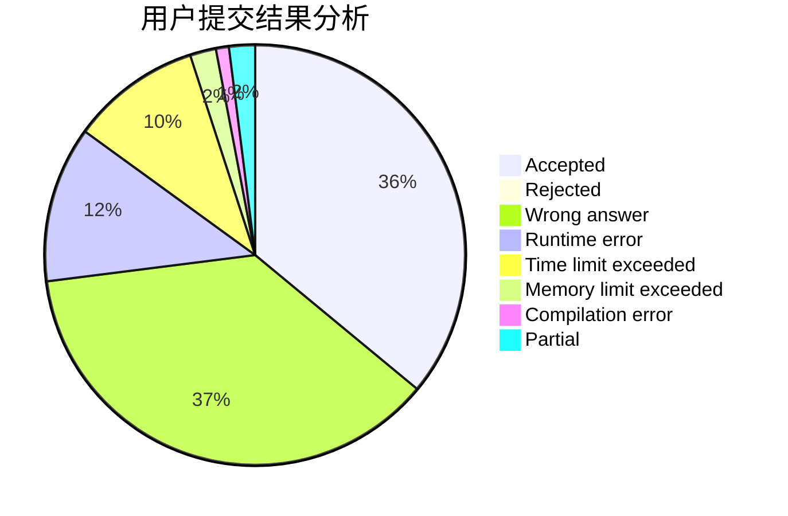
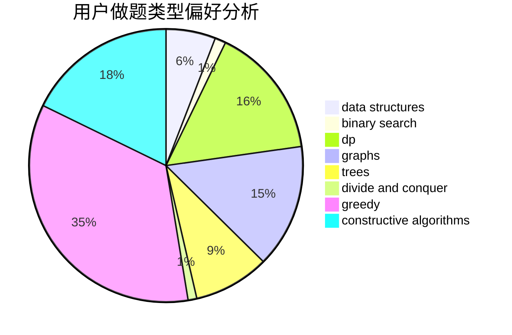
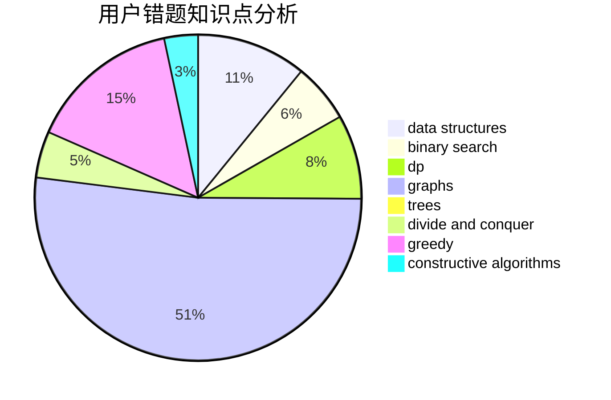

# Lavine
<!-- tabs:start -->
#### **用户提交结果分析**

#### **用户做题类型偏好分析**

#### **用户错题知识点分析**

<!-- tabs:end -->
# 推荐题目
[Little Artem and Matrix](https://codeforces.com/contest/669/problem/C)		implementation		  
[Toy Train](http://codeforces.com/problemset/problem/1129/A2)		brute force,
                        greedy		  
[Alena And The Heater](http://codeforces.com/problemset/problem/940/D)		binary search,
                        implementation		  
[New Year and Cleaning](http://codeforces.com/problemset/problem/611/F)		binary search,
                        implementation		  
[Football Championship](http://codeforces.com/problemset/problem/200/C)		brute force,
                        implementation		  
[Colored Rectangles](http://codeforces.com/problemset/problem/1398/D)		dp,
                        greedy,
                        sortings		  
[Kamil and Making a Stream](https://codeforces.com/contest/1229/problem/B)		math,
                        number theory,
                        trees		  
[Fafa and Array](http://codeforces.com/problemset/problem/935/F)		data structures,
                        greedy		  
[Logistical Questions](http://codeforces.com/problemset/problem/566/C)		dfs and similar,
                        divide and conquer,
                        trees		  
[Cheese Board](http://codeforces.com/problemset/problem/952/E)		nan		  
<!-- tabs:start -->
#### **data structures**
[Little Artem and Matrix](http://codeforces.com/problemset/problem/935/F)		data structures,
                        greedy		  
[Toy Train](http://codeforces.com/problemset/problem/1148/H)		data structures		  
[Alena And The Heater](https://codeforces.com/contest/318/problem/D)		2-sat,
                        data structures,
                        trees		  
[New Year and Cleaning](http://codeforces.com/problemset/problem/1179/C)		binary search,
                        data structures,
                        graph matchings,
                        greedy,
                        implementation,
                        math,
                        trees		  
[Football Championship](http://codeforces.com/problemset/problem/547/E)		data structures,
                        string suffix structures,
                        strings,
                        trees		  
[Colored Rectangles](http://codeforces.com/problemset/problem/1209/F)		data structures,
                        dfs and similar,
                        graphs,
                        shortest paths,
                        strings,
                        trees		  
[Kamil and Making a Stream](http://codeforces.com/problemset/problem/1051/G)		data structures,
                        dsu,
                        greedy		  
[Fafa and Array](http://codeforces.com/problemset/problem/316/E1)		brute force,
                        data structures		  
[Logistical Questions](http://codeforces.com/problemset/problem/1351/C)		data structures,
                        implementation		  
[Cheese Board](http://codeforces.com/problemset/problem/242/E)		bitmasks,
                        data structures		  
#### **binary search**
[Little Artem and Matrix](http://codeforces.com/problemset/problem/940/D)		binary search,
                        implementation		  
[Toy Train](http://codeforces.com/problemset/problem/611/F)		binary search,
                        implementation		  
[Alena And The Heater](https://codeforces.com/contest/1104/problem/D)		binary search,
                        constructive algorithms,
                        interactive		  
[New Year and Cleaning](http://codeforces.com/problemset/problem/1179/C)		binary search,
                        data structures,
                        graph matchings,
                        greedy,
                        implementation,
                        math,
                        trees		  
[Football Championship](http://codeforces.com/problemset/problem/1066/D)		binary search,
                        implementation		  
[Colored Rectangles](http://codeforces.com/problemset/problem/1436/C)		binary search,
                        combinatorics		  
[Kamil and Making a Stream](http://codeforces.com/problemset/problem/1492/C)		binary search,
                        data structures,
                        dp,
                        greedy,
                        two pointers		  
[Fafa and Array](http://codeforces.com/problemset/problem/1463/D)		binary search,
                        constructive algorithms,
                        greedy,
                        two pointers		  
[Logistical Questions](http://codeforces.com/problemset/problem/1490/G)		binary search,
                        data structures,
                        math		  
[Cheese Board](http://codeforces.com/problemset/problem/1479/D)		binary search,
                        bitmasks,
                        brute force,
                        data structures,
                        probabilities,
                        trees		  
#### **dp**
[Little Artem and Matrix](http://codeforces.com/problemset/problem/1398/D)		dp,
                        greedy,
                        sortings		  
[Toy Train](http://codeforces.com/problemset/problem/1328/D)		constructive algorithms,
                        dp,
                        graphs,
                        greedy,
                        math		  
[Alena And The Heater](http://codeforces.com/problemset/problem/838/C)		dp,
                        games		  
[New Year and Cleaning](http://codeforces.com/problemset/problem/888/F)		dp,
                        graphs		  
[Football Championship](https://codeforces.com/contest/1277/problem/C)		dp,
                        greedy		  
[Colored Rectangles](http://codeforces.com/problemset/problem/1303/E)		dp,
                        strings		  
[Kamil and Making a Stream](http://codeforces.com/problemset/problem/1442/D)		data structures,
                        divide and conquer,
                        dp,
                        greedy		  
[Fafa and Array](http://codeforces.com/problemset/problem/1492/C)		binary search,
                        data structures,
                        dp,
                        greedy,
                        two pointers		  
[Logistical Questions](https://codeforces.com/contest/1457/problem/C)		brute force,
                        dp,
                        implementation		  
[Cheese Board](http://codeforces.com/problemset/problem/1491/C)		brute force,
                        data structures,
                        dp,
                        greedy,
                        implementation		  
#### **graph**
[Little Artem and Matrix](http://codeforces.com/problemset/problem/167/E)		dfs and similar,
                        graphs,
                        math,
                        matrices		  
[Toy Train](http://codeforces.com/problemset/problem/131/D)		dfs and similar,
                        graphs		  
[Alena And The Heater](http://codeforces.com/problemset/problem/1009/D)		brute force,
                        constructive algorithms,
                        graphs,
                        greedy,
                        math		  
[New Year and Cleaning](http://codeforces.com/problemset/problem/1179/C)		binary search,
                        data structures,
                        graph matchings,
                        greedy,
                        implementation,
                        math,
                        trees		  
[Football Championship](http://codeforces.com/problemset/problem/1328/D)		constructive algorithms,
                        dp,
                        graphs,
                        greedy,
                        math		  
[Colored Rectangles](http://codeforces.com/problemset/problem/1325/E)		brute force,
                        dfs and similar,
                        graphs,
                        number theory,
                        shortest paths		  
[Kamil and Making a Stream](http://codeforces.com/problemset/problem/1487/C)		brute force,
                        constructive algorithms,
                        dfs and similar,
                        graphs,
                        greedy,
                        implementation,
                        math		  
[Fafa and Array](http://codeforces.com/problemset/problem/1242/E)		constructive algorithms,
                        graphs		  
[Logistical Questions](http://codeforces.com/problemset/problem/888/F)		dp,
                        graphs		  
[Cheese Board](http://codeforces.com/problemset/problem/557/D)		combinatorics,
                        dfs and similar,
                        graphs,
                        math		  
#### **trees**
[Little Artem and Matrix](https://codeforces.com/contest/1229/problem/B)		math,
                        number theory,
                        trees		  
[Toy Train](http://codeforces.com/problemset/problem/566/C)		dfs and similar,
                        divide and conquer,
                        trees		  
[Alena And The Heater](https://codeforces.com/contest/318/problem/D)		2-sat,
                        data structures,
                        trees		  
[New Year and Cleaning](http://codeforces.com/problemset/problem/1179/C)		binary search,
                        data structures,
                        graph matchings,
                        greedy,
                        implementation,
                        math,
                        trees		  
[Football Championship](http://codeforces.com/problemset/problem/547/E)		data structures,
                        string suffix structures,
                        strings,
                        trees		  
[Colored Rectangles](http://codeforces.com/problemset/problem/1209/F)		data structures,
                        dfs and similar,
                        graphs,
                        shortest paths,
                        strings,
                        trees		  
[Kamil and Making a Stream](http://codeforces.com/problemset/problem/76/A)		dsu,
                        graphs,
                        sortings,
                        trees		  
[Fafa and Array](http://codeforces.com/problemset/problem/1479/D)		binary search,
                        bitmasks,
                        brute force,
                        data structures,
                        probabilities,
                        trees		  
[Logistical Questions](http://codeforces.com/problemset/problem/1511/C)		brute force,
                        data structures,
                        implementation,
                        trees		  
[Cheese Board](http://codeforces.com/problemset/problem/1499/F)		combinatorics,
                        dfs and similar,
                        dp,
                        trees		  
#### **divide and conquer**
[Little Artem and Matrix](http://codeforces.com/problemset/problem/566/C)		dfs and similar,
                        divide and conquer,
                        trees		  
[Toy Train](http://codeforces.com/problemset/problem/1442/D)		data structures,
                        divide and conquer,
                        dp,
                        greedy		  
[Alena And The Heater](http://codeforces.com/problemset/problem/1461/D)		binary search,
                        brute force,
                        data structures,
                        divide and conquer,
                        implementation,
                        sortings		  
[New Year and Cleaning](http://codeforces.com/problemset/problem/1466/G)		combinatorics,
                        divide and conquer,
                        hashing,
                        math,
                        string suffix structures,
                        strings		  
[Football Championship](http://codeforces.com/problemset/problem/1490/D)		dfs and similar,
                        divide and conquer,
                        implementation		  
[Colored Rectangles](https://codeforces.com/contest/1483/problem/C)		data structures,
                        divide and conquer,
                        dp		  
[Kamil and Making a Stream](http://codeforces.com/problemset/problem/1491/E)		brute force,
                        dfs and similar,
                        divide and conquer,
                        number theory,
                        trees		  
[Fafa and Array](http://codeforces.com/problemset/problem/1303/G)		data structures,
                        divide and conquer,
                        geometry,
                        trees		  
[Logistical Questions](http://codeforces.com/problemset/problem/1494/D)		constructive algorithms,
                        data structures,
                        dfs and similar,
                        divide and conquer,
                        dsu,
                        greedy,
                        sortings,
                        trees		  
[Cheese Board](http://codeforces.com/problemset/problem/1482/E)		data structures,
                        divide and conquer,
                        dp		  
#### **greedy**
[Little Artem and Matrix](http://codeforces.com/problemset/problem/1129/A2)		brute force,
                        greedy		  
[Toy Train](http://codeforces.com/problemset/problem/1398/D)		dp,
                        greedy,
                        sortings		  
[Alena And The Heater](http://codeforces.com/problemset/problem/935/F)		data structures,
                        greedy		  
[New Year and Cleaning](http://codeforces.com/problemset/problem/6/C)		greedy,
                        two pointers		  
[Football Championship](http://codeforces.com/problemset/problem/1090/A)		greedy		  
[Colored Rectangles](http://codeforces.com/problemset/problem/529/B)		brute force,
                        greedy,
                        sortings		  
[Kamil and Making a Stream](https://codeforces.com/contest/820/problem/C)		games,
                        greedy		  
[Fafa and Array](http://codeforces.com/problemset/problem/1009/D)		brute force,
                        constructive algorithms,
                        graphs,
                        greedy,
                        math		  
[Logistical Questions](https://codeforces.com/contest/443/problem/D)		greedy,
                        math,
                        probabilities		  
[Cheese Board](http://codeforces.com/problemset/problem/1179/C)		binary search,
                        data structures,
                        graph matchings,
                        greedy,
                        implementation,
                        math,
                        trees		  
#### **constructive algorithms**
[Little Artem and Matrix](http://codeforces.com/problemset/problem/183/A)		constructive algorithms,
                        math		  
[Toy Train](https://codeforces.com/contest/1104/problem/D)		binary search,
                        constructive algorithms,
                        interactive		  
[Alena And The Heater](http://codeforces.com/problemset/problem/1009/D)		brute force,
                        constructive algorithms,
                        graphs,
                        greedy,
                        math		  
[New Year and Cleaning](https://codeforces.com/contest/1435/problem/A)		constructive algorithms,
                        math		  
[Football Championship](http://codeforces.com/problemset/problem/1328/D)		constructive algorithms,
                        dp,
                        graphs,
                        greedy,
                        math		  
[Colored Rectangles](http://codeforces.com/problemset/problem/1467/C)		constructive algorithms,
                        greedy		  
[Kamil and Making a Stream](http://codeforces.com/problemset/problem/1487/C)		brute force,
                        constructive algorithms,
                        dfs and similar,
                        graphs,
                        greedy,
                        implementation,
                        math		  
[Fafa and Array](http://codeforces.com/problemset/problem/1242/E)		constructive algorithms,
                        graphs		  
[Logistical Questions](http://codeforces.com/problemset/problem/1404/D)		constructive algorithms,
                        dfs and similar,
                        interactive,
                        math,
                        number theory		  
[Cheese Board](http://codeforces.com/problemset/problem/1405/B)		constructive algorithms,
                        implementation		  
#### **sortings**
[Little Artem and Matrix](http://codeforces.com/problemset/problem/1398/D)		dp,
                        greedy,
                        sortings		  
[Toy Train](http://codeforces.com/problemset/problem/529/B)		brute force,
                        greedy,
                        sortings		  
[Alena And The Heater](http://codeforces.com/problemset/problem/76/A)		dsu,
                        graphs,
                        sortings,
                        trees		  
[New Year and Cleaning](https://codeforces.com/contest/1496/problem/C)		geometry,
                        greedy,
                        math,
                        sortings		  
[Football Championship](http://codeforces.com/problemset/problem/1495/A)		geometry,
                        greedy,
                        math,
                        sortings		  
[Colored Rectangles](http://codeforces.com/problemset/problem/1497/A)		brute force,
                        data structures,
                        greedy,
                        sortings		  
[Kamil and Making a Stream](http://codeforces.com/problemset/problem/1427/A)		math,
                        sortings		  
[Fafa and Array](http://codeforces.com/problemset/problem/1461/D)		binary search,
                        brute force,
                        data structures,
                        divide and conquer,
                        implementation,
                        sortings		  
[Logistical Questions](http://codeforces.com/problemset/problem/1437/C)		dp,
                        flows,
                        graph matchings,
                        greedy,
                        math,
                        sortings		  
[Cheese Board](http://codeforces.com/problemset/problem/1473/A)		greedy,
                        implementation,
                        math,
                        sortings		  
<!-- tabs:end -->
