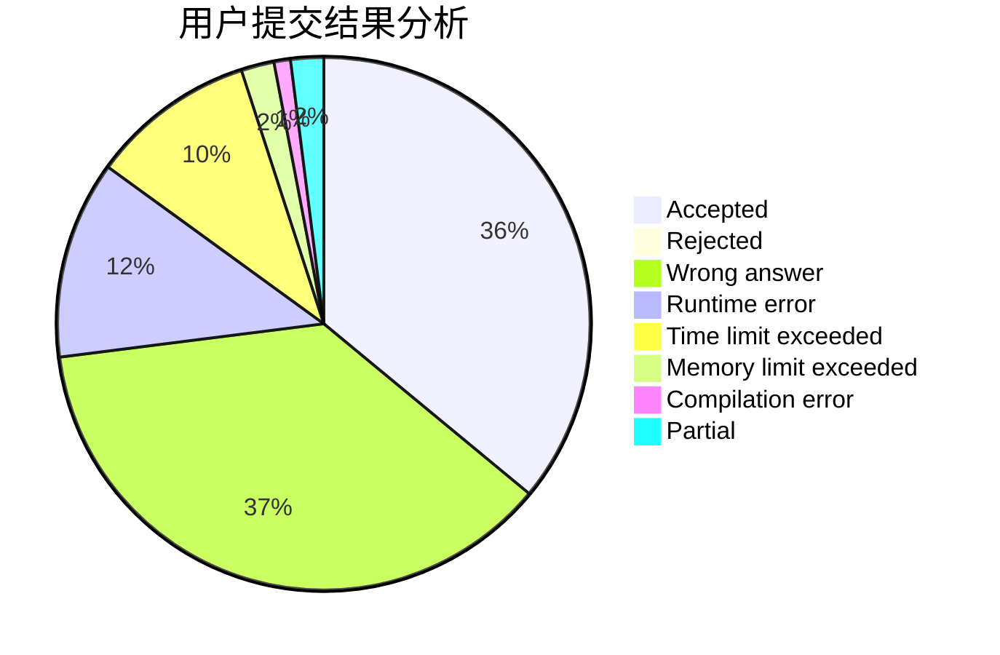
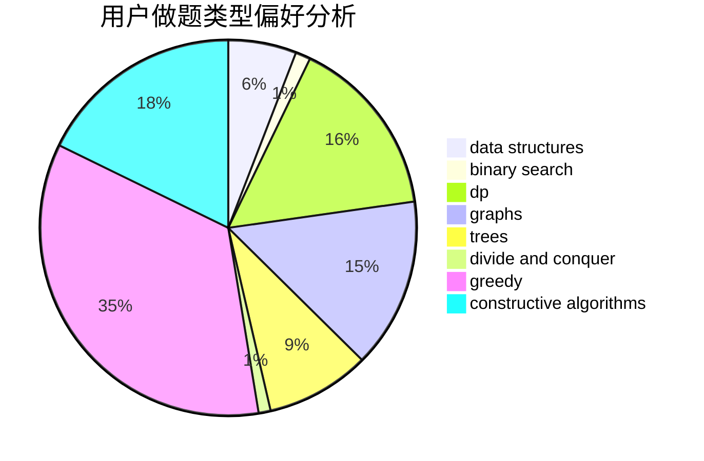
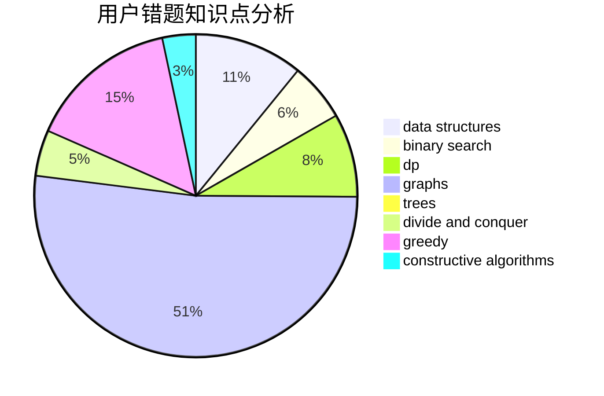

# Lavine

<!-- tabs:start -->

#### **用户提交结果分析**

#### **用户做题类型偏好分析**

#### **用户错题知识点分析**

<!-- tabs:end -->
# 推荐题目
[669C](https://codeforces.com/contest/669/problem/C)		dsu,graphs,sortings,trees		  
[1229B](https://codeforces.com/contest/1229/problem/B)		dsu,graphs,sortings,trees		  
[566C](https://codeforces.com/contest/566/problem/C)		dfs and similar,
                        divide and conquer,
                        trees		  
[935F](https://codeforces.com/contest/935/problem/F)		data structures,
                        greedy		  
[611F](https://codeforces.com/contest/611/problem/F)		binary search,
                        implementation		  
[940D](https://codeforces.com/contest/940/problem/D)		binary search,
                        implementation		  
[1129A2](https://codeforces.com/contest/1129A/problem/2)		brute force,
                        greedy		  
[200C](https://codeforces.com/contest/200/problem/C)		brute force,
                        implementation		  
[1148H](https://codeforces.com/contest/1148/problem/H)		data structures		  
[754B](https://codeforces.com/contest/754/problem/B)		brute force,
                        implementation		  
