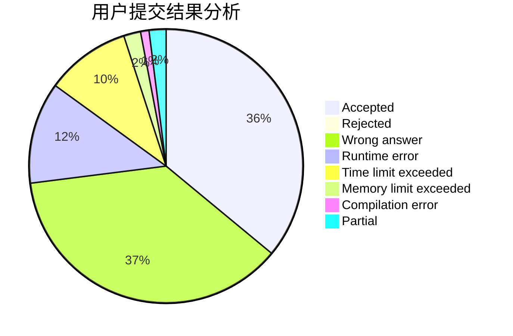
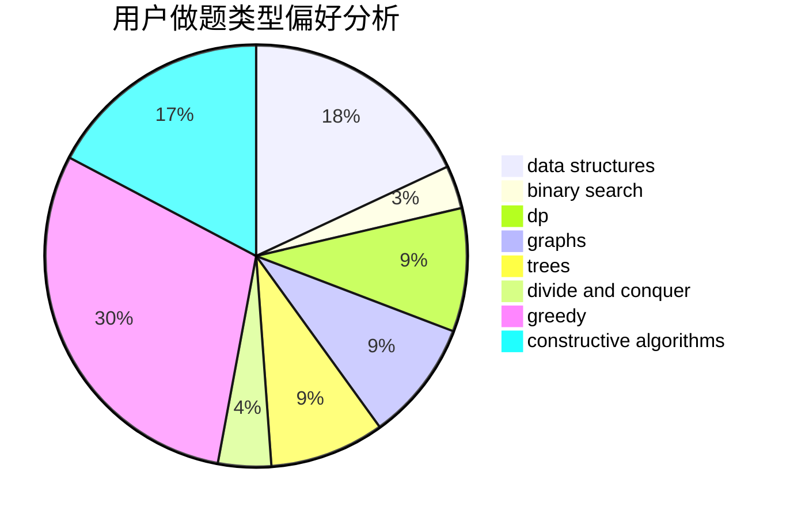
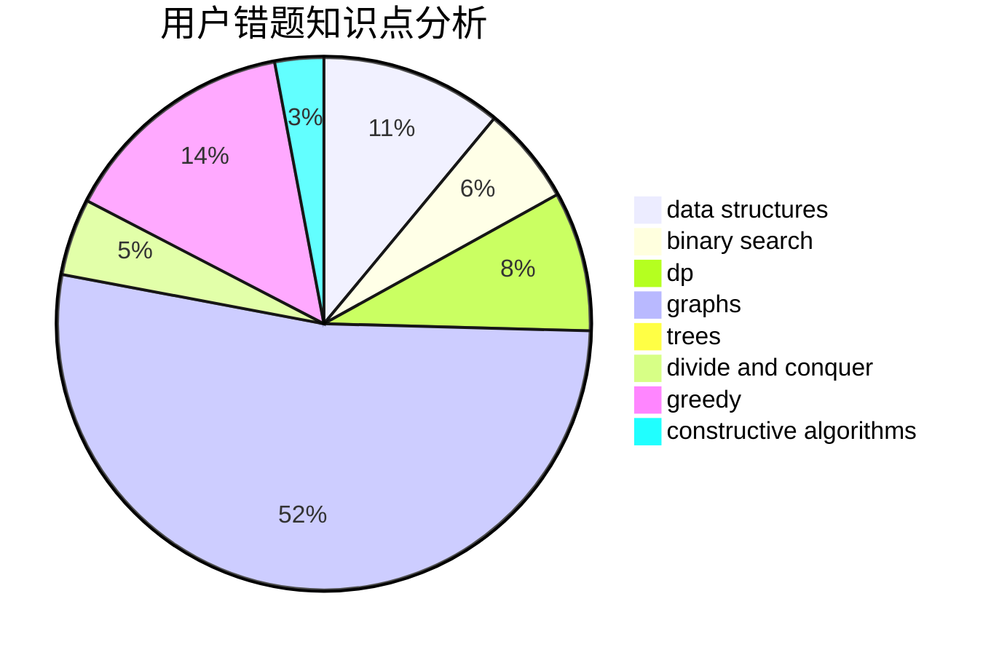

# Lavine

<!-- tabs:start -->

#### **用户提交结果分析**

#### **用户做题类型偏好分析**

#### **用户错题知识点分析**

<!-- tabs:end -->
# 推荐题目
[691C](https://codeforces.com/contest/691/problem/C)		implementation,
                        strings		  
[1237F](https://codeforces.com/contest/1237/problem/F)		combinatorics,
                        dp		  
[585B](https://codeforces.com/contest/585/problem/B)		dfs and similar,
                        graphs,
                        shortest paths		  
[957E](https://codeforces.com/contest/957/problem/E)		dsu,graphs,sortings,trees		  
[630J](https://codeforces.com/contest/630/problem/J)		math,
                        number theory		  
[962A](https://codeforces.com/contest/962/problem/A)		implementation		  
[1131A](https://codeforces.com/contest/1131/problem/A)		math		  
[225E](https://codeforces.com/contest/225/problem/E)		math,
                        number theory		  
[1150C](https://codeforces.com/contest/1150/problem/C)		dsu,graphs,sortings,trees		  
[772C](https://codeforces.com/contest/772/problem/C)		constructive algorithms,
                        dp,
                        graphs,
                        math,
                        number theory		  
