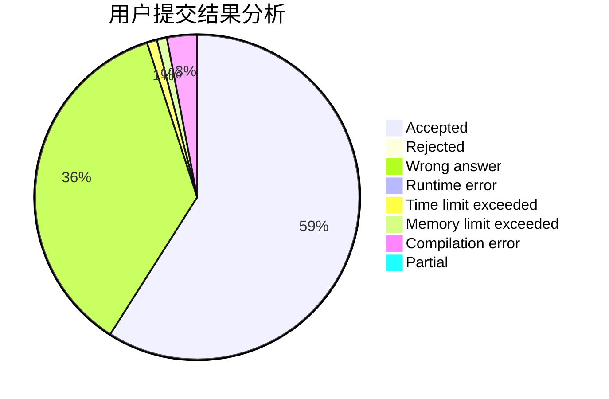
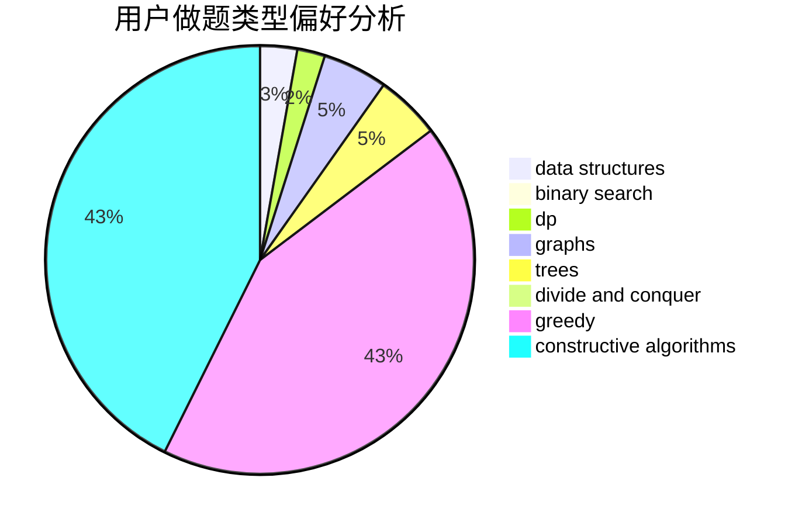
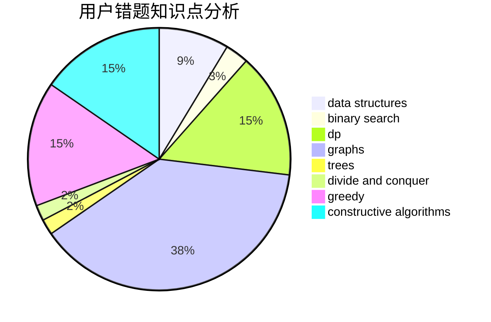

# LazyCharlie

<!-- tabs:start -->

#### **用户提交结果分析**

#### **用户做题类型偏好分析**

#### **用户错题知识点分析**

<!-- tabs:end -->
# 推荐题目
[809E](https://codeforces.com/contest/809/problem/E)		divide and conquer,
                        math,
                        number theory,
                        trees		  
[554A](https://codeforces.com/contest/554/problem/A)		brute force,
                        math,
                        strings		  
[1245F](https://codeforces.com/contest/1245/problem/F)		bitmasks,
                        brute force,
                        combinatorics,
                        dp		  
[919B](https://codeforces.com/contest/919/problem/B)		binary search,
                        brute force,
                        dp,
                        implementation,
                        number theory		  
[812E](https://codeforces.com/contest/812/problem/E)		games,
                        trees		  
[1490C](https://codeforces.com/contest/1490/problem/C)		binary search,
                        brute force,
                        brute force,
                        math		  
[1497B](https://codeforces.com/contest/1497/problem/B)		constructive algorithms,
                        greedy,
                        math		  
[1491C](https://codeforces.com/contest/1491/problem/C)		brute force,
                        data structures,
                        dp,
                        greedy,
                        implementation		  
[1484C](https://codeforces.com/contest/1484/problem/C)		dsu,graphs,sortings,trees		  
[1480A](https://codeforces.com/contest/1480/problem/A)		games,
                        greedy,
                        strings		  
