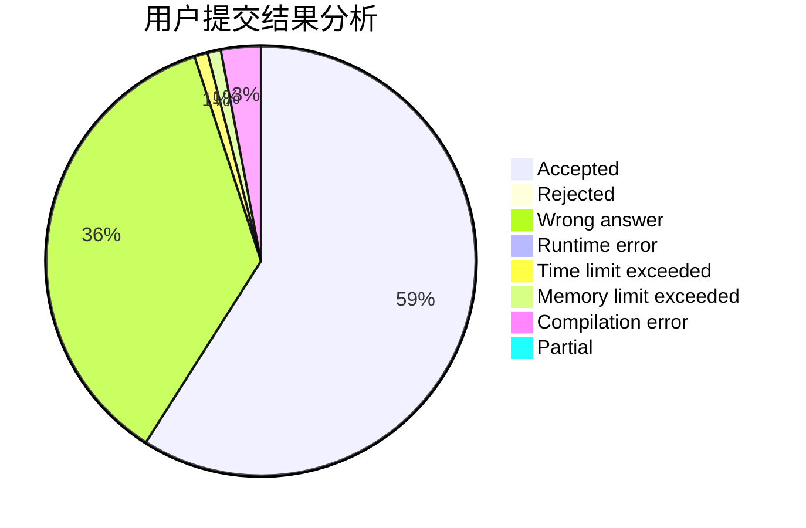
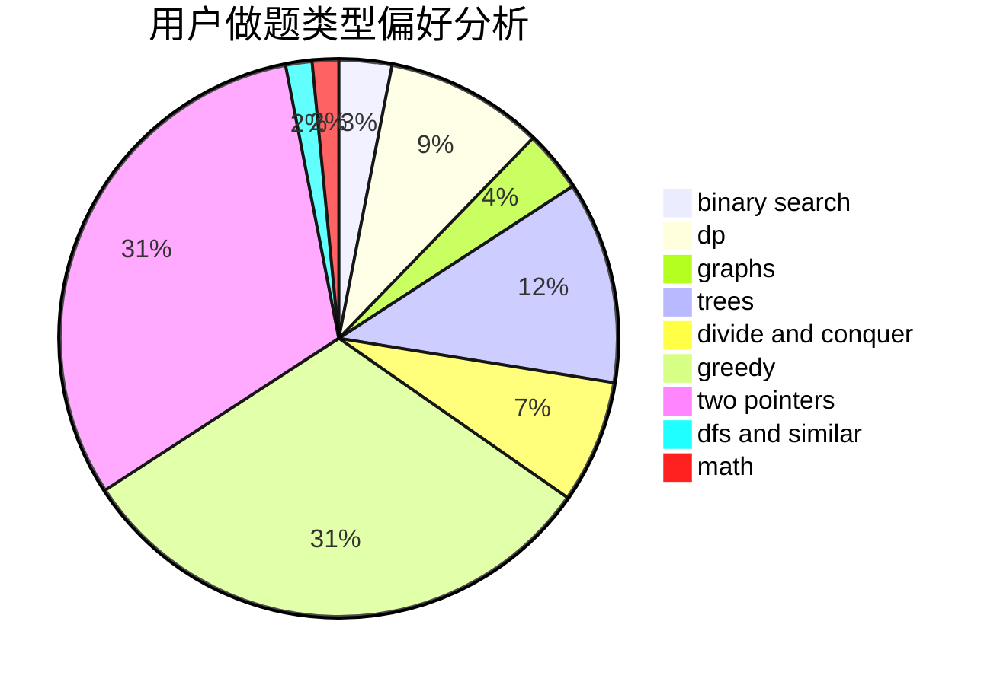

# LazyCharlie

<!-- tabs:start -->

#### **用户提交结果分析**

#### **用户做题类型偏好分析**

<!-- tabs:end -->
# 推荐题目
[809E](https://codeforces.com/contest/809/problem/E)
[554A](https://codeforces.com/contest/554/problem/A)
[1245F](https://codeforces.com/contest/1245/problem/F)
[919B](https://codeforces.com/contest/919/problem/B)
[812E](https://codeforces.com/contest/812/problem/E)
[1490C](https://codeforces.com/contest/1490/problem/C)
[1497B](https://codeforces.com/contest/1497/problem/B)
[1491C](https://codeforces.com/contest/1491/problem/C)
[1484C](https://codeforces.com/contest/1484/problem/C)
[1480A](https://codeforces.com/contest/1480/problem/A)
