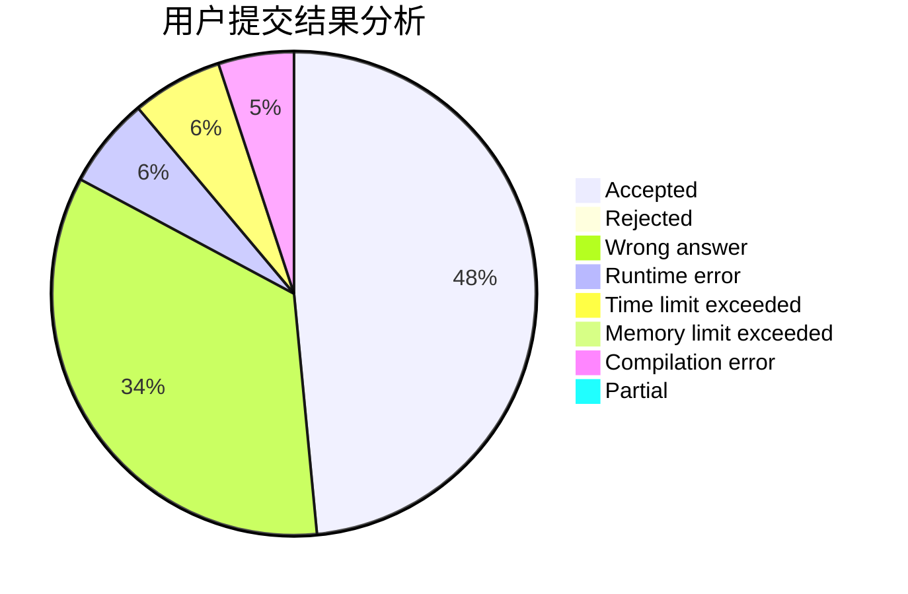
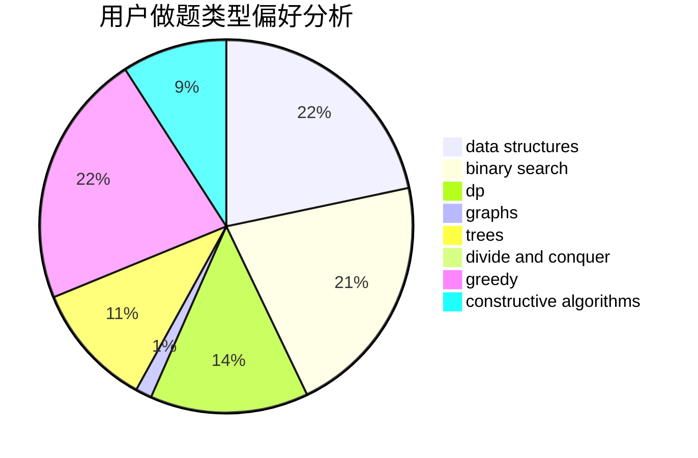
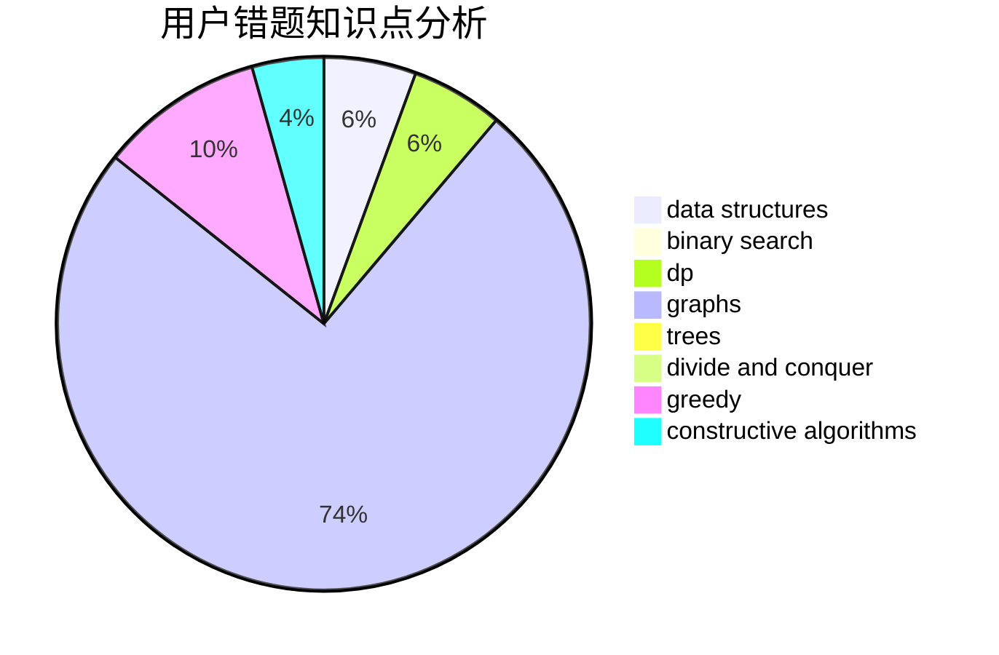

# Lcyanstars

<!-- tabs:start -->

#### **用户提交结果分析**

#### **用户做题类型偏好分析**

#### **用户错题知识点分析**

<!-- tabs:end -->
# 推荐题目
[1481D](https://codeforces.com/contest/1481/problem/D)		brute force,
                        constructive algorithms,
                        graphs,
                        greedy,
                        implementation		  
[1495C](https://codeforces.com/contest/1495/problem/C)		constructive algorithms,
                        graphs		  
[1349B](https://codeforces.com/contest/1349/problem/B)		constructive algorithms,
                        greedy,
                        math		  
[975E](https://codeforces.com/contest/975/problem/E)		geometry		  
[1086C](https://codeforces.com/contest/1086/problem/C)		dsu,graphs,sortings,trees		  
[935B](https://codeforces.com/contest/935/problem/B)		implementation		  
[95A](https://codeforces.com/contest/95/problem/A)		implementation,
                        strings		  
[349B](https://codeforces.com/contest/349/problem/B)		data structures,
                        dp,
                        greedy,
                        implementation		  
[421B](https://codeforces.com/contest/421/problem/B)		dsu,graphs,sortings,trees		  
[11521](https://codeforces.com/contest/1152/problem/1)		dsu,graphs,sortings,trees		  
