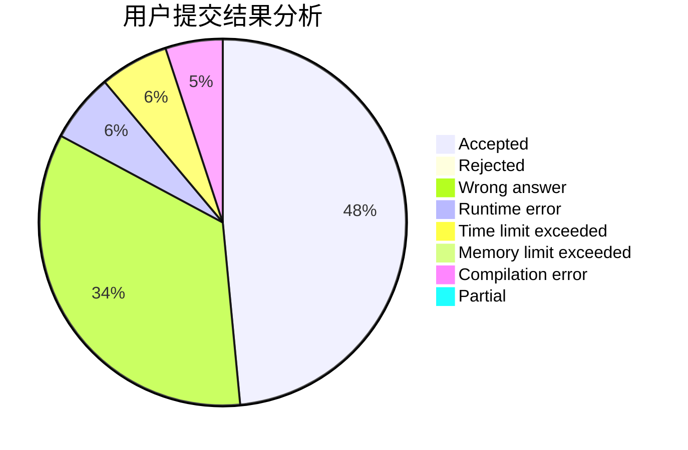
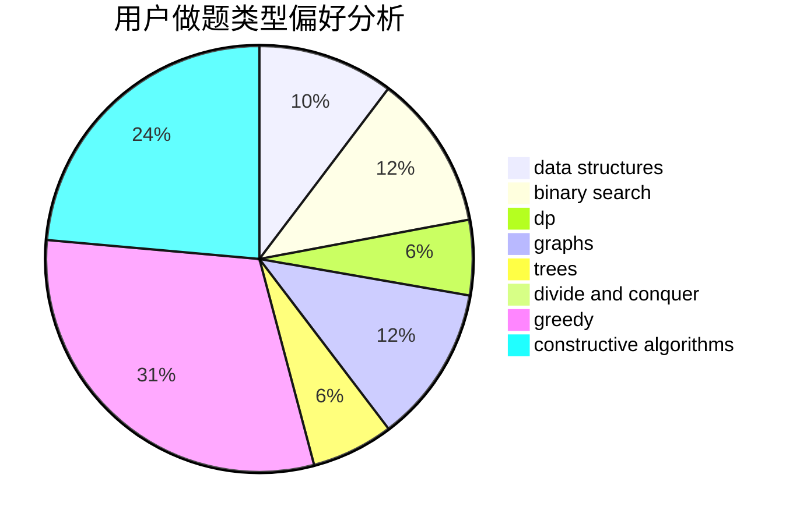
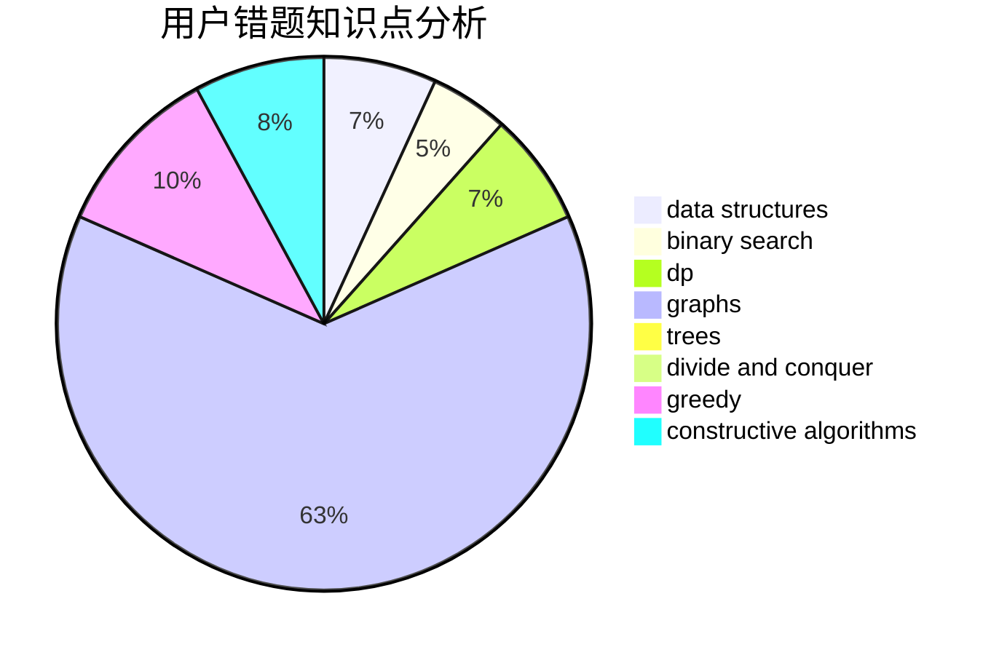

# Lcyanstars

<!-- tabs:start -->

#### **用户提交结果分析**

#### **用户做题类型偏好分析**

#### **用户错题知识点分析**

<!-- tabs:end -->
# 推荐题目
[1473A](https://codeforces.com/contest/1473/problem/A)		greedy,
                        implementation,
                        math,
                        sortings		  
[1487F](https://codeforces.com/contest/1487/problem/F)		dp,
                        greedy,
                        shortest paths		  
[1342D](https://codeforces.com/contest/1342/problem/D)		binary search,
                        constructive algorithms,
                        data structures,
                        greedy,
                        sortings,
                        two pointers		  
[952F](https://codeforces.com/contest/952/problem/F)		nan		  
[1085G](https://codeforces.com/contest/1085/problem/G)		combinatorics,
                        data structures,
                        dp		  
[915C](https://codeforces.com/contest/915/problem/C)		dp,
                        greedy		  
[938B](https://codeforces.com/contest/938/problem/B)		brute force,
                        greedy		  
[319A](https://codeforces.com/contest/319/problem/A)		combinatorics,
                        math		  
[393C](https://codeforces.com/contest/393/problem/C)		dsu,graphs,sortings,trees		  
[114D](https://codeforces.com/contest/114/problem/D)		dsu,graphs,sortings,trees		  
