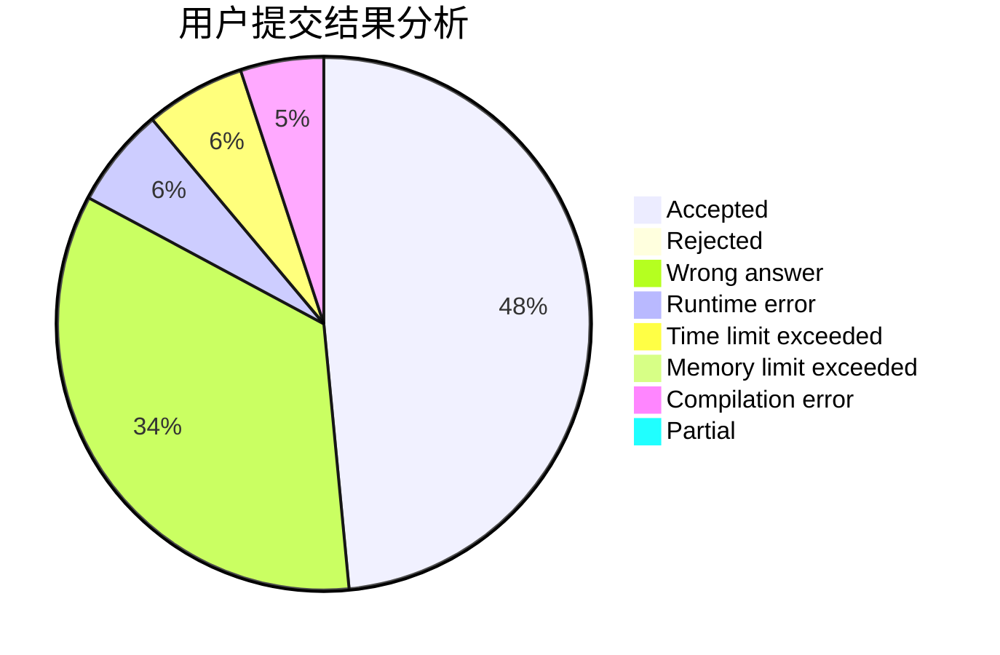
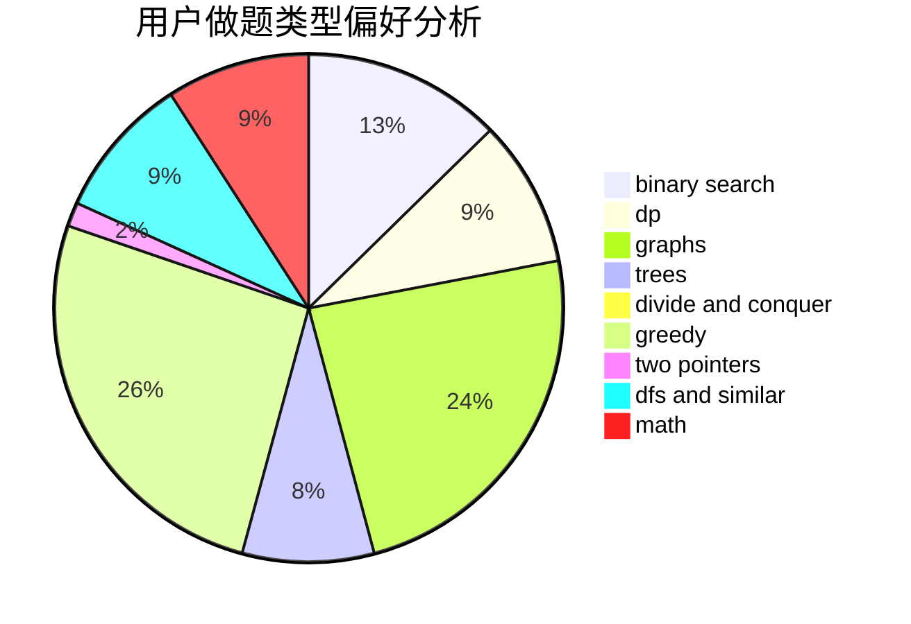

# Lcyanstars

<!-- tabs:start -->

#### **用户提交结果分析**

#### **用户做题类型偏好分析**

<!-- tabs:end -->
# 推荐题目
[1481D](https://codeforces.com/contest/1481/problem/D)
[1495C](https://codeforces.com/contest/1495/problem/C)
[1349B](https://codeforces.com/contest/1349/problem/B)
[975E](https://codeforces.com/contest/975/problem/E)
[1086C](https://codeforces.com/contest/1086/problem/C)
[935B](https://codeforces.com/contest/935/problem/B)
[95A](https://codeforces.com/contest/95/problem/A)
[349B](https://codeforces.com/contest/349/problem/B)
[421B](https://codeforces.com/contest/421/problem/B)
[11521](https://codeforces.com/contest/1152/problem/1)
