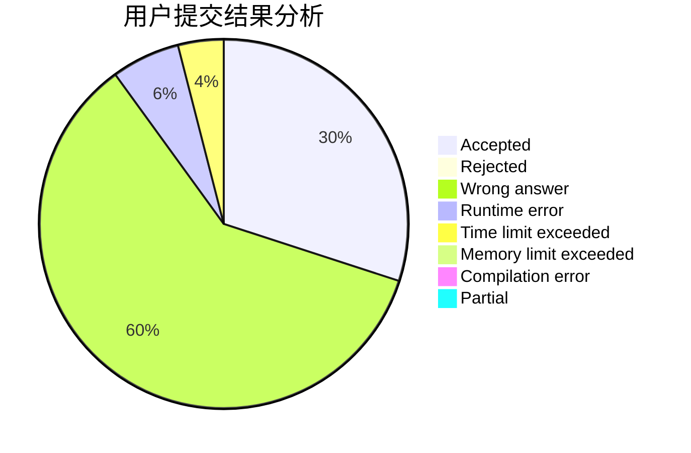
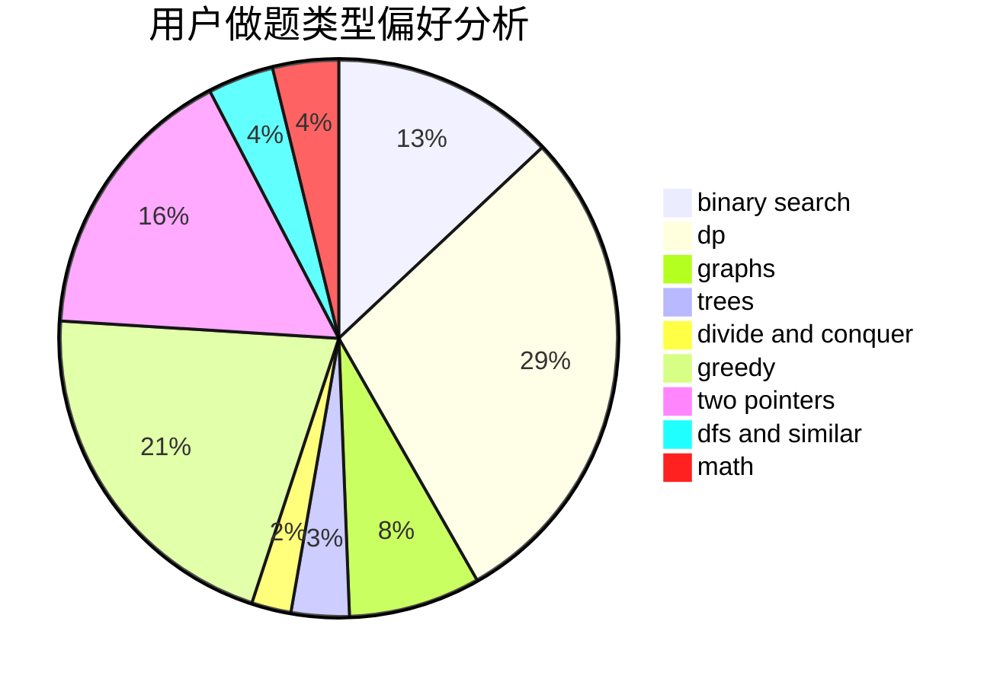

# LeafSeek

<!-- tabs:start -->

#### **用户提交结果分析**

#### **用户做题类型偏好分析**

<!-- tabs:end -->
# 推荐题目
[837D](https://codeforces.com/contest/837/problem/D)
[1186D](https://codeforces.com/contest/1186/problem/D)
[479E](https://codeforces.com/contest/479/problem/E)
[705A](https://codeforces.com/contest/705/problem/A)
[614D](https://codeforces.com/contest/614/problem/D)
[1342F](https://codeforces.com/contest/1342/problem/F)
[1511F](https://codeforces.com/contest/1511/problem/F)
[194E](https://codeforces.com/contest/194/problem/E)
[91A](https://codeforces.com/contest/91/problem/A)
[389A](https://codeforces.com/contest/389/problem/A)
