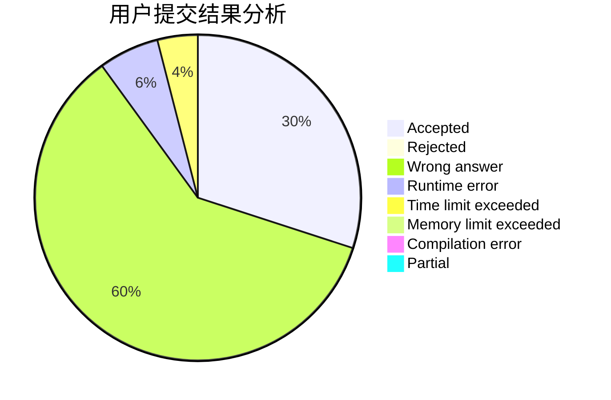
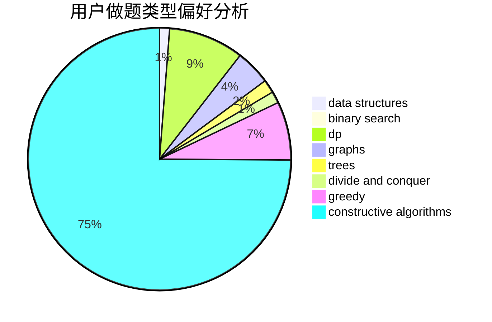
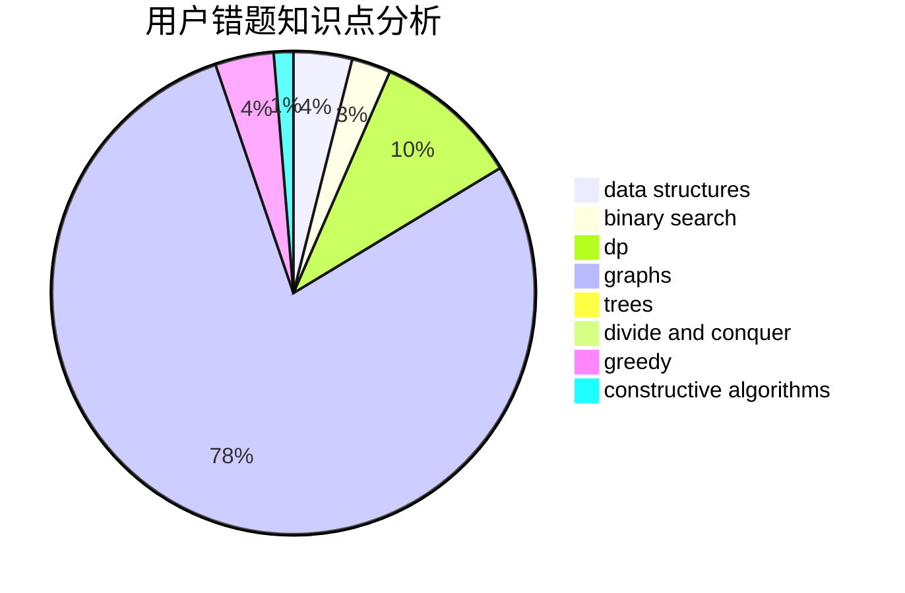

# LeafSeek

<!-- tabs:start -->

#### **用户提交结果分析**

#### **用户做题类型偏好分析**

#### **用户错题知识点分析**

<!-- tabs:end -->
# 推荐题目
[837D](https://codeforces.com/contest/837/problem/D)		dp,
                        math		  
[1186D](https://codeforces.com/contest/1186/problem/D)		constructive algorithms,
                        greedy,
                        math		  
[479E](https://codeforces.com/contest/479/problem/E)		combinatorics,
                        dp		  
[705A](https://codeforces.com/contest/705/problem/A)		implementation		  
[614D](https://codeforces.com/contest/614/problem/D)		dsu,graphs,sortings,trees		  
[1342F](https://codeforces.com/contest/1342/problem/F)		bitmasks,
                        brute force,
                        dp		  
[1511F](https://codeforces.com/contest/1511/problem/F)		brute force,
                        data structures,
                        dp,
                        matrices,
                        string suffix structures,
                        strings		  
[194E](https://codeforces.com/contest/194/problem/E)		dsu,graphs,sortings,trees		  
[91A](https://codeforces.com/contest/91/problem/A)		greedy,
                        strings		  
[389A](https://codeforces.com/contest/389/problem/A)		greedy,
                        math		  
