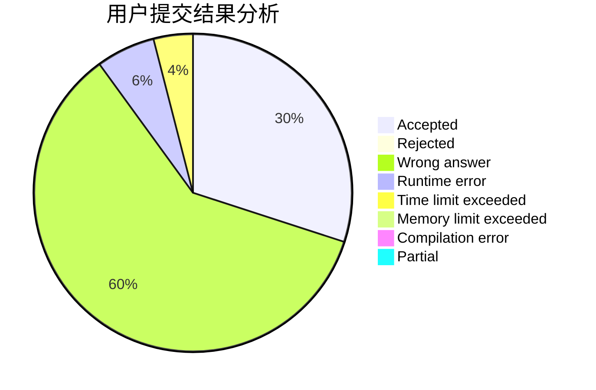
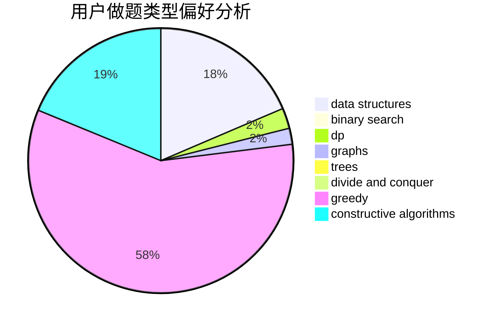
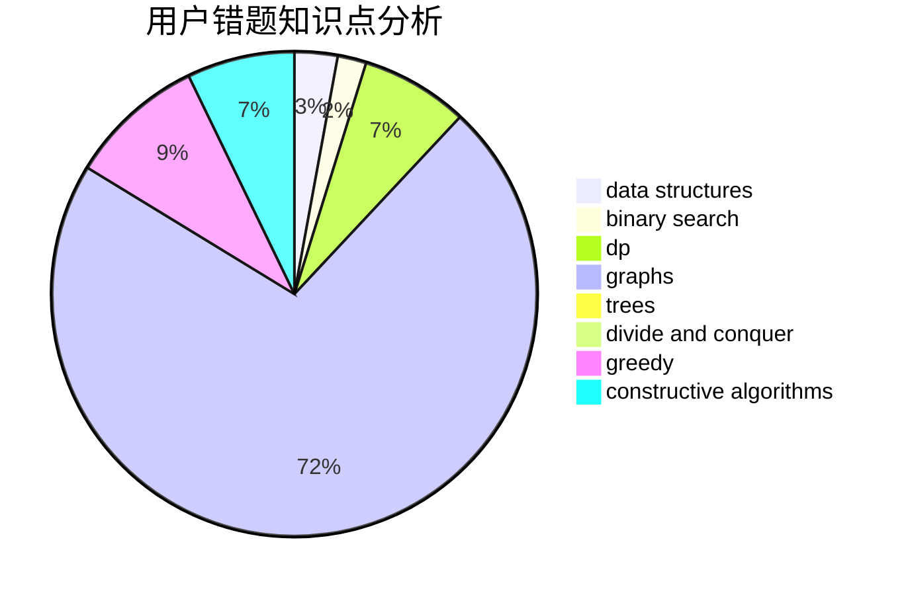

# LeafSeek

<!-- tabs:start -->

#### **用户提交结果分析**

#### **用户做题类型偏好分析**

#### **用户错题知识点分析**

<!-- tabs:end -->
# 推荐题目
[817D](https://codeforces.com/contest/817/problem/D)		data structures,
                        divide and conquer,
                        dsu,
                        sortings		  
[1183F](https://codeforces.com/contest/1183/problem/F)		brute force,
                        math,
                        sortings		  
[460B](https://codeforces.com/contest/460/problem/B)		brute force,
                        implementation,
                        math,
                        number theory		  
[681B](https://codeforces.com/contest/681/problem/B)		brute force		  
[597C](https://codeforces.com/contest/597/problem/C)		data structures,
                        dp		  
[1335E2](https://codeforces.com/contest/1335E/problem/2)		brute force,
                        data structures,
                        dp,
                        two pointers		  
[1501E](https://codeforces.com/contest/1501/problem/E)		dsu,graphs,sortings,trees		  
[167E](https://codeforces.com/contest/167/problem/E)		dfs and similar,
                        graphs,
                        math,
                        matrices		  
[906A](https://codeforces.com/contest/906/problem/A)		implementation,
                        strings		  
[360E](https://codeforces.com/contest/360/problem/E)		graphs,
                        greedy,
                        shortest paths		  
