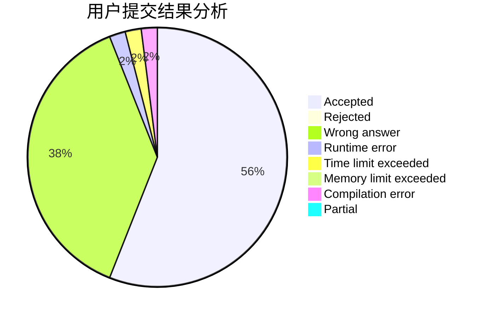
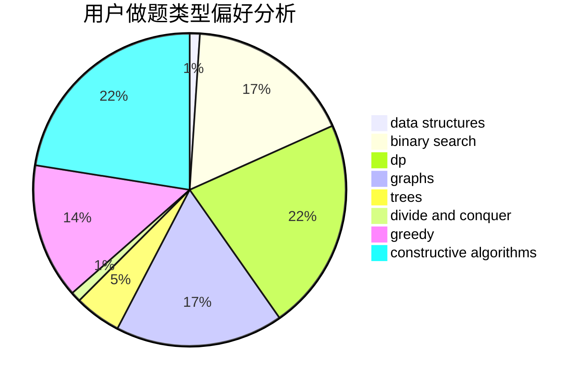
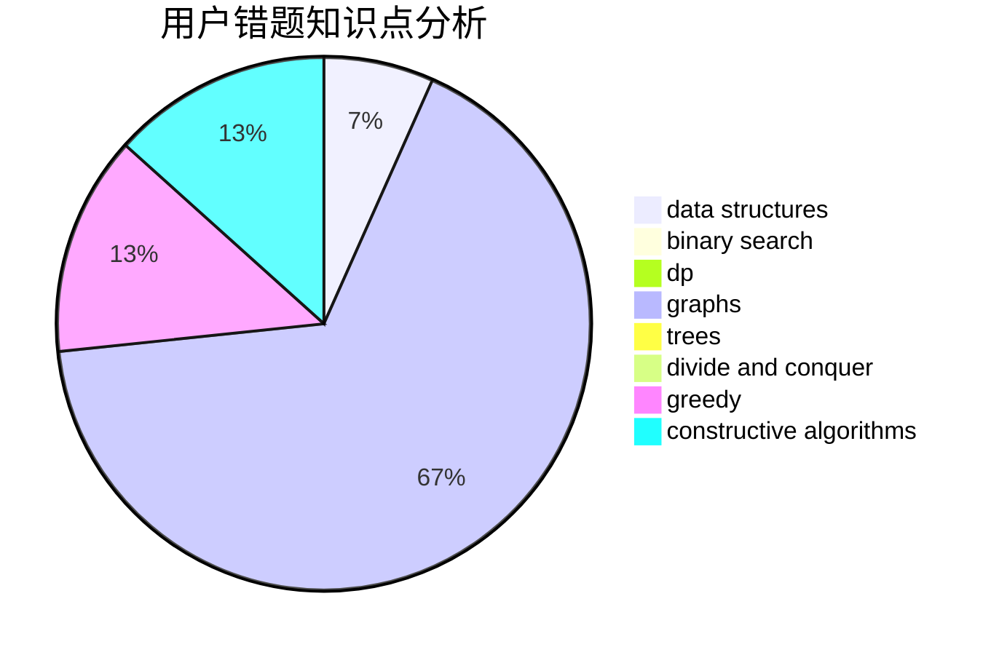

# Leafy

<!-- tabs:start -->

#### **用户提交结果分析**

#### **用户做题类型偏好分析**

#### **用户错题知识点分析**

<!-- tabs:end -->
# 推荐题目
[758D](https://codeforces.com/contest/758/problem/D)		constructive algorithms,
                        dp,
                        greedy,
                        math,
                        strings		  
[555B](https://codeforces.com/contest/555/problem/B)		data structures,
                        greedy,
                        sortings		  
[860A](https://codeforces.com/contest/860/problem/A)		dsu,graphs,sortings,trees		  
[1249F](https://codeforces.com/contest/1249/problem/F)		dp,
                        trees		  
[568A](https://codeforces.com/contest/568/problem/A)		brute force,
                        implementation,
                        math,
                        number theory		  
[497C](https://codeforces.com/contest/497/problem/C)		dsu,graphs,sortings,trees		  
[1347C](https://codeforces.com/contest/1347/problem/C)		dsu,graphs,sortings,trees		  
[936A](https://codeforces.com/contest/936/problem/A)		binary search,
                        implementation,
                        math		  
[300C](https://codeforces.com/contest/300/problem/C)		brute force,
                        combinatorics		  
[1056C](https://codeforces.com/contest/1056/problem/C)		greedy,
                        implementation,
                        interactive,
                        sortings		  
