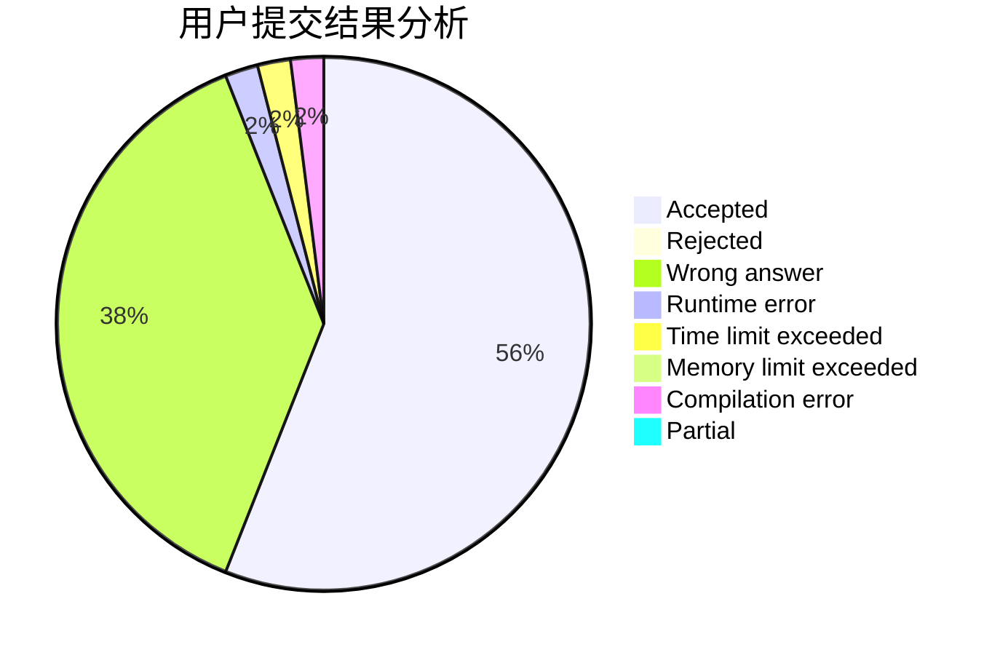
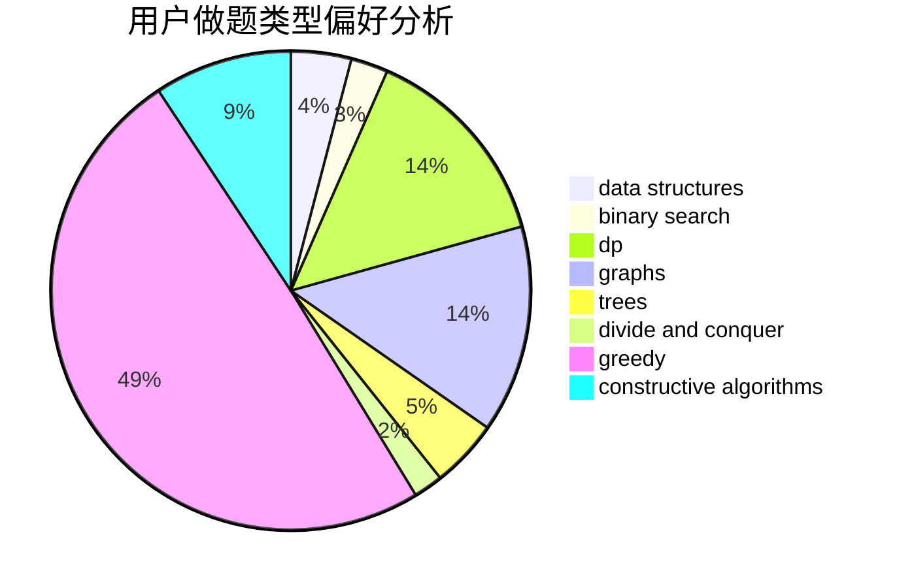
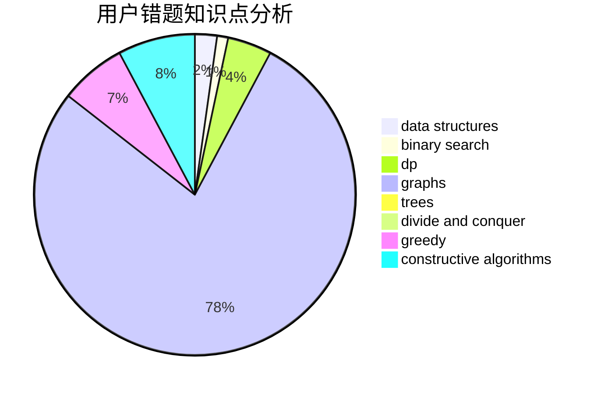

# Leafy

<!-- tabs:start -->

#### **用户提交结果分析**

#### **用户做题类型偏好分析**

#### **用户错题知识点分析**

<!-- tabs:end -->
# 推荐题目
[736E](https://codeforces.com/contest/736/problem/E)		constructive algorithms,
                        flows,
                        greedy,
                        math		  
[533D](https://codeforces.com/contest/533/problem/D)		data structures,
                        dp		  
[841A](https://codeforces.com/contest/841/problem/A)		brute force,
                        implementation		  
[1244D](https://codeforces.com/contest/1244/problem/D)		brute force,
                        constructive algorithms,
                        dp,
                        graphs,
                        implementation,
                        trees		  
[543E](https://codeforces.com/contest/543/problem/E)		constructive algorithms,
                        data structures		  
[477C](https://codeforces.com/contest/477/problem/C)		dsu,graphs,sortings,trees		  
[1340D](https://codeforces.com/contest/1340/problem/D)		constructive algorithms,
                        dfs and similar,
                        graphs,
                        trees		  
[916A](https://codeforces.com/contest/916/problem/A)		brute force,
                        implementation,
                        math		  
[286B](https://codeforces.com/contest/286/problem/B)		implementation		  
[1055F](https://codeforces.com/contest/1055/problem/F)		strings,
                        trees		  
