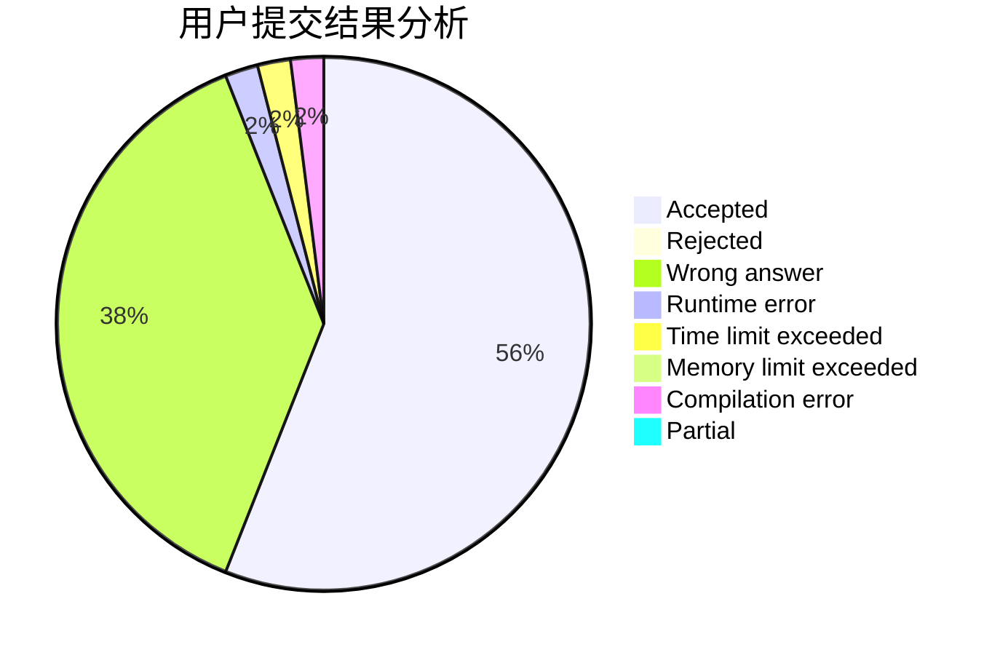
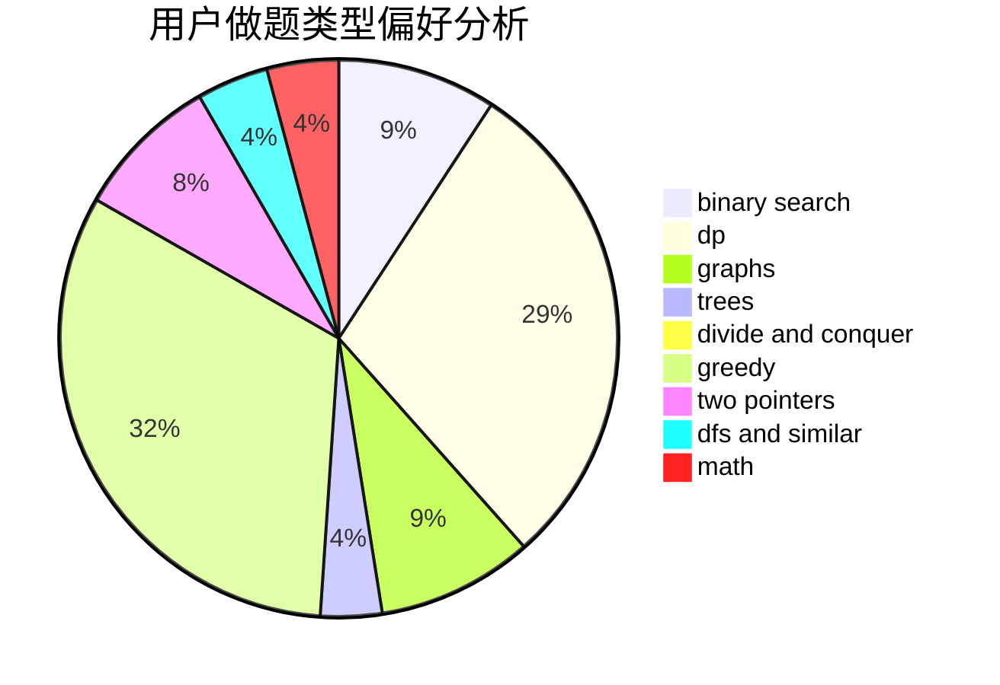

# Leafy

<!-- tabs:start -->

#### **用户提交结果分析**

#### **用户做题类型偏好分析**

<!-- tabs:end -->
# 推荐题目
[758D](https://codeforces.com/contest/758/problem/D)
[555B](https://codeforces.com/contest/555/problem/B)
[860A](https://codeforces.com/contest/860/problem/A)
[1249F](https://codeforces.com/contest/1249/problem/F)
[568A](https://codeforces.com/contest/568/problem/A)
[497C](https://codeforces.com/contest/497/problem/C)
[1347C](https://codeforces.com/contest/1347/problem/C)
[936A](https://codeforces.com/contest/936/problem/A)
[300C](https://codeforces.com/contest/300/problem/C)
[1056C](https://codeforces.com/contest/1056/problem/C)
