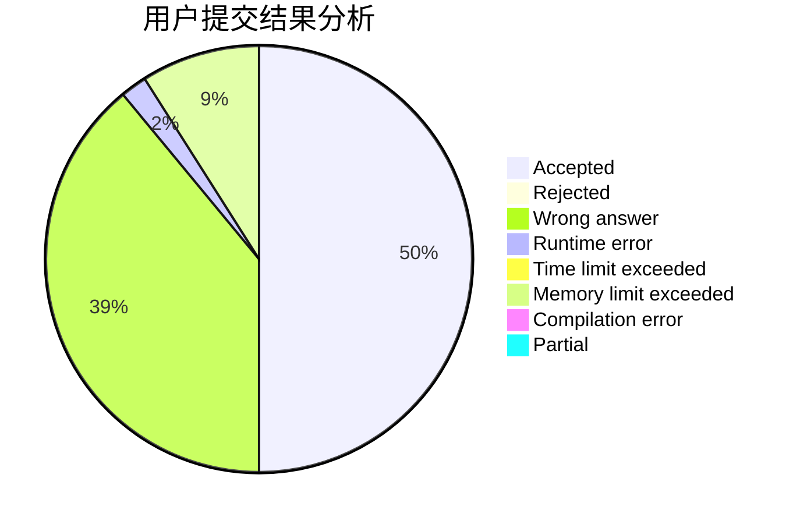
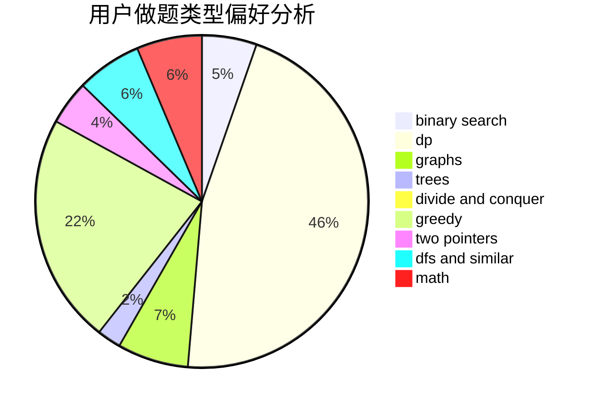

# Leaving_

<!-- tabs:start -->

#### **用户提交结果分析**

#### **用户做题类型偏好分析**

<!-- tabs:end -->
# 推荐题目
[13352](https://codeforces.com/contest/1335/problem/2)
[763D](https://codeforces.com/contest/763/problem/D)
[730B](https://codeforces.com/contest/730/problem/B)
[24E](https://codeforces.com/contest/24/problem/E)
[425E](https://codeforces.com/contest/425/problem/E)
[1138E](https://codeforces.com/contest/1138/problem/E)
[199B](https://codeforces.com/contest/199/problem/B)
[356D](https://codeforces.com/contest/356/problem/D)
[333E](https://codeforces.com/contest/333/problem/E)
[1109E](https://codeforces.com/contest/1109/problem/E)
