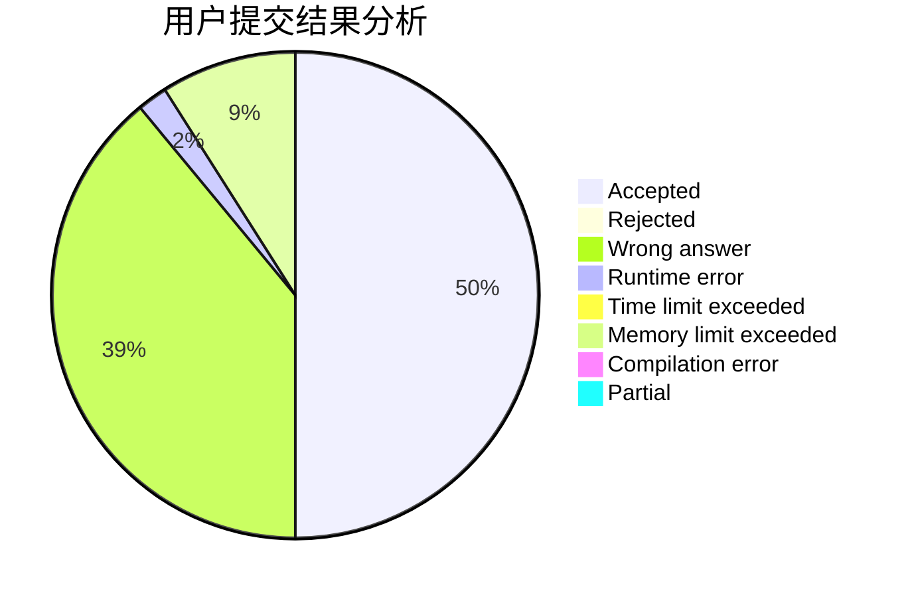
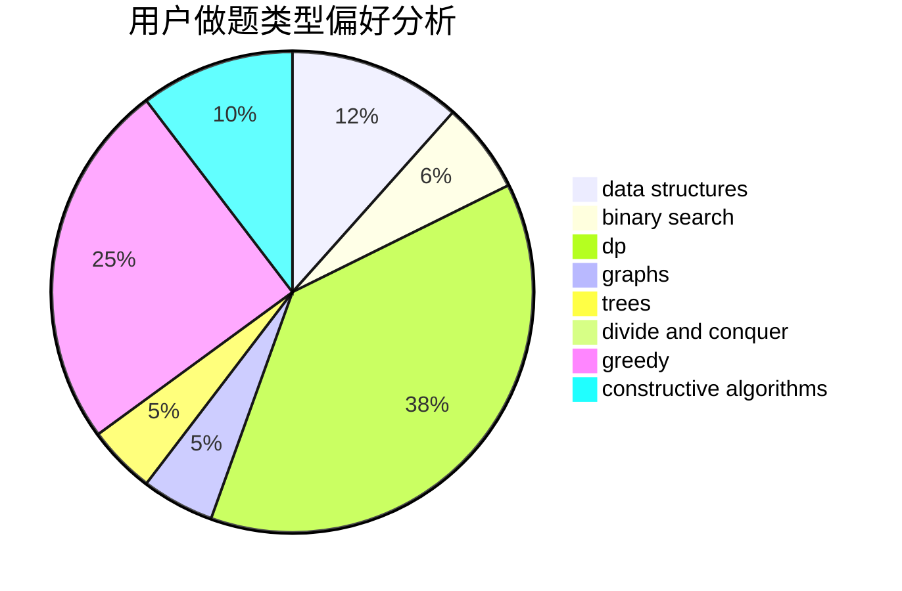
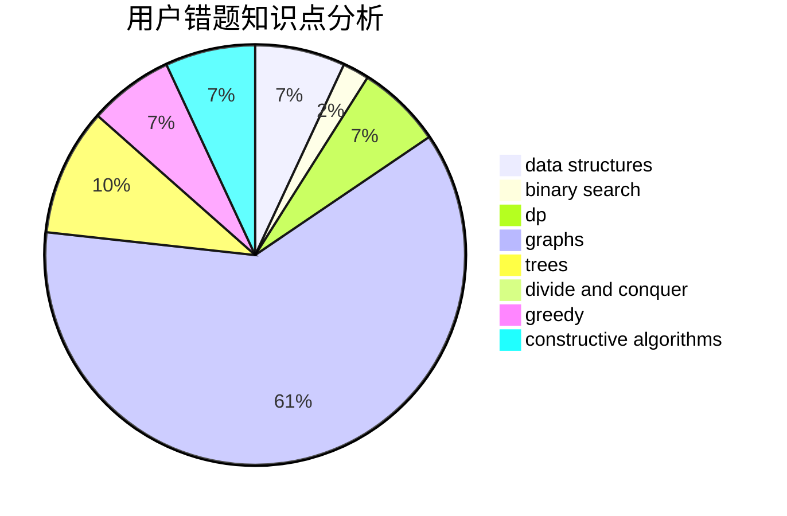

# Leaving_

<!-- tabs:start -->

#### **用户提交结果分析**

#### **用户做题类型偏好分析**

#### **用户错题知识点分析**

<!-- tabs:end -->
# 推荐题目
[1328F](https://codeforces.com/contest/1328/problem/F)		greedy		  
[743C](https://codeforces.com/contest/743/problem/C)		brute force,
                        constructive algorithms,
                        math,
                        number theory		  
[70D](https://codeforces.com/contest/70/problem/D)		data structures,
                        geometry		  
[22B](https://codeforces.com/contest/22/problem/B)		brute force,
                        dp		  
[39C](https://codeforces.com/contest/39/problem/C)		dp,
                        sortings		  
[1136C](https://codeforces.com/contest/1136/problem/C)		constructive algorithms,
                        sortings		  
[171E](https://codeforces.com/contest/171/problem/E)		*special problem		  
[328A](https://codeforces.com/contest/328/problem/A)		implementation		  
[30E](https://codeforces.com/contest/30/problem/E)		binary search,
                        constructive algorithms,
                        data structures,
                        greedy,
                        hashing,
                        strings		  
[1109A](https://codeforces.com/contest/1109/problem/A)		dp,
                        implementation		  
