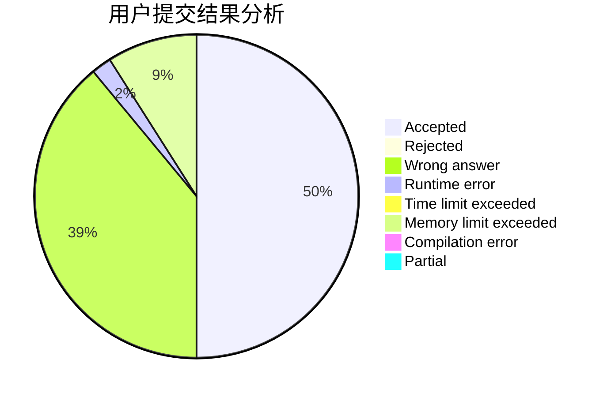
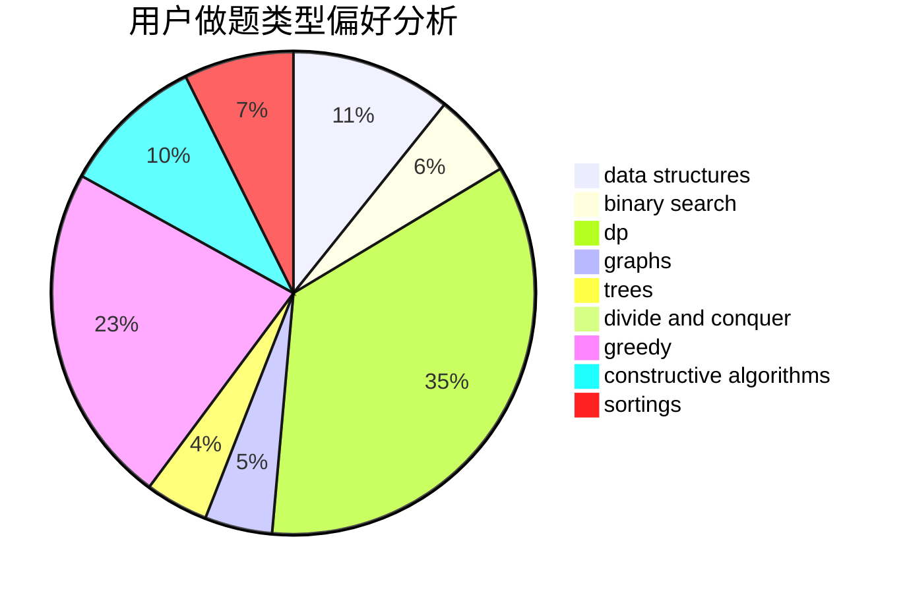
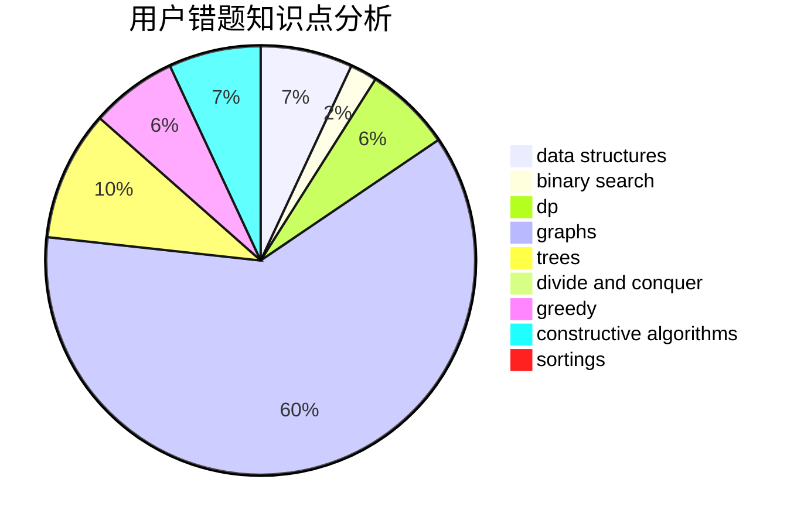

# Leaving_
<!-- tabs:start -->
#### **用户提交结果分析**

#### **用户做题类型偏好分析**

#### **用户错题知识点分析**

<!-- tabs:end -->
# 推荐题目
[22B](http://codeforces.com/problemset/problem/22/B)		brute force,
                        dp		  
[1328F](http://codeforces.com/problemset/problem/1328/F)		greedy		  
[39C](http://codeforces.com/problemset/problem/39/C)		dp,
                        sortings		  
[743C](http://codeforces.com/problemset/problem/743/C)		brute force,
                        constructive algorithms,
                        math,
                        number theory		  
[328A](http://codeforces.com/problemset/problem/328/A)		implementation		  
[256D](http://codeforces.com/problemset/problem/256/D)		dp		  
[1010E](http://codeforces.com/problemset/problem/1010/E)		data structures		  
[1216F](http://codeforces.com/problemset/problem/1216/F)		data structures,
                        dp,
                        greedy		  
[819B](http://codeforces.com/problemset/problem/819/B)		data structures,
                        implementation,
                        math		  
[58C](http://codeforces.com/problemset/problem/58/C)		brute force		  
<!-- tabs:start -->
#### **data structures**
[1010E](http://codeforces.com/problemset/problem/1010/E)		data structures		  
[1216F](http://codeforces.com/problemset/problem/1216/F)		data structures,
                        dp,
                        greedy		  
[819B](http://codeforces.com/problemset/problem/819/B)		data structures,
                        implementation,
                        math		  
[1335F](http://codeforces.com/problemset/problem/1335/F)		data structures,
                        dfs and similar,
                        dsu,
                        graphs,
                        greedy,
                        matrices		  
[263E](http://codeforces.com/problemset/problem/263/E)		brute force,
                        data structures,
                        dp		  
[70D](http://codeforces.com/problemset/problem/70/D)		data structures,
                        geometry		  
[500E](http://codeforces.com/problemset/problem/500/E)		data structures,
                        dp,
                        dsu		  
[30E](http://codeforces.com/problemset/problem/30/E)		binary search,
                        constructive algorithms,
                        data structures,
                        greedy,
                        hashing,
                        strings		  
[1041D](http://codeforces.com/problemset/problem/1041/D)		binary search,
                        data structures,
                        two pointers		  
[702B](http://codeforces.com/problemset/problem/702/B)		brute force,
                        data structures,
                        implementation,
                        math		  
#### **binary search**
[30E](http://codeforces.com/problemset/problem/30/E)		binary search,
                        constructive algorithms,
                        data structures,
                        greedy,
                        hashing,
                        strings		  
[1041D](http://codeforces.com/problemset/problem/1041/D)		binary search,
                        data structures,
                        two pointers		  
[1201C](http://codeforces.com/problemset/problem/1201/C)		binary search,
                        greedy,
                        math,
                        sortings		  
[1492C](http://codeforces.com/problemset/problem/1492/C)		binary search,
                        data structures,
                        dp,
                        greedy,
                        two pointers		  
[1463D](http://codeforces.com/problemset/problem/1463/D)		binary search,
                        constructive algorithms,
                        greedy,
                        two pointers		  
[1490G](http://codeforces.com/problemset/problem/1490/G)		binary search,
                        data structures,
                        math		  
[1479D](http://codeforces.com/problemset/problem/1479/D)		binary search,
                        bitmasks,
                        brute force,
                        data structures,
                        probabilities,
                        trees		  
[1436E](http://codeforces.com/problemset/problem/1436/E)		binary search,
                        data structures,
                        two pointers		  
[1461D](http://codeforces.com/problemset/problem/1461/D)		binary search,
                        brute force,
                        data structures,
                        divide and conquer,
                        implementation,
                        sortings		  
[1493C](http://codeforces.com/problemset/problem/1493/C)		binary search,
                        brute force,
                        constructive algorithms,
                        greedy,
                        strings		  
#### **dp**
[22B](http://codeforces.com/problemset/problem/22/B)		brute force,
                        dp		  
[39C](http://codeforces.com/problemset/problem/39/C)		dp,
                        sortings		  
[256D](http://codeforces.com/problemset/problem/256/D)		dp		  
[1216F](http://codeforces.com/problemset/problem/1216/F)		data structures,
                        dp,
                        greedy		  
[263E](http://codeforces.com/problemset/problem/263/E)		brute force,
                        data structures,
                        dp		  
[1109A](http://codeforces.com/problemset/problem/1109/A)		dp,
                        implementation		  
[1322F](http://codeforces.com/problemset/problem/1322/F)		dp,
                        trees		  
[500E](http://codeforces.com/problemset/problem/500/E)		data structures,
                        dp,
                        dsu		  
[498B](http://codeforces.com/problemset/problem/498/B)		dp,
                        probabilities,
                        two pointers		  
[1380C](http://codeforces.com/problemset/problem/1380/C)		brute force,
                        dp,
                        greedy,
                        implementation,
                        sortings		  
#### **graph**
[1335F](http://codeforces.com/problemset/problem/1335/F)		data structures,
                        dfs and similar,
                        dsu,
                        graphs,
                        greedy,
                        matrices		  
[528C](https://codeforces.com/contest/528/problem/C)		dfs and similar,
                        graphs		  
[1105D](http://codeforces.com/problemset/problem/1105/D)		dfs and similar,
                        graphs,
                        implementation,
                        shortest paths		  
[1383F](http://codeforces.com/problemset/problem/1383/F)		flows,
                        graphs		  
[1487C](http://codeforces.com/problemset/problem/1487/C)		brute force,
                        constructive algorithms,
                        dfs and similar,
                        graphs,
                        greedy,
                        implementation,
                        math		  
[1437C](http://codeforces.com/problemset/problem/1437/C)		dp,
                        flows,
                        graph matchings,
                        greedy,
                        math,
                        sortings		  
[1470D](http://codeforces.com/problemset/problem/1470/D)		constructive algorithms,
                        dfs and similar,
                        graph matchings,
                        graphs,
                        greedy		  
[1476C](http://codeforces.com/problemset/problem/1476/C)		dp,
                        graphs,
                        greedy		  
[1304D](http://codeforces.com/problemset/problem/1304/D)		constructive algorithms,
                        graphs,
                        greedy,
                        two pointers		  
[1475C](http://codeforces.com/problemset/problem/1475/C)		combinatorics,
                        graphs,
                        math		  
#### **trees**
[828D](https://codeforces.com/contest/828/problem/D)		constructive algorithms,
                        greedy,
                        implementation,
                        trees		  
[1387B2](http://codeforces.com/problemset/problem/1387/B2)		*special problem,
                        dfs and similar,
                        trees		  
[1322F](http://codeforces.com/problemset/problem/1322/F)		dp,
                        trees		  
[1479D](http://codeforces.com/problemset/problem/1479/D)		binary search,
                        bitmasks,
                        brute force,
                        data structures,
                        probabilities,
                        trees		  
[1511C](http://codeforces.com/problemset/problem/1511/C)		brute force,
                        data structures,
                        implementation,
                        trees		  
[1499F](http://codeforces.com/problemset/problem/1499/F)		combinatorics,
                        dfs and similar,
                        dp,
                        trees		  
[1491E](http://codeforces.com/problemset/problem/1491/E)		brute force,
                        dfs and similar,
                        divide and conquer,
                        number theory,
                        trees		  
[1466D](http://codeforces.com/problemset/problem/1466/D)		data structures,
                        greedy,
                        sortings,
                        trees		  
[1495D](http://codeforces.com/problemset/problem/1495/D)		combinatorics,
                        dfs and similar,
                        graphs,
                        math,
                        shortest paths,
                        trees		  
[1303G](http://codeforces.com/problemset/problem/1303/G)		data structures,
                        divide and conquer,
                        geometry,
                        trees		  
#### **divide and conquer**
[1420C2](http://codeforces.com/problemset/problem/1420/C2)		data structures,
                        divide and conquer,
                        dp,
                        greedy,
                        implementation		  
[1461D](http://codeforces.com/problemset/problem/1461/D)		binary search,
                        brute force,
                        data structures,
                        divide and conquer,
                        implementation,
                        sortings		  
[1466G](http://codeforces.com/problemset/problem/1466/G)		combinatorics,
                        divide and conquer,
                        hashing,
                        math,
                        string suffix structures,
                        strings		  
[1490D](http://codeforces.com/problemset/problem/1490/D)		dfs and similar,
                        divide and conquer,
                        implementation		  
[1483C](https://codeforces.com/contest/1483/problem/C)		data structures,
                        divide and conquer,
                        dp		  
[1491E](http://codeforces.com/problemset/problem/1491/E)		brute force,
                        dfs and similar,
                        divide and conquer,
                        number theory,
                        trees		  
[1303G](http://codeforces.com/problemset/problem/1303/G)		data structures,
                        divide and conquer,
                        geometry,
                        trees		  
[1494D](http://codeforces.com/problemset/problem/1494/D)		constructive algorithms,
                        data structures,
                        dfs and similar,
                        divide and conquer,
                        dsu,
                        greedy,
                        sortings,
                        trees		  
[1482E](http://codeforces.com/problemset/problem/1482/E)		data structures,
                        divide and conquer,
                        dp		  
[566C](http://codeforces.com/problemset/problem/566/C)		dfs and similar,
                        divide and conquer,
                        trees		  
#### **greedy**
[1328F](http://codeforces.com/problemset/problem/1328/F)		greedy		  
[1216F](http://codeforces.com/problemset/problem/1216/F)		data structures,
                        dp,
                        greedy		  
[828D](https://codeforces.com/contest/828/problem/D)		constructive algorithms,
                        greedy,
                        implementation,
                        trees		  
[1335F](http://codeforces.com/problemset/problem/1335/F)		data structures,
                        dfs and similar,
                        dsu,
                        graphs,
                        greedy,
                        matrices		  
[30E](http://codeforces.com/problemset/problem/30/E)		binary search,
                        constructive algorithms,
                        data structures,
                        greedy,
                        hashing,
                        strings		  
[1264A](http://codeforces.com/problemset/problem/1264/A)		greedy,
                        implementation		  
[1380C](http://codeforces.com/problemset/problem/1380/C)		brute force,
                        dp,
                        greedy,
                        implementation,
                        sortings		  
[1420C2](http://codeforces.com/problemset/problem/1420/C2)		data structures,
                        divide and conquer,
                        dp,
                        greedy,
                        implementation		  
[1504F](https://codeforces.com/contest/1504/problem/F)		2-sat,
                        constructive algorithms,
                        data structures,
                        greedy,
                        sortings,
                        two pointers		  
[1201C](http://codeforces.com/problemset/problem/1201/C)		binary search,
                        greedy,
                        math,
                        sortings		  
#### **constructive algorithms**
[743C](http://codeforces.com/problemset/problem/743/C)		brute force,
                        constructive algorithms,
                        math,
                        number theory		  
[828D](https://codeforces.com/contest/828/problem/D)		constructive algorithms,
                        greedy,
                        implementation,
                        trees		  
[1081B](http://codeforces.com/problemset/problem/1081/B)		constructive algorithms,
                        implementation		  
[23C](http://codeforces.com/problemset/problem/23/C)		constructive algorithms,
                        sortings		  
[1136C](http://codeforces.com/problemset/problem/1136/C)		constructive algorithms,
                        sortings		  
[1450C2](http://codeforces.com/problemset/problem/1450/C2)		constructive algorithms,
                        math		  
[30E](http://codeforces.com/problemset/problem/30/E)		binary search,
                        constructive algorithms,
                        data structures,
                        greedy,
                        hashing,
                        strings		  
[1110C](http://codeforces.com/problemset/problem/1110/C)		constructive algorithms,
                        math,
                        number theory		  
[1395B](http://codeforces.com/problemset/problem/1395/B)		constructive algorithms		  
[1504F](https://codeforces.com/contest/1504/problem/F)		2-sat,
                        constructive algorithms,
                        data structures,
                        greedy,
                        sortings,
                        two pointers		  
#### **sortings**
[39C](http://codeforces.com/problemset/problem/39/C)		dp,
                        sortings		  
[23C](http://codeforces.com/problemset/problem/23/C)		constructive algorithms,
                        sortings		  
[1136C](http://codeforces.com/problemset/problem/1136/C)		constructive algorithms,
                        sortings		  
[1380C](http://codeforces.com/problemset/problem/1380/C)		brute force,
                        dp,
                        greedy,
                        implementation,
                        sortings		  
[1504F](https://codeforces.com/contest/1504/problem/F)		2-sat,
                        constructive algorithms,
                        data structures,
                        greedy,
                        sortings,
                        two pointers		  
[1201C](http://codeforces.com/problemset/problem/1201/C)		binary search,
                        greedy,
                        math,
                        sortings		  
[1496C](https://codeforces.com/contest/1496/problem/C)		geometry,
                        greedy,
                        math,
                        sortings		  
[1495A](http://codeforces.com/problemset/problem/1495/A)		geometry,
                        greedy,
                        math,
                        sortings		  
[1497A](http://codeforces.com/problemset/problem/1497/A)		brute force,
                        data structures,
                        greedy,
                        sortings		  
[1427A](http://codeforces.com/problemset/problem/1427/A)		math,
                        sortings		  
<!-- tabs:end -->
