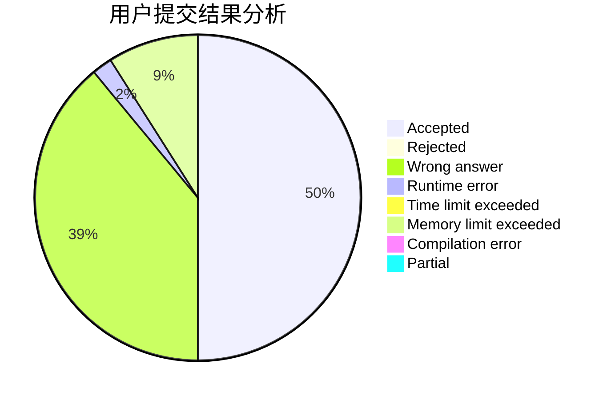
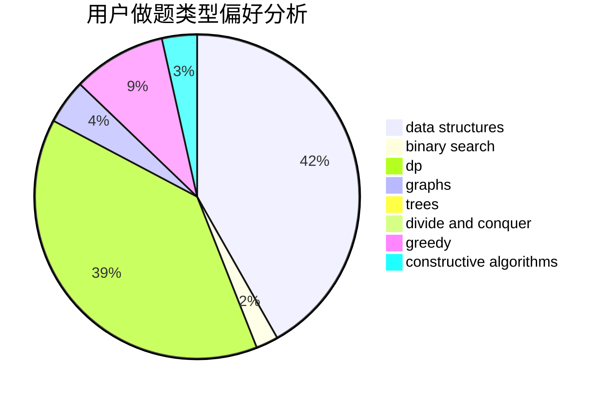
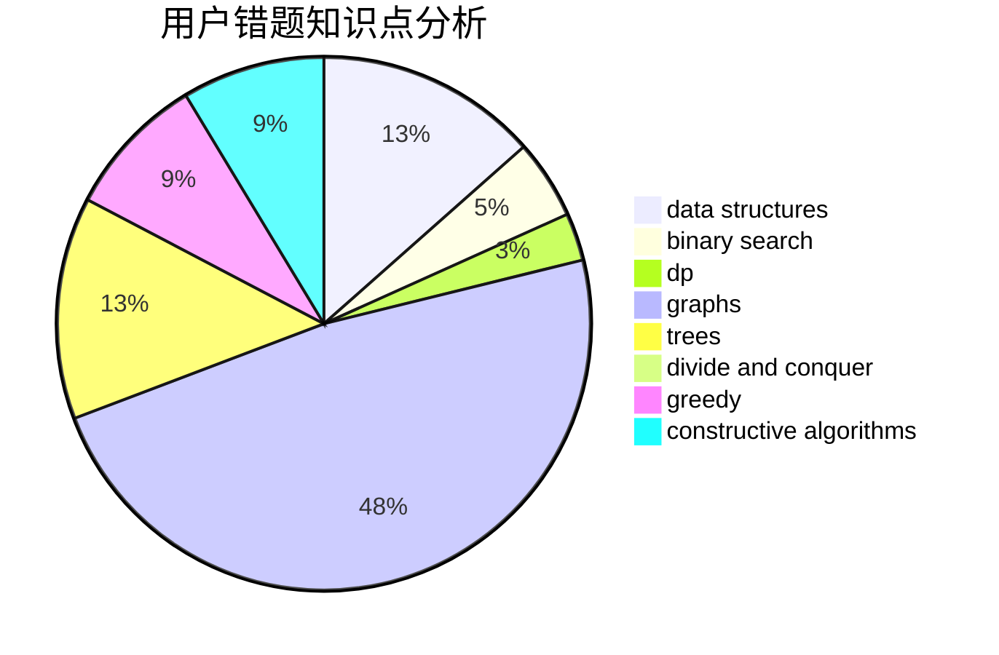

# Leaving_

<!-- tabs:start -->

#### **用户提交结果分析**

#### **用户做题类型偏好分析**

#### **用户错题知识点分析**

<!-- tabs:end -->
# 推荐题目
[13352](https://codeforces.com/contest/1335/problem/2)		dsu,graphs,sortings,trees		  
[763D](https://codeforces.com/contest/763/problem/D)		data structures,
                        graphs,
                        hashing,
                        shortest paths,
                        trees		  
[730B](https://codeforces.com/contest/730/problem/B)		constructive algorithms,
                        interactive		  
[24E](https://codeforces.com/contest/24/problem/E)		binary search		  
[425E](https://codeforces.com/contest/425/problem/E)		dp		  
[1138E](https://codeforces.com/contest/1138/problem/E)		dsu,graphs,sortings,trees		  
[199B](https://codeforces.com/contest/199/problem/B)		geometry		  
[356D](https://codeforces.com/contest/356/problem/D)		bitmasks,
                        constructive algorithms,
                        dp,
                        greedy		  
[333E](https://codeforces.com/contest/333/problem/E)		binary search,
                        bitmasks,
                        brute force,
                        geometry,
                        sortings		  
[1109E](https://codeforces.com/contest/1109/problem/E)		data structures,
                        number theory		  
