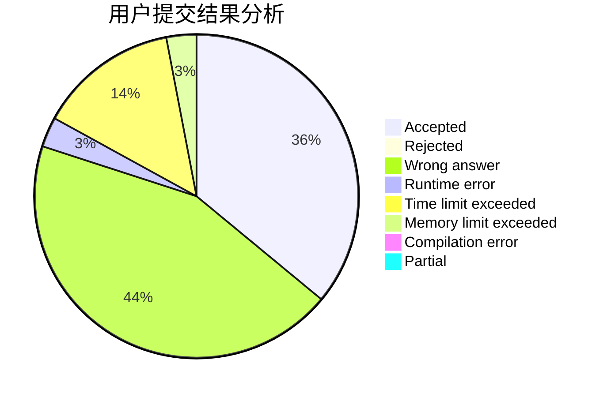
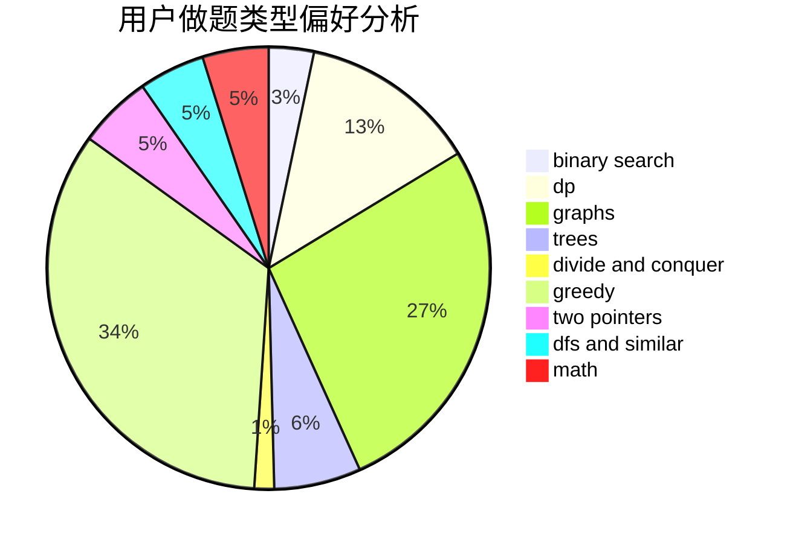

# LebronDurant

<!-- tabs:start -->

#### **用户提交结果分析**

#### **用户做题类型偏好分析**

<!-- tabs:end -->
# 推荐题目
[1416A](https://codeforces.com/contest/1416/problem/A)
[603E](https://codeforces.com/contest/603/problem/E)
[976A](https://codeforces.com/contest/976/problem/A)
[1272F](https://codeforces.com/contest/1272/problem/F)
[497C](https://codeforces.com/contest/497/problem/C)
[1250A](https://codeforces.com/contest/1250/problem/A)
[501A](https://codeforces.com/contest/501/problem/A)
[30B](https://codeforces.com/contest/30/problem/B)
[402C](https://codeforces.com/contest/402/problem/C)
[350B](https://codeforces.com/contest/350/problem/B)
