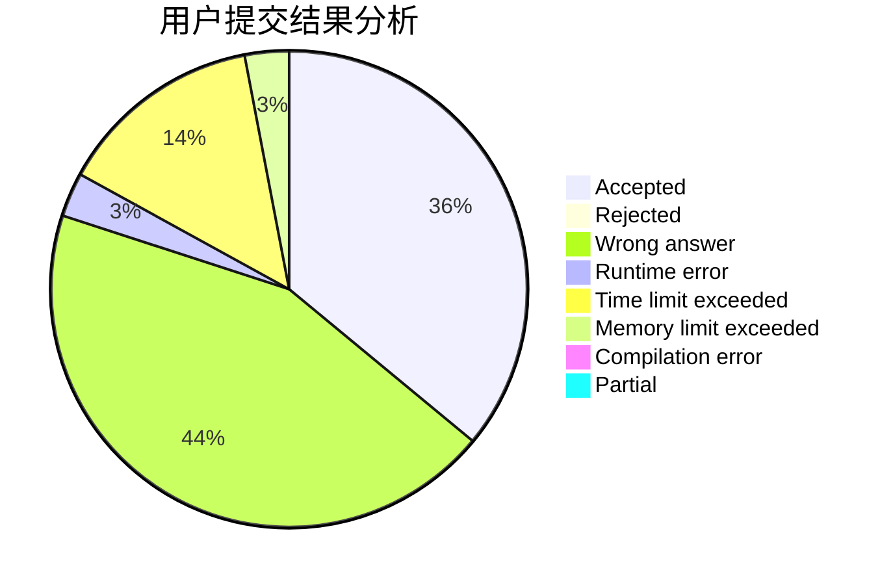
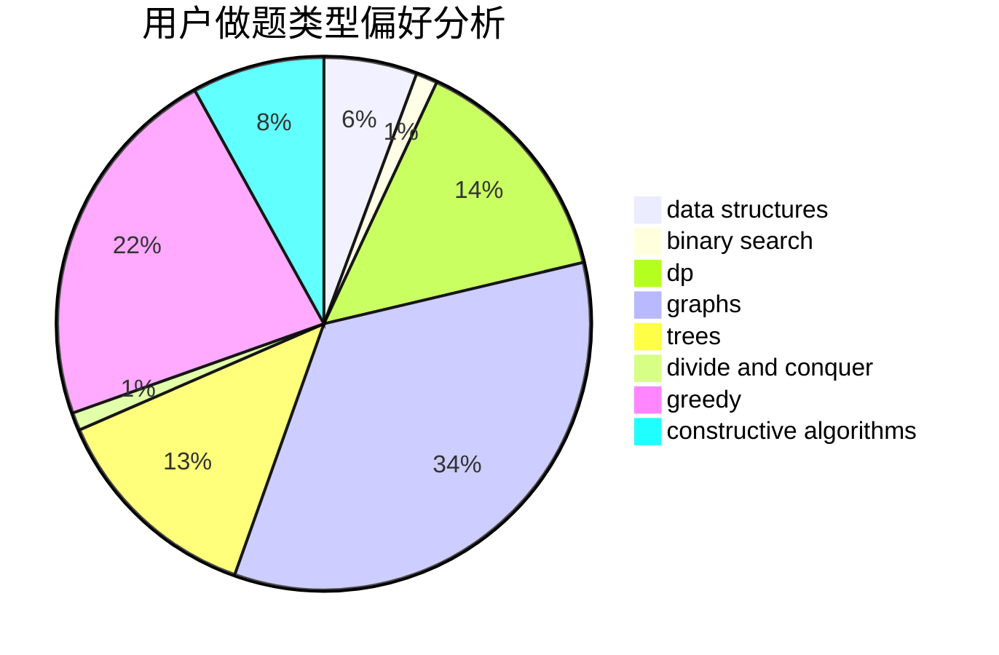
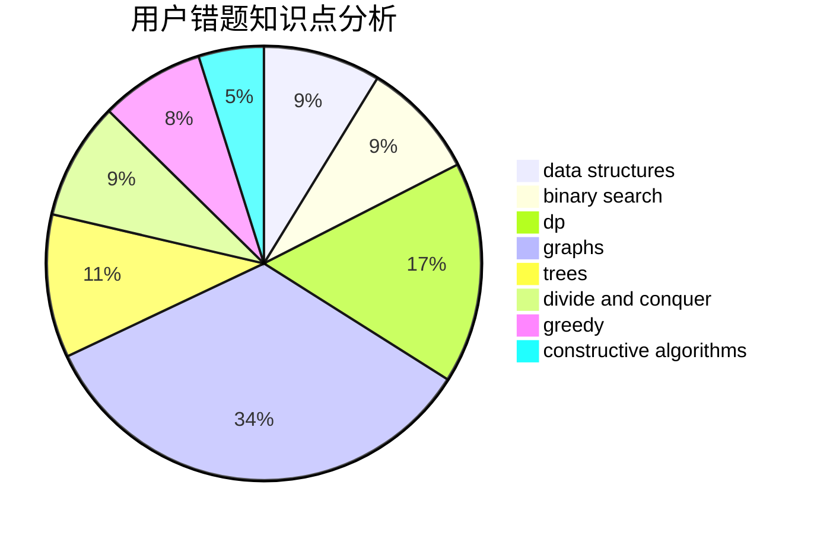

# LebronDurant

<!-- tabs:start -->

#### **用户提交结果分析**

#### **用户做题类型偏好分析**

#### **用户错题知识点分析**

<!-- tabs:end -->
# 推荐题目
[1416A](https://codeforces.com/contest/1416/problem/A)		binary search,
                        data structures,
                        implementation,
                        two pointers		  
[603E](https://codeforces.com/contest/603/problem/E)		data structures,
                        divide and conquer,
                        dsu,
                        math,
                        trees		  
[976A](https://codeforces.com/contest/976/problem/A)		implementation		  
[1272F](https://codeforces.com/contest/1272/problem/F)		dp,
                        strings,
                        two pointers		  
[497C](https://codeforces.com/contest/497/problem/C)		dsu,graphs,sortings,trees		  
[1250A](https://codeforces.com/contest/1250/problem/A)		implementation		  
[501A](https://codeforces.com/contest/501/problem/A)		implementation		  
[30B](https://codeforces.com/contest/30/problem/B)		implementation		  
[402C](https://codeforces.com/contest/402/problem/C)		brute force,
                        constructive algorithms,
                        graphs		  
[350B](https://codeforces.com/contest/350/problem/B)		graphs		  
